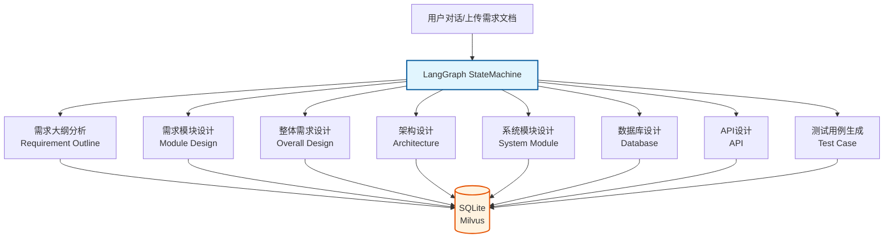

# AI Case Generator Demo

[](https://github.com/moderncrazy/ai-case-generator-demo) [](https://github.com/moderncrazy/ai-case-generator-demo/blob/main/LICENSE)  

> **基于 LLM 的智能需求分析和测试用例生成平台**，通过 LangGraph Multi-Agent 架构实现从需求文档到测试用例的全流程自动化

---

### 📢 项目动态与交流

> [!TIP]
>
> **项目状态**：本项目目前处于 **Early Demo** 阶段。正聚焦于 **Multi-Agent 协同精度**与**系统响应性能**的优化
>
> **关于作者**：一名拥有 Java & Node.js 资深背景的开发者，目前正深度投入于 Python AI 生态与 Agent 编排架构的落地实践
>   - 🔭 **职业状态**：处于开放的技术探索与职业转型期，欢迎关于 **Python 架构**、**测试开发工程化** 或 **模型评测**
      相关的职位邀约与技术交流
>   - 🤝 **联系我
      **：[BOSS 直聘/51Job](https://m.zhipin.com/mpa/html/resume-detail?sid=self&securityId=h8YXVQQMWPA6Z-k1DhC4kAgh5DfVVnP7pBYPmsnfwxkw9JgK8E4m8reqINEIJRfX-g5Fz4Zxz2qxlQu1N65F1dNpY2jMD28InXp75LXmguCT8Ao9K0okHcdarTfNMPuTI0ifgMFyZC9lDWxw2xB4q6LJKI5mu3q9XTWL7A~~) | [GitHub Issues](https://github.com/moderncrazy/ai-case-generator-demo/issues)

---

## 🎯 项目简介

本项目旨在探索如何通过大语言模型（LLM）解决复杂业务场景下的需求拆解痛点。通过 Multi-Agent 协作，将传统的人工分析转化为可工程化、可度量的自动化流水线

### 核心价值

- ⏱️ **效率提升** - 自动化生成测试用例，减少 60%+ 手工工作量
- 🤖 **AI 赋能** - 基于大语言模型，理解需求、生成用例、分析风险
- 📊 **全流程覆盖** - 需求大纲 → 需求模块 → 整体需求 → 架构设计 → 系统模块设计 → 数据库设计 → 接口设计 → 测试用例
- 🔒 **私有化部署** - 支持本地大模型，零 API 成本，数据安全

---

## 🏗️ 系统架构



---

## 📋 核心流程

|    阶段     | 说明             | 输出        |
|:---------:|:---------------|:----------|
| 1️⃣ 需求大纲  | AI 分析需求，提取关键信息 | 需求大纲/功能模块 |
| 2️⃣ 需求模块  | 补全功能模块明细，识别风险点 | 功能模块树     |
| 3️⃣ 整体需求  | 整合功能模块，补充细节    | 完整需求文档    |
| 4️⃣ 架构设计  | 生成系统架构方案       | 架构图/文档    |
| 5️⃣ 系统模块  | 设计系统内各模块       | 模块详细设计    |
| 6️⃣ 数据库设计 | 设计数据表结构        | ER 图/SQL  |
| 7️⃣ 接口设计  | 设计 API 接口      | 接口文档      |
| 8️⃣ 用例生成  | 生成测试用例（分级）     | 测试用例      |

---

## 💡 技术亮点

### 1. 异步并发的多角色评审机制

* **并发执行调度**：利用 LangGraph 的 `Send` 模式实现架构、后端、测试等多个角色的**并行评审**，极大地缩短了反馈链路。
* **状态自动归约**：设计了精细的 `State Reducer` 逻辑，在并发节点结束后自动汇总冲突并修正，相比串行模式，响应耗时降低 **40%
  以上**。

### 2. 精细化的 LangGraph 状态机编排

* **逻辑解耦**：将复杂业务流拆解为多个独立 Agent 节点，利用 `StateGraph` 管理状态流转。
* **闭环反馈**：引入“设计-评审-重写”的循环迭代机制，有效降低了单一 Agent 输出的幻觉问题。

### 3. 高性能异步 RAG 架构

* **全链路异步化**：后端基于 **FastAPI + Asyncio**，针对向量检索与 LLM 调用进行了并发调度优化。
* **混合检索策略**：基于 Milvus Lite 实现稠密与稀疏向量混合检索，并集成 BGE-M3 (ONNX) 模型实现高效的本地向量化处理。

### 4. 实时交互体验优化

* **SSE 流式渲染**：通过 **Server-Sent Events (SSE)** 协议，在 Streamlit 前端实时展示 Agent 执行过程的实时可视化展示，提升用户交互体验。

---

## 🗺️ 进化路线 (Roadmap)

- [x] **Phase 1**: 核心工作流跑通，实现需求到用例的基本闭环。
- [ ] **Phase 2 (当前)**:
    - 🛠️ **协作调优**：优化 Agent 间的 Prompt 协议，提升多角色配合的稳定性。
    - ⚡ **性能压测**：优化并发调度逻辑，提升多用户环境下的系统吞吐。
- [ ] **Phase 3**:
    - 📊 **评测体系**：引入用例质量自动评分机制，支持多模型对比测试报告。

---

## 🛠️ 技术栈

- **核心编排**: Python 3.12, LangChain, LangGraph
- **后端架构**: FastAPI, Uvicorn, Piccolo (ORM)
- **向量存储**: Milvus Lite, BGE-M3 (ONNX INT8)
- **展示层**: Streamlit (SSE)

---

## 🚀 快速开始

### 环境要求

- Python 3.12+
- macOS / Linux / Windows
- 内存 8GB+（推荐 16GB）
- Docker（可选，用于 ClamAV）

### 安装步骤

```bash
# 1. 克隆项目
git clone https://github.com/moderncrazy/ai-case-generator-demo.git
cd ai-case-generator-demo

# 2. 创建虚拟环境
python -m venv .venv
source .venv/bin/activate  # Linux/macOS
# .venv\Scripts\activate  # Windows

# 3. 安装依赖
pip install -r requirements.txt

# 4. 配置环境变量
cp .env.example .env
# 编辑 .env 填写必要的 API Key

# 5. 启动应用
uvicorn src.main:app --reload       # 后端 API http://localhost:8000
streamlit run src/frontend/web.py   # 前端 UI  http://localhost:8501
```

### ClamAV 依赖

```bash
# 启动依赖服务（ClamAV）
docker-compose -f docker/docker-compose-dependency.yml up -d
```

---

## 📁 项目结构

```
ai-case-generator-demo/
├── src/
│   ├── agents/                 # AI Agent 核心
│   ├── graphs/                 # LangGraph 工作流
│   │   ├── requirement/       # 需求相关工作流
│   │   ├── system/             # 系统设计工作流
│   │   └── test/              # 测试工作流
│   ├── services/               # 业务服务层
│   ├── repositories/           # 数据访问层
│   ├── models/                 # 数据模型
│   ├── routes/                 # API 路由
│   ├── middlewares/            # 中间件
│   ├── schemas/                # Pydantic 模型
│   ├── enums/                  # 枚举定义
│   ├── utils/                  # 工具函数
│   ├── frontend/               # Streamlit 前端
│   ├── config.py               # 配置管理
│   ├── constant.py             # 常量定义
│   ├── context.py              # 上下文变量
│   └── main.py                 # FastAPI 应用入口
├── prompts/                    # Prompt 模板
├── doc/                        # 设计文档
├── docker/                     # Docker 配置
├── requirements.txt            # Python 依赖
└── pyproject.toml              # 项目配置
```

---

## 📝 License

MIT License - 详见 [LICENSE](LICENSE) 文件

---

## 👤 Author

[moderncrazy](https://github.com/moderncrazy)