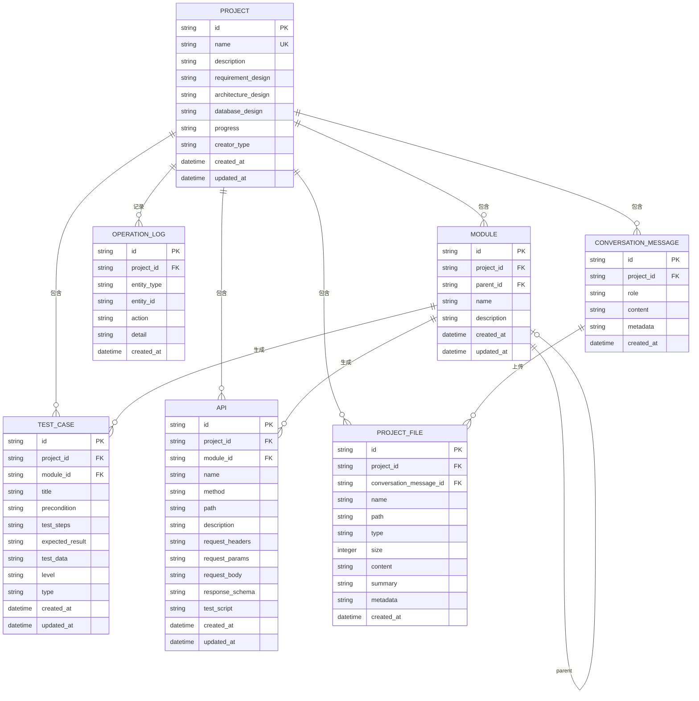

# AI 测试用例生成平台 - 数据库设计

## 概述

本文档描述 AI Case Generator Demo 的 SQLite 数据库表结构设计。

---

## ER 图



---

## 数据表设计

### 1. 项目表 (project)

| 字段                  | 类型       | 约束                        | 说明                            |
|---------------------|----------|---------------------------|-------------------------------|
| id                  | TEXT     | PRIMARY KEY               | UUID                          |
| name                | TEXT     | NOT NULL, UNIQUE          | 项目名称（唯一）                      |
| description         | TEXT     |                           | 项目描述                          |
| requirement_design  | TEXT     |                           | 需求设计内容                        |
| architecture_design | TEXT     |                           | 架构设计内容                        |
| database_design     | TEXT     |                           | 数据库设计内容                       |
| progress            | TEXT     | DEFAULT 'init'            | 项目进度                          |
| creator_type        | TEXT     | DEFAULT 'user'            | 创建者类型: system 系统创建, user 用户创建 |
| created_at          | DATETIME | DEFAULT CURRENT_TIMESTAMP | 创建时间                          |
| updated_at          | DATETIME |                           | 更新时间                          |

### 2. 模块表 (module)

| 字段          | 类型       | 约束                        | 说明           |
|-------------|----------|---------------------------|--------------|
| id          | TEXT     | PRIMARY KEY               | UUID         |
| project_id  | TEXT     | FOREIGN KEY               | 所属项目ID       |
| parent_id   | TEXT     | FOREIGN KEY, SELF         | 父级模块ID（支持多级） |
| name        | TEXT     | NOT NULL                  | 模块名称         |
| description | TEXT     |                           | 模块描述         |
| created_at  | DATETIME | DEFAULT CURRENT_TIMESTAMP | 创建时间         |
| updated_at  | DATETIME |                           | 更新时间         |

### 3. 测试用例表 (test_case)

| 字段              | 类型       | 约束                        | 说明                                   |
|-----------------|----------|---------------------------|--------------------------------------|
| id              | TEXT     | PRIMARY KEY               | UUID                                 |
| project_id      | TEXT     | FOREIGN KEY               | 所属项目ID                               |
| module_id       | TEXT     | FOREIGN KEY               | 所属模块ID                               |
| title           | TEXT     | NOT NULL                  | 用例标题                                 |
| precondition    | TEXT     |                           | 前置条件                                 |
| test_steps      | TEXT     | NOT NULL                  | 测试步骤 (JSON)                          |
| expected_result | TEXT     | NOT NULL                  | 预期结果                                 |
| test_data       | TEXT     | NOT NULL                  | 测试数据 (JSON)                          |
| level           | TEXT     | DEFAULT 'P2'              | 用例等级: P0/P1/P2/P3                    |
| type            | TEXT     | DEFAULT 'functional'      | 类型: functional/interface/performance |
| created_at      | DATETIME | DEFAULT CURRENT_TIMESTAMP | 创建时间                                 |
| updated_at      | DATETIME |                           | 更新时间                                 |

### 4. 接口表 (api)

| 字段              | 类型       | 约束                        | 说明                           |
|-----------------|----------|---------------------------|------------------------------|
| id              | TEXT     | PRIMARY KEY               | UUID                         |
| project_id      | TEXT     | FOREIGN KEY               | 所属项目ID                       |
| module_id       | TEXT     | FOREIGN KEY               | 所属模块ID                       |
| name            | TEXT     | NOT NULL                  | 接口名称                         |
| method          | TEXT     | NOT NULL                  | HTTP 方法: GET/POST/PUT/DELETE |
| path            | TEXT     | NOT NULL                  | 接口路径                         |
| description     | TEXT     |                           | 接口描述                         |
| request_headers | TEXT     |                           | 请求头 (JSON Array)             |
| request_params  | TEXT     |                           | 请求参数 (JSON Array)            |
| request_body    | TEXT     |                           | 请求体 (JSON Array)             |
| response_schema | TEXT     | NOT NULL                  | 响应结构 (JSON)                  |
| test_script     | TEXT     |                           | Locust 压测脚本                  |
| created_at      | DATETIME | DEFAULT CURRENT_TIMESTAMP | 创建时间                         |
| updated_at      | DATETIME |                           | 更新时间                         |

### 5. 操作日志表 (operation_log)

| 字段          | 类型       | 约束                        | 说明                                 |
|-------------|----------|---------------------------|------------------------------------|
| id          | TEXT     | PRIMARY KEY               | UUID                               |
| project_id  | TEXT     | FOREIGN KEY               | 所属项目ID                             |
| entity_type | TEXT     | NOT NULL                  | 实体类型: project/module/test_case/api |
| entity_id   | TEXT     | NOT NULL                  | 实体ID                               |
| action      | TEXT     | NOT NULL                  | 操作类型: create/update/delete/export  |
| detail      | TEXT     |                           | 操作详情 (JSON)                        |
| created_at  | DATETIME | DEFAULT CURRENT_TIMESTAMP | 操作时间                               |

### 6. 对话记录表 (conversation_message)

| 字段         | 类型       | 约束                        | 说明                        |
|------------|----------|---------------------------|---------------------------|
| id         | TEXT     | PRIMARY KEY               | UUID                      |
| project_id | TEXT     | FOREIGN KEY               | 所属项目ID                    |
| role       | TEXT     | NOT NULL                  | 角色: user/assistant/system |
| content    | TEXT     | NOT NULL                  | 消息内容                      |
| metadata   | TEXT     | NOT NULL                  | 额外元数据 (JSON)              |
| created_at | DATETIME | DEFAULT CURRENT_TIMESTAMP | 创建时间                      |

### 7. 项目文件表 (project_file)

| 字段                      | 类型       | 约束          | 说明           |
|-------------------------|----------|-------------|--------------|
| id                      | TEXT     | PRIMARY KEY | UUID         |
| project_id              | TEXT     | FOREIGN KEY | 所属项目ID       |
| conversation_message_id | TEXT     | FOREIGN KEY | 上传该文件的对话消息ID |
| name                    | TEXT     | NOT NULL    | 文件名          |
| path                    | TEXT     | NOT NULL    | 文件路径         |
| type                    | TEXT     | NOT NULL    | 文件类型/扩展名     |
| size                    | INTEGER  | NOT NULL    | 文件大小(字节)     |
| content                 | TEXT     |             | 文件内容         |
| summary                 | TEXT     |             | 文件摘要         |
| metadata                | TEXT     |             | 额外元数据 (JSON) |
| created_at              | DATETIME | NOT NULL    | 创建时间         |

---

## SQL 建表脚本

```sqlite
-- 项目表
CREATE TABLE IF NOT EXISTS project
(
    id                  TEXT PRIMARY KEY,
    name                TEXT NOT NULL UNIQUE,
    description         TEXT,
    requirement_design  TEXT,
    architecture_design TEXT,
    database_design     TEXT,
    progress            TEXT     DEFAULT 'init'
        CHECK (progress IN
               ('init', 'requirement_outline_design', 'requirement_module_design', 'requirement_overall_design',
                'sys_architecture_design', 'sys_modules_design', 'sys_database_design', 'sys_api_design',
                'test_case_design', 'completed')),
    creator_type        TEXT     DEFAULT 'user'
        CHECK (creator_type IN ('system', 'user')),
    created_at          DATETIME DEFAULT CURRENT_TIMESTAMP,
    updated_at          DATETIME
);

CREATE UNIQUE INDEX idx_project_name ON project (name);
CREATE INDEX idx_project_progress ON project (progress);
CREATE INDEX idx_project_created ON project (created_at);

-- 模块表
CREATE TABLE IF NOT EXISTS module
(
    id          TEXT PRIMARY KEY,
    project_id  TEXT NOT NULL,
    parent_id   TEXT,
    name        TEXT NOT NULL,
    description TEXT,
    created_at  DATETIME DEFAULT CURRENT_TIMESTAMP,
    updated_at  DATETIME,
    FOREIGN KEY (project_id) REFERENCES project (id),
    FOREIGN KEY (parent_id) REFERENCES module (id)
);

CREATE INDEX idx_module_project ON module (project_id);
CREATE INDEX idx_module_parent ON module (parent_id);

-- 测试用例表
CREATE TABLE IF NOT EXISTS test_case
(
    id              TEXT PRIMARY KEY,
    project_id      TEXT NOT NULL,
    module_id       TEXT NOT NULL,
    title           TEXT NOT NULL,
    precondition    TEXT,
    test_steps      TEXT NOT NULL,
    expected_result TEXT NOT NULL,
    test_data       TEXT NOT NULL,
    level           TEXT     DEFAULT 'P2'
        CHECK (level IN ('P0', 'P1', 'P2', 'P3')),
    type            TEXT     DEFAULT 'functional'
        CHECK (type IN ('functional', 'interface', 'performance')),
    created_at      DATETIME DEFAULT CURRENT_TIMESTAMP,
    updated_at      DATETIME,
    FOREIGN KEY (project_id) REFERENCES project (id),
    FOREIGN KEY (module_id) REFERENCES module (id)
);

CREATE INDEX idx_test_case_project ON test_case (project_id);
CREATE INDEX idx_test_case_module ON test_case (module_id);
CREATE INDEX idx_test_case_level ON test_case (level);

-- 接口表
CREATE TABLE IF NOT EXISTS api
(
    id              TEXT PRIMARY KEY,
    project_id      TEXT NOT NULL,
    module_id       TEXT NOT NULL,
    name            TEXT NOT NULL,
    method          TEXT NOT NULL
        CHECK (method IN ('GET', 'POST', 'PUT', 'DELETE', 'PATCH')),
    path            TEXT NOT NULL,
    description     TEXT,
    request_headers TEXT,
    request_params  TEXT,
    request_body    TEXT,
    response_schema TEXT NOT NULL,
    test_script     TEXT,
    created_at      DATETIME DEFAULT CURRENT_TIMESTAMP,
    updated_at      DATETIME,
    FOREIGN KEY (project_id) REFERENCES project (id),
    FOREIGN KEY (module_id) REFERENCES module (id)
);

CREATE INDEX idx_api_project ON api (project_id);
CREATE INDEX idx_api_module ON api (module_id);
CREATE UNIQUE INDEX idx_api_path_method ON api (project_id, path, method);

-- 操作日志表
CREATE TABLE IF NOT EXISTS operation_log
(
    id          TEXT PRIMARY KEY,
    project_id  TEXT NOT NULL,
    entity_type TEXT NOT NULL,
    entity_id   TEXT NOT NULL,
    action      TEXT NOT NULL,
    detail      TEXT,
    created_at  DATETIME DEFAULT CURRENT_TIMESTAMP,
    FOREIGN KEY (project_id) REFERENCES project (id)
);

CREATE INDEX idx_logs_project ON operation_log (project_id);
CREATE INDEX idx_logs_entity ON operation_log (entity_type, entity_id);
CREATE INDEX idx_logs_created ON operation_log (created_at);

-- 对话记录表
CREATE TABLE IF NOT EXISTS conversation_message
(
    id         TEXT PRIMARY KEY,
    project_id TEXT NOT NULL,
    role       TEXT NOT NULL
        CHECK (role IN ('user', 'assistant', 'system')),
    content    TEXT NOT NULL,
    metadata   TEXT,
    created_at DATETIME DEFAULT CURRENT_TIMESTAMP,
    FOREIGN KEY (project_id) REFERENCES project (id)
);

CREATE INDEX idx_messages_project ON conversation_message (project_id);
CREATE INDEX idx_messages_created ON conversation_message (created_at);

-- 项目文件表
CREATE TABLE IF NOT EXISTS project_file
(
    id                      TEXT PRIMARY KEY,
    project_id              TEXT    NOT NULL,
    conversation_message_id TEXT    NOT NULL,
    name                    TEXT    NOT NULL,
    path                    TEXT    NOT NULL,
    type                    TEXT    NOT NULL,
    size                    INTEGER NOT NULL,
    content                 TEXT,
    summary                 TEXT,
    metadata                TEXT,
    created_at              DATETIME DEFAULT CURRENT_TIMESTAMP,
    FOREIGN KEY (project_id) REFERENCES project (id),
    FOREIGN KEY (conversation_message_id) REFERENCES conversation_message (id)
);

CREATE INDEX idx_files_project ON project_file (project_id);
CREATE INDEX idx_files_name ON project_file (name);
CREATE INDEX idx_files_message ON project_file (conversation_message_id);
```

---

## 项目进度流转

```
init ──> requirement_outline_design ──> requirement_module_design ──> requirement_overall_design ──> 
sys_architecture_design ──> sys_modules_design ──> sys_database_design ──> sys_api_design ──> test_case_design ──> completed
```

| 进度值                        | 说明          |
|----------------------------|-------------|
| init                       | 初始化         |
| requirement_outline_design | 需求大纲设计      |
| requirement_module_design  | 需求模块设计      |
| requirement_overall_design | 需求总体（PRD）设计 |
| sys_architecture_design    | 系统架构设计设计    |
| sys_modules_design         | 系统模块设计      |
| sys_database_design        | 系统数据库设计     |
| sys_api_design             | 系统接口设计      |
| test_case_design           | 测试用例设计      |
| completed                  | 完成          |

---

## 备注

- 所有 ID 使用 UUID v4
- JSON 类型字段存储时使用 JSON 格式
- 使用硬删除机制，直接物理删除数据
- 时间字段使用 ISO 8601 格式
- 项目名称全局唯一，避免重复项目
- 模块支持树形结构（parent_id 自关联）
- 需求信息合并到项目表，减少表关联
- 进度由项目统一管理，模块/用例/接口不再有独立状态
- 对话消息记录用户与 AI 的交互历史
- 项目文件通过对话消息关联，支持追溯文件上传来源
