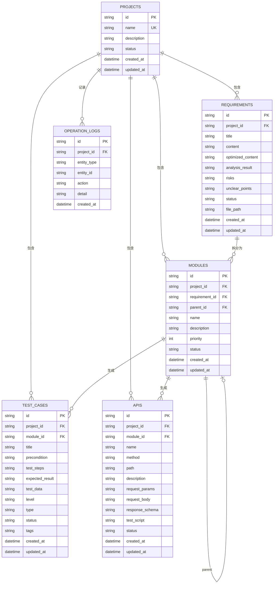

# AI 测试用例生成平台 - 数据库设计

## 概述

本文档描述 AI Case Generator Demo 的 SQLite 数据库表结构设计。

---

## ER 图



---

## 数据表设计

### 1. 项目表 (projects)

| 字段 | 类型 | 约束 | 说明 |
|------|------|------|------|
| id | TEXT | PRIMARY KEY | UUID |
| name | TEXT | NOT NULL, UNIQUE | 项目名称（唯一） |
| description | TEXT | | 项目描述 |
| status | TEXT | DEFAULT 'draft' | 状态: draft/active/completed |
| created_at | DATETIME | DEFAULT CURRENT_TIMESTAMP | 创建时间 |
| updated_at | DATETIME | | 更新时间 |

### 2. 需求表 (requirements)

| 字段 | 类型 | 约束 | 说明 |
|------|------|------|------|
| id | TEXT | PRIMARY KEY | UUID |
| project_id | TEXT | FOREIGN KEY | 所属项目ID |
| title | TEXT | NOT NULL | 需求标题 |
| content | TEXT | | 需求内容原文 |
| optimized_content | TEXT | | AI 优化后的需求内容 |
| analysis_result | TEXT | | AI 分析结果 |
| risks | TEXT | | 识别的风险点 (JSON) |
| unclear_points | TEXT | | 不明确点 (JSON) |
| status | TEXT | DEFAULT 'pending' | 状态: pending/analyzed/confirmed |
| file_path | TEXT | | 原始文件路径 |
| created_at | DATETIME | DEFAULT CURRENT_TIMESTAMP | 创建时间 |
| updated_at | DATETIME | | 更新时间 |

### 3. 模块表 (modules)

| 字段 | 类型 | 约束 | 说明 |
|------|------|------|------|
| id | TEXT | PRIMARY KEY | UUID |
| project_id | TEXT | FOREIGN KEY | 所属项目ID |
| requirement_id | TEXT | FOREIGN KEY | 所属需求ID |
| parent_id | TEXT | FOREIGN KEY, SELF | 父级模块ID（支持多级） |
| name | TEXT | NOT NULL | 模块名称 |
| description | TEXT | | 模块描述 |
| priority | INTEGER | DEFAULT 1 | 优先级 1-5 |
| status | TEXT | DEFAULT 'pending' | 状态: pending/designing/completed |
| created_at | DATETIME | DEFAULT CURRENT_TIMESTAMP | 创建时间 |
| updated_at | DATETIME | | 更新时间 |

### 4. 测试用例表 (test_cases)

| 字段 | 类型 | 约束 | 说明 |
|------|------|------|------|
| id | TEXT | PRIMARY KEY | UUID |
| project_id | TEXT | FOREIGN KEY | 所属项目ID |
| module_id | TEXT | FOREIGN KEY | 所属模块ID |
| title | TEXT | NOT NULL | 用例标题 |
| precondition | TEXT | | 前置条件 |
| test_steps | TEXT | | 测试步骤 (JSON) |
| expected_result | TEXT | | 预期结果 |
| test_data | TEXT | | 测试数据 (JSON) |
| level | TEXT | DEFAULT 'P2' | 用例等级: P0/P1/P2/P3 |
| type | TEXT | DEFAULT 'functional' | 类型: functional/interface/performance |
| status | TEXT | DEFAULT 'draft' | 状态: draft/approved/archived |
| tags | TEXT | | 标签 (JSON) |
| created_at | DATETIME | DEFAULT CURRENT_TIMESTAMP | 创建时间 |
| updated_at | DATETIME | | 更新时间 |

### 5. 接口表 (apis)

| 字段 | 类型 | 约束 | 说明 |
|------|------|------|------|
| id | TEXT | PRIMARY KEY | UUID |
| project_id | TEXT | FOREIGN KEY | 所属项目ID |
| module_id | TEXT | FOREIGN KEY | 所属模块ID |
| name | TEXT | NOT NULL | 接口名称 |
| method | TEXT | NOT NULL | HTTP 方法: GET/POST/PUT/DELETE |
| path | TEXT | NOT NULL | 接口路径 |
| description | TEXT | | 接口描述 |
| request_params | TEXT | | 请求参数 (JSON) |
| request_body | TEXT | | 请求体 (JSON) |
| response_schema | TEXT | | 响应结构 (JSON) |
| test_script | TEXT | | Locust 压测脚本 |
| status | TEXT | DEFAULT 'draft' | 状态: draft/approved |
| created_at | DATETIME | DEFAULT CURRENT_TIMESTAMP | 创建时间 |
| updated_at | DATETIME | | 更新时间 |

### 6. 操作日志表 (operation_logs)

| 字段 | 类型 | 约束 | 说明 |
|------|------|------|------|
| id | TEXT | PRIMARY KEY | UUID |
| project_id | TEXT | FOREIGN KEY | 所属项目ID |
| entity_type | TEXT | NOT NULL | 实体类型: project/requirement/module/test_case/api |
| entity_id | TEXT | NOT NULL | 实体ID |
| action | TEXT | NOT NULL | 操作类型: create/update/delete/export |
| detail | TEXT | | 操作详情 (JSON) |
| created_at | DATETIME | DEFAULT CURRENT_TIMESTAMP | 操作时间 |

---

## SQL 建表脚本

```sql
-- 项目表
CREATE TABLE IF NOT EXISTS projects (
    id TEXT PRIMARY KEY,
    name TEXT NOT NULL UNIQUE,
    description TEXT,
    status TEXT DEFAULT 'draft' CHECK(status IN ('draft', 'active', 'completed')),
    created_at DATETIME DEFAULT CURRENT_TIMESTAMP,
    updated_at DATETIME
);

-- 项目表索引
CREATE UNIQUE INDEX idx_projects_name ON projects(name);
CREATE INDEX idx_projects_status ON projects(status);
CREATE INDEX idx_projects_created ON projects(created_at);

-- 需求表
CREATE TABLE IF NOT EXISTS requirements (
    id TEXT PRIMARY KEY,
    project_id TEXT NOT NULL,
    title TEXT NOT NULL,
    content TEXT,
    optimized_content TEXT,
    analysis_result TEXT,
    risks TEXT,
    unclear_points TEXT,
    status TEXT DEFAULT 'pending' CHECK(status IN ('pending', 'analyzed', 'confirmed')),
    file_path TEXT,
    created_at DATETIME DEFAULT CURRENT_TIMESTAMP,
    updated_at DATETIME,
    FOREIGN KEY (project_id) REFERENCES projects(id) ON DELETE CASCADE
);

-- 需求表索引
CREATE INDEX idx_requirements_project ON requirements(project_id);
CREATE INDEX idx_requirements_status ON requirements(status);

-- 模块表
CREATE TABLE IF NOT EXISTS modules (
    id TEXT PRIMARY KEY,
    project_id TEXT NOT NULL,
    requirement_id TEXT,
    parent_id TEXT,
    name TEXT NOT NULL,
    description TEXT,
    priority INTEGER DEFAULT 1 CHECK(priority BETWEEN 1 AND 5),
    status TEXT DEFAULT 'pending' CHECK(status IN ('pending', 'designing', 'completed')),
    created_at DATETIME DEFAULT CURRENT_TIMESTAMP,
    updated_at DATETIME,
    FOREIGN KEY (project_id) REFERENCES projects(id) ON DELETE CASCADE,
    FOREIGN KEY (requirement_id) REFERENCES requirements(id) ON DELETE SET NULL,
    FOREIGN KEY (parent_id) REFERENCES modules(id) ON DELETE SET NULL
);

-- 模块表索引
CREATE INDEX idx_modules_project ON modules(project_id);
CREATE INDEX idx_modules_requirement ON modules(requirement_id);
CREATE INDEX idx_modules_parent ON modules(parent_id);
CREATE INDEX idx_modules_status ON modules(status);

-- 测试用例表
CREATE TABLE IF NOT EXISTS test_cases (
    id TEXT PRIMARY KEY,
    project_id TEXT NOT NULL,
    module_id TEXT,
    title TEXT NOT NULL,
    precondition TEXT,
    test_steps TEXT,
    expected_result TEXT,
    test_data TEXT,
    level TEXT DEFAULT 'P2' CHECK(level IN ('P0', 'P1', 'P2', 'P3')),
    type TEXT DEFAULT 'functional' CHECK(type IN ('functional', 'interface', 'performance')),
    status TEXT DEFAULT 'draft' CHECK(status IN ('draft', 'approved', 'archived')),
    tags TEXT,
    created_at DATETIME DEFAULT CURRENT_TIMESTAMP,
    updated_at DATETIME,
    FOREIGN KEY (project_id) REFERENCES projects(id) ON DELETE CASCADE,
    FOREIGN KEY (module_id) REFERENCES modules(id) ON DELETE SET NULL
);

-- 测试用例索引
CREATE INDEX idx_testcases_project ON test_cases(project_id);
CREATE INDEX idx_testcases_module ON test_cases(module_id);
CREATE INDEX idx_testcases_level ON test_cases(level);
CREATE INDEX idx_testcases_status ON test_cases(status);

-- 接口表
CREATE TABLE IF NOT EXISTS apis (
    id TEXT PRIMARY KEY,
    project_id TEXT NOT NULL,
    module_id TEXT,
    name TEXT NOT NULL,
    method TEXT NOT NULL CHECK(method IN ('GET', 'POST', 'PUT', 'DELETE', 'PATCH')),
    path TEXT NOT NULL,
    description TEXT,
    request_params TEXT,
    request_body TEXT,
    response_schema TEXT,
    test_script TEXT,
    status TEXT DEFAULT 'draft' CHECK(status IN ('draft', 'approved')),
    created_at DATETIME DEFAULT CURRENT_TIMESTAMP,
    updated_at DATETIME,
    FOREIGN KEY (project_id) REFERENCES projects(id) ON DELETE CASCADE,
    FOREIGN KEY (module_id) REFERENCES modules(id) ON DELETE SET NULL
);

-- 接口表索引
CREATE INDEX idx_apis_project ON apis(project_id);
CREATE INDEX idx_apis_module ON apis(module_id);
CREATE INDEX idx_apis_status ON apis(status);
CREATE UNIQUE INDEX idx_apis_path_method ON apis(project_id, path, method);

-- 操作日志表
CREATE TABLE IF NOT EXISTS operation_logs (
    id TEXT PRIMARY KEY,
    project_id TEXT NOT NULL,
    entity_type TEXT NOT NULL,
    entity_id TEXT NOT NULL,
    action TEXT NOT NULL,
    detail TEXT,
    created_at DATETIME DEFAULT CURRENT_TIMESTAMP,
    FOREIGN KEY (project_id) REFERENCES projects(id) ON DELETE CASCADE
);

-- 操作日志索引
CREATE INDEX idx_logs_project ON operation_logs(project_id);
CREATE INDEX idx_logs_entity ON operation_logs(entity_type, entity_id);
CREATE INDEX idx_logs_created ON operation_logs(created_at);
```

---

## 状态流转

```
项目状态:
draft ──> active ──> completed

需求状态:
pending ──> analyzed ──> confirmed

模块状态:
pending ──> designing ──> completed

用例状态:
draft ──> approved ──> archived

接口状态:
draft ──> approved
```

---

## 备注

- 所有 ID 使用 UUID v4
- JSON 类型字段存储时使用 JSON 格式
- 使用软删除机制（status 标记）而非物理删除
- 时间字段使用 ISO 8601 格式
- 项目名称全局唯一，避免重复项目
- 模块支持树形结构（parent_id 自关联）
