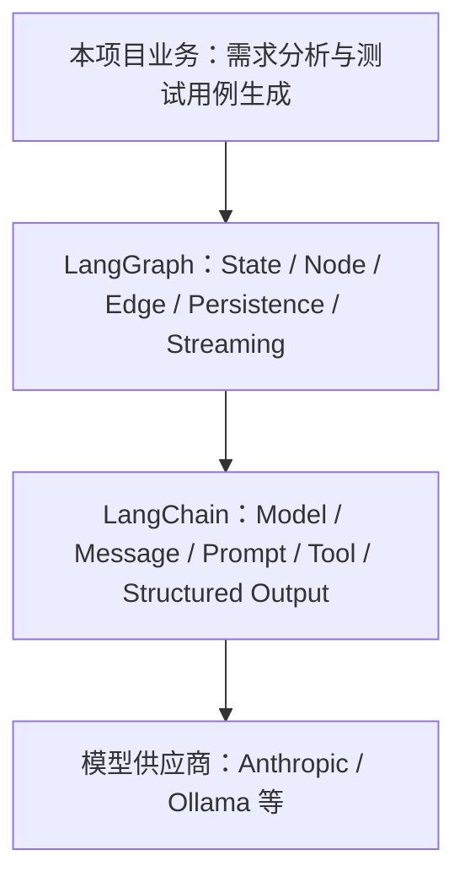
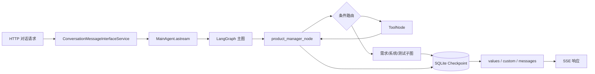

# LangChain 与 LangGraph：从核心概念到项目实践

> 面向团队内部的 45–60 分钟知识分享稿

## 1. 分享目标与阅读地图

完成本次分享后，读者应能够：

- 区分 LangChain 与 LangGraph 的职责；
- 按状态、节点、工具、路由、持久化和流式输出的顺序搭建工作流；
- 沿本项目代码定位一次 Agent（智能体）请求的完整执行过程；
- 根据项目约束初步选择 LangGraph、Dify 及可观测性工具。

### 时间分配

- 基础概念与框架关系：约 15 分钟；
- LangGraph 开发模式：约 15 分钟；
- 本项目代码走读：约 20 分钟；
- 对比、可观测性与讨论：约 5–10 分钟。

### 先记住的三个结论

1. **LangChain 提供 AI（人工智能）应用组件**：模型、消息、Prompt（提示词）、Tool（工具）与结构化输出等能力可被统一组合。
2. **LangGraph 提供有状态编排运行时**：它负责节点、分支、循环、持久化与流式执行。
3. **本项目在 LangGraph 节点中组合 LangChain 组件**：前者控制业务流程，后者完成模型交互和工具能力。

接下来先建立两者的边界，再依次进入核心概念、开发流程和本项目的一次真实请求链路。

## 2. LangChain 是什么

LangChain 是面向模型、消息、Prompt、Tool 和常见 Agent 循环的高层框架与集成层。它把不同模型供应商和常用 AI 应用组件抽象为相对一致的接口，让应用代码更专注于业务规则，而不是逐个适配模型 API（应用程序编程接口）。

可以把它理解为“搭建 AI 能力的组件库”：选择模型、组织消息、编写 Prompt、声明工具和约束结构化结果，通常都在这一层完成。它也提供高层 Agent 能力，用于处理常见的“模型判断—调用工具—继续回答”循环。

**最小示意：** 用统一模型接口发送消息即可把供应商调用留在组件层。

```python
model = init_chat_model(model="your-model", model_provider="your-provider")
reply = model.invoke("请总结这份需求")
```

**项目定位：** `src/graphs/common/llms.py` 用 `init_chat_model` 初始化模型；节点再组合消息、Prompt 与 Tool。**注意：** LangChain 统一了组件接口，但不应把多步业务路由全部塞进一个 Agent；流程控制交给 LangGraph。

官方产品定位可参阅 [LangChain products](https://docs.langchain.com/oss/python/concepts/products)。

## 3. LangGraph 是什么，以及它与 LangChain 的关系

LangGraph 是面向长时运行、有状态、可循环、可分支工作流的低层编排框架和运行时。它把业务流程表达为状态（State）、节点（Node）和边（Edge），并提供持久化、恢复与流式输出等运行能力。

它解决的重点不是“怎样调用一次模型”，而是“复杂任务如何在多步、多分支、可恢复的流程中稳定运行”。例如，需求分析完成后，流程可以进入工具调用、业务子图、人工确认或结束节点，并把每一步状态保存下来。

LangGraph 可以独立使用，但通常会配合 LangChain 的模型与工具抽象。LangChain 的高层 Agent 能力建立在 LangGraph 之上；当我们手写 `StateGraph` 时，则能获得更细粒度的状态、路由和恢复控制。

**最小示意：** 先声明状态，再把处理步骤接成可编译的图。

```python
builder = StateGraph(State)
builder.add_node("product_manager_node", product_manager_node)
graph = builder.compile()
```

**项目定位：** `src/graphs/graph.py` 的 `create_agent()` 创建主 `StateGraph(State)` 并编译。**注意：** 节点只返回自己负责的状态更新；先定义状态契约与合并规则，再增加分支或循环，避免流程变复杂后难以恢复和排查。



该图表示本项目的主要依赖方向，不表示 LangGraph 必须依赖 LangChain。

官方概览可参阅 [LangGraph overview](https://docs.langchain.com/oss/python/langgraph/overview)。

## 4. LangChain 核心概念

这一节把 LangChain 看作节点内部的“能力工具箱”。下表每行都用同一套问题讲解：它是什么、解决什么、最小形态、项目在哪里、使用时防什么坑。先记住：模型负责推理，工具负责执行，状态和流程仍由 LangGraph 管理。

| 概念（是什么） | 解决的问题 | 最小示意 | 本项目位置 | 实践注意 |
| --- | --- | --- | --- | --- |
| Chat Model（聊天模型） | 统一供应商接口，避免节点逐个适配模型 API。 | `init_chat_model(...).invoke(messages)` | `src/graphs/common/llms.py` 初始化 Ollama、MiniMax。 | 固定模型名、超时、重试和温度；不要把供应商参数散落在节点中。 |
| Message（消息） | 让对话角色和工具往返可追踪：`SystemMessage` 是系统规则/角色约束，`HumanMessage` 是用户输入，`AIMessage` 是模型回复（可含 `tool_calls`），`ToolMessage` 是返回给模型的工具执行结果。 | `System → Human → AI(tool_calls) → Tool` | `src/graphs/state.py` 继承 `MessagesState`；`src/graphs/tools.py` 构造 `ToolMessage`。 | 工具结果必须带正确 `tool_call_id`，否则模型无法关联请求与结果。 |
| Prompt（提示词） | 将业务规则、上下文和输入变成可执行指令。 | `system_rule + context + user_input` | 业务节点组合项目状态、指令模板和消息。 | 只放必要且可信的上下文；把稳定规则与易变输入分开。 |
| Tool（工具）与 Tool Calling（工具调用） | 让模型请求真实数据或副作用操作，而非凭空回答。 | `@tool` → `bind_tools([...])` → tool call | `src/graphs/tools.py` 的 `@tool`；主图注册工具节点。 | 模型只提出意图，不会执行函数；参数 schema、权限和幂等性要明确。 |
| Structured Output（结构化输出） | 用 Pydantic 模型或 JSON Schema 约束输出字段，将自然语言答案变为可被下游稳定读取的数据。 | `class Output(BaseModel): next_step: str` | `src/graphs/schemas.py`、`src/graphs/common/utils/structured_output_utils.py`。 | schema 校验失败要有重试/降级；不要把未经校验的文本直接写入状态。 |
| Runnable（可运行组件）与 `RunnableConfig`（运行配置） | 以统一调用方式传递配置、callbacks（回调）、tags（标签）和 metadata（元数据）。 | `runnable.invoke(input, config)` | `src/graphs/nodes.py`、`src/graphs/common/base/nodes.py` 接收 `RunnableConfig`。 | 用 config 传追踪与调用级配置，不要把会话业务数据偷塞进全局变量。 |

**最小示例：** 以下是教学等价代码，不是从项目函数复制；它采用当前项目的导入风格，并显示工具绑定后的模型调用。

**对应源码：** `src/graphs/common/llms.py`、`src/graphs/tools.py`。

```python
from langchain.chat_models import init_chat_model
from langchain.messages import HumanMessage
from langchain.tools import tool

model = init_chat_model(model="your-model", model_provider="your-provider")

@tool
def get_project_progress(project_id: str) -> str:
    """查询项目当前阶段。"""
    return "requirement_outline_design"

response = model.bind_tools([get_project_progress]).invoke(
    [HumanMessage(content="项目下一步做什么？")]
)
```

模型返回 tool call 不等于工具已经执行：它只是 `AIMessage` 中的一项调用请求。本项目用 `ToolNode` 接收该请求、执行函数并写回 `ToolMessage`，由此形成“模型判断—工具执行—模型继续回答”的闭环。

**官方依据：** [LangChain Tools](https://docs.langchain.com/oss/python/langchain/tools)（工具 schema、调用和 `Command`）。

## 5. LangGraph 核心概念

如果说 LangChain 解决“节点里能做什么”，LangGraph 解决的就是“这些节点以什么状态、什么顺序、能否恢复地协作”。仍按“是什么—问题—最小示意—位置—注意”走读，表中的示意用于理解，不代表完整生产实现。

| 概念（是什么） | 解决的问题 | 最小示意 | 本项目位置 | 实践注意 |
| --- | --- | --- | --- | --- |
| State（状态） | 让节点共享受约束的数据契约。 | `{"project_id": "p1"}` | `src/graphs/state.py:State` 保存消息、进度、需求和风险。 | 先定义字段所有权；避免节点直接修改输入状态。 |
| Node（节点） | 将工作拆成可测试的单一职责单元。 | `def node(state): return {"x": 1}` | `product_manager_node` 等业务节点。 | 只返回自己负责的局部更新，副作用要可追踪或幂等。 |
| Edge（边） | 表达确定的先后流转。 | `add_edge("a", "b")` | 主图和子图的 `add_edge`。 | 线性边保持简单；循环必须有退出条件。 |
| Conditional Edge（条件边） | 按状态或路由结果选择下一步。 | `add_conditional_edges("a", route)` | `src/graphs/graph.py` 的多处条件路由。 | 路由应覆盖所有返回值，并显式处理异常或结束分支。 |
| Reducer（归约器） | 合并同一字段的多次或并发更新。 | `Annotated[list[str], add]` | `src/graphs/common/reduce.py` 的重写、去重 reducer。 | 先决定覆盖、追加、去重或拒绝；不要依赖并发写入顺序。 |
| `ToolNode`（工具节点） | 真正执行模型产生的工具调用并回写结果。 | `ToolNode(tools)` | `src/graphs/graph.py` 的 `product_manager_tool_node`。 | 它是执行闭环，不是模型绑定的替代；要处理工具错误和消息键。 |
| `Command`（命令） | 让工具/节点同时返回状态更新和控制信息。 | `Command(update={"x": 1})` | `src/graphs/tools.py` 的确认、重置工具。 | 更新字段仍受 reducer 约束；工具结果应附带 `ToolMessage`。 |
| `Send`（动态分支） | 为运行时发现的并行任务创建分支。 | `Send("review", task_state)` | `src/graphs/common/utils/router_utils.py`；`src/graphs/common/base/routes.py` 也生成评审分支。 | 每个分支输入要最小化；汇合字段必须设计 reducer。 |
| Subgraph（子图） | 封装可复用流程，避免主图膨胀。 | `add_node("sub", subgraph)` | `src/graphs/requirement/*/graph.py`、`src/graphs/system/*/graph.py`。 | 明确父子状态边界，避免把内部临时字段泄漏给父图。 |
| Checkpoint（检查点） | 按 `thread_id` 保存每步快照，以便恢复。 | `compile(checkpointer=saver)` | `src/graphs/graph.py` 编译时传入 SQLite saver。 | `thread_id` 必须稳定且隔离租户；演进 State 时考虑旧快照兼容。 |
| Streaming（流式输出） | 让调用方逐步获得状态、token 或进度，而非等待结束。 | `graph.astream(...)` / writer event | `src/graphs/common/utils/utils.py`、`format_utils.py` 用 `get_stream_writer()`。 | 区分状态、token 和自定义事件；消费者须能处理乱序、断连和重连。 |

**最小图示例：** 以下是教学等价代码，不是从项目函数复制；`notes` 使用 `add` 作为 reducer，表示新笔记会追加而不是覆盖。

**对应源码：** `src/graphs/graph.py`、`src/graphs/state.py`。

```python
from typing import Annotated, TypedDict
from operator import add
from langgraph.graph import StateGraph, START, END

class DemoState(TypedDict):
    topic: str
    notes: Annotated[list[str], add]

def collect_note(state: DemoState) -> dict:
    return {"notes": [f"分析：{state['topic']}"]}

builder = StateGraph(DemoState)
builder.add_node("collect_note", collect_note)
builder.add_edge(START, "collect_note")
builder.add_edge("collect_note", END)
graph = builder.compile()
```

Reducer 对并发写入尤其重要：如果两个由 `Send` 创建的分支都更新列表字段，没有明确合并规则，结果可能发生覆盖、顺序不确定或运行时冲突。状态字段应在设计时明确“覆盖、追加、去重还是拒绝”的语义，而不是把决定留给节点实现细节。

**官方依据：** [LangGraph overview](https://docs.langchain.com/oss/python/langgraph/overview)、[Persistence](https://docs.langchain.com/oss/python/langgraph/persistence)、[Streaming](https://docs.langchain.com/oss/python/langgraph/streaming)。

## 6. LangChain/LangGraph 标准开发流程

下面按“先契约、后能力、再编排和运行”的顺序推进。走读项目时，每一步都应落到明确产物和一个可回答的检查问题上。

1. **定义输入、输出和状态字段。**
   - 产物：输入/输出 schema，以及 State 字段说明和所有权。
   - 检查问题：两个并发节点同时更新此字段时，应覆盖、追加、去重还是拒绝？
2. **确定 reducer，尤其是列表和并发字段。**
   - 产物：每个可更新 State 字段的 reducer 及其边界行为说明。
   - 检查问题：重试、清空和相同 ID 的重复更新会得到可预期结果吗？
3. **初始化模型并设计 Prompt。**
   - 产物：模型配置、系统指令、上下文拼装策略，以及必要的结构化输出 schema。
   - 检查问题：模型不知道的信息是否已被放入 Prompt 或通过 Tool 提供，且输出是否能被下游消费？
4. **编写单一职责节点与 schema 明确的 Tool。**
   - 产物：只读写必要 State 字段的节点，以及参数、返回值和副作用清晰的 `@tool` 函数。
   - 检查问题：模型提出 tool call 后，究竟由哪个 `ToolNode` 执行，失败结果又如何回到模型？
5. **添加固定边、条件路由、循环和子图。**
   - 产物：可读的图拓扑、路由函数与可复用子图边界。
   - 检查问题：每个分支和循环是否都有明确退出条件，异常或人工确认会流向哪里？
6. **选择 Checkpointer，并约定稳定的 `thread_id`。**
   - 产物：持久化实现、线程 ID 生成规则和恢复策略。
   - 检查问题：同一业务会话重试时能否恢复正确快照，不同用户或项目之间会不会串状态？
7. **编译、调用、消费 Streaming，并分层测试。**
   - 产物：已编译图、调用配置、流式事件消费者，以及 reducer/节点/路由/端到端测试。
   - 检查问题：调用方是否正确处理状态更新、消息 token 和自定义进度事件，并能定位失败的节点与 thread？

实际落地时，先以一个线性、可打印 State 的最小图验证第 1–4 步；再逐步加入条件路由、`ToolNode`、`Send`、子图、Checkpoint 和 Streaming。这样每次复杂度增加都有可观察、可回退的基线。

## 7. 本项目：一次请求如何穿过整个 Agent

下面沿一次项目对话请求走读。先分清两层：HTTP 服务层负责把图的事件变成前端能消费的 SSE（Server-Sent Events，服务端推送事件）；LangGraph 图负责状态、决策和执行。这样遇到“为什么前端没有回复”时，可以从 SSE 反向定位到具体图节点。



这是教学视图：Checkpoint 由已编译的图在执行步骤中维护，并不是某个业务节点手动调用。实际主图在开始时还会经过状态修复、项目加载和可选的图片理解节点；图中的子图完成后会进入结束节点。

### 7.1 从服务边界进入图

`ConversationMessageInterfaceService._start_agent()` 接到项目、用户消息和可选文件后，异步遍历 `main_agent.astream(...)` 的流事件。它不参与模型路由：`custom` 进度事件会去重后转发；`values` 和 `messages` 中的 AI 输出才会经过敏感内容过滤。正式会话消息会被持久化，并通过 `queue.put("data: ...\\n\\n")` 写成 SSE 数据帧。

`MainAgent.astream()` 把用户文本包装为 `HumanMessage`，并连同 `project_id` 与可选 `new_file_list` 作为初始 State 交给已编译图。这里的 `project_id` 有两重含义：业务上它定位项目数据；运行时它也作为 LangGraph 的 `thread_id`，把同一项目的每次请求连接到同一份 checkpoint 状态。

**对应项目源码：** `src/agents/main_agent.py:MainAgent.astream` 第 66–71 行；以下是原样保留的关键配置行。

```python
config={"configurable": {"thread_id": project_id}}
stream_mode=["values", "custom", "messages"]
```

因此，`thread_id` 不能随请求随机生成，也必须在多租户场景中避免仅凭可猜测 ID 造成跨租户状态串联。

### 7.2 主图做决策，节点完成工作

首次调用时，`MainAgent.get_agent()` 懒加载 `graph.create_agent()`。后者创建 `StateGraph(State)`、注册状态准备节点、产品经理节点、`ToolNode` 和八个需求/系统/测试业务子图，再以 SQLite saver 编译：

**对应项目源码（节选）：** `src/graphs/graph.py:create_agent` 第 37、77–87、106–107 行。下面的 `[...]` 是对源码中完整目标节点列表的缩写。

```python
agent_builder = StateGraph(State)
agent_builder.add_conditional_edges("product_manager_node", routes.product_manager_tool_router, [...])
agent = agent_builder.compile(checkpointer=sqlite_saver)
```

`product_manager_node` 根据项目进度选择 Prompt，绑定项目工具和通用工具，并通过结构化输出辅助函数调用模型。模型输出的 Tool Call 会让路由进入 `product_manager_tool_node`；`ToolNode` 执行后回到产品经理节点，形成“判断—执行—继续判断”的循环。若没有工具调用，路由会根据 `pm_next_step` 进入需求、系统或测试子图；未知或已完成的步骤会进入 `end_node`。

每个节点返回局部 State 更新，`State` 上的 reducer 决定如何合并这些更新；已编译图则按 `thread_id` 将执行快照写入 SQLite。特别是在 `Send` 并发分支汇合时，不能依赖“最后完成者覆盖前者”，而要依赖明确的 reducer 语义。

### 7.3 从图事件回到浏览器

本项目订阅三种流：`values` 提供状态快照，服务层从最后一条非工具 `AIMessage` 中提取、过滤敏感内容后落库；`custom` 用于节点主动报告“需求理解中”等阶段或通知消息，去重后直接转发，不调用同一敏感输出过滤；`messages` 提供 `AIMessageChunk` token，过滤敏感内容后转换为前端的增量 `STREAM` 消息。三类事件都被包装成 SSE `data:` 帧，前端因而既能显示过程，也能显示逐 token 输出和最终正式消息。

## 8. 本项目中的典型开发模式

这一节不是要求照抄现有实现，而是用“代码位置 / 做法 / 原因 / 注意事项”提炼可复用的设计选择。

### 8.1 模型统一初始化

- **代码位置：** `src/graphs/common/llms.py`。
- **做法：** 集中用 `init_chat_model` 初始化 Ollama 与 MiniMax（Anthropic 兼容）模型，再指定 `default_model`。
- **原因：** 供应商地址、温度、token 上限与重试策略只有一个维护点，节点可以专注业务。
- **注意事项：** 不要在节点内散落模型参数；切换默认模型时应复核工具调用和结构化输出的兼容性。

### 8.2 大状态模型

- **代码位置：** `src/graphs/state.py`。
- **做法：** `State` 继承 `MessagesState`，将项目进度、文档、风险、私有消息等字段声明为带 reducer 的注解字段。
- **原因：** 主图与子图共享一份可检查的业务契约，消息和业务产物可被 checkpoint 一并恢复。
- **注意事项：** 状态大不等于节点都可读写全部字段；新增字段要明确所有者和 reducer，避免子图私有字段泄漏。

### 8.3 主图与八个业务子图

- **代码位置：** `src/graphs/graph.py`。
- **做法：** 主图注册需求大纲、需求模块、整体需求，系统架构、系统模块、数据库、API，以及测试用例共八个子图。
- **原因：** 主图只负责阶段编排，各阶段的优化循环可独立演进和测试。
- **注意事项：** 子图输入输出仍共享 State；改动字段名或阶段枚举时，要同步检查主图路由和恢复中的旧快照。

### 8.4 节点执行与路由分离

- **代码位置：** `src/graphs/nodes.py`、`src/graphs/routes.py`。
- **做法：** 节点调用模型、工具辅助方法或业务服务并返回更新；路由函数只依据 `tool_calls`、`node_rollback`、`pm_next_step` 返回目标节点。
- **原因：** “做什么”和“下一步去哪”可独立测试，增加阶段时不必把分支判断塞入节点。
- **注意事项：** 路由返回值必须与 `add_conditional_edges` 的允许目标一致，并为未知枚举保留结束或错误路径。

### 8.5 Tool Calling 与结构化输出

- **代码位置：** `src/graphs/tools.py`、`src/graphs/common/utils/structured_output_utils.py`。
- **做法：** 用 `@tool` 声明参数 schema；节点 `bind_tools` 后由结构化输出辅助函数识别目标 Tool Call、重试无效输出或将其他 Tool Call 留给 `ToolNode`。
- **原因：** 模型的自然语言决策被约束为可执行参数和稳定的业务结果，同时保留普通工具调用的闭环。
- **注意事项：** Tool Call 是模型意图而非函数已经执行；副作用工具需考虑幂等性、权限和失败后的 `ToolMessage`/回滚状态。

### 8.6 通用优化循环与嵌套子图

- **代码位置：** `src/graphs/common/base/graph.py`。
- **做法：** 抽取初始化、生成方案、评审、优化、PM 评审、成员评审、问题汇总等通用图骨架；成员评审本身又是含 `ToolNode` 的嵌套子图。
- **原因：** 多类文档阶段复用同一“生成—评审—修订”控制流，只替换具体节点、路由和输出工具。
- **注意事项：** 复用基类时明确 `messages_key` 和状态 schema；不要为了复用而让无关阶段继承不需要的状态字段。

### 8.7 `Send` 并发评审与 reducer 汇总

- **代码位置：** `src/graphs/common/base/routes.py`、`src/graphs/common/reduce.py`。
- **做法：** 路由为每个评审角色生成一个动态分支，再以 reducer 合并评审结果。

**对应项目源码：** `src/graphs/common/base/routes.py:AnyOptimizationDocRoutes.pm_review_optimization_doc_tool_router` 第 119–122 行；以下是其中原样的单个 `Send` 表达式。

```python
Send("group_member_review_optimization_doc_node", {"role": role, **state})
```

- **原因：** 角色数量在运行时才确定，`Send` 能以同一子图并发处理各角色输入，缩短等待时间。
- **注意事项：** 分支输入应只包含需要的数据；`distinct_reducer`、优先级消息 reducer 等合并策略必须预先定义，不能假设并发完成顺序。

### 8.8 SQLite Checkpoint 和 `thread_id`

- **代码位置：** `src/graphs/graph.py`、`src/agents/main_agent.py`。
- **做法：** `create_agent()` 用 `AsyncSqliteSaver` 编译图；`astream()` 和 `get_state()` 都把 `project_id` 放入 `configurable.thread_id`。
- **原因：** 同一项目跨消息持续使用 State，并可读取对应执行快照，而不需要在每个节点手工传递历史。
- **注意事项：** SQLite 文件适合当前部署形态；多实例或高并发生产环境应评估共享持久层、迁移和线程/租户隔离策略。

### 8.9 三种 Streaming 模式到 SSE

- **代码位置：** `src/agents/main_agent.py`、`src/services/interface/conversation_message_interface_service.py`。
- **做法：** 图以 `values`、`custom`、`messages` 三种模式流式执行，服务层分别将最终状态回复、阶段消息和 token 块转换为 SSE。
- **原因：** 用户既能看到即时反馈，也能得到可持久化的正式回答；服务层无需理解每个业务节点。
- **注意事项：** `values` 与 `messages` 可能表达同一次回答的不同粒度，服务层要去重；断连、心跳、异常帧和消息落库的一致性应作为接口测试重点。

### 8.10 异常边界

- **代码位置：** `src/graphs/nodes.py:product_manager_node` 第 187–206 行，`src/graphs/common/utils/structured_output_utils.py:llm_tool_structured_output` 第 109–155 行，`src/graphs/graph.py:create_agent` 第 107 行，以及 `src/services/interface/conversation_message_interface_service.py:_start_agent` 第 183–213 行。
- **做法：** 节点记录 `project_id` 等上下文后 await 结构化输出辅助函数；主图将这些节点编译为可执行图。辅助函数记录模型/工具上下文，对网络调用重试，重试耗尽时抛出 `BusinessException`；结构化输出 Tool 调用异常则记录日志并写入 `ToolMessage`，让图继续处理。未被图内处理的异常到达服务边界后由 `_start_agent()` 捕获，持久化“系统繁忙，请稍后再试！”失败消息，写入 SSE `data:` 帧和 `error:` 帧，最后关闭队列。
- **原因：** 这种分层让节点与 Tool 保留诊断上下文，图仍能处理可恢复的 Tool 结果；最终由 HTTP 服务层统一将残余失败转成前端协议与可查询的会话记录。
- **注意事项：** 上述重试与 `ToolMessage` 转换是当前实现，不能把它表述为所有 Tool 都会自动恢复。当前服务层统一捕获异常，尚未在这里按可重试模型错误、业务校验错误和系统错误生成不同前端契约；如需生产级分类，应另行定义错误类型、重试上限、告警和 SSE 错误 schema。
