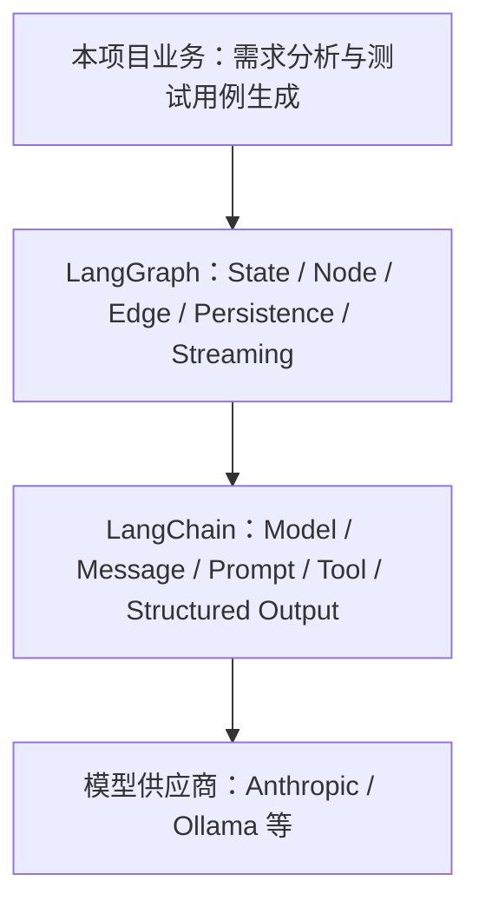
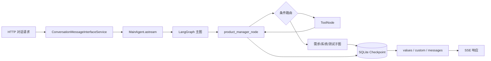

# LangChain 与 LangGraph：从核心概念到项目实践

> 面向团队内部的 45–60 分钟知识分享稿

## 1. 分享目标与阅读地图

完成本次分享后，读者应能够：

- 区分 LangChain 与 LangGraph 的职责；
- 按状态、节点、工具、路由、持久化和流式输出的顺序搭建工作流；
- 沿本项目代码定位一次 Agent（智能体）请求的完整执行过程；
- 根据项目约束初步选择 LangGraph、Dify 及可观测性工具。

### 主持人路线：58 分钟现场版

全文同时承担分享稿和会后手册两种用途，**现场不要逐字朗读**。下面是一条总计 58 分钟的默认路线；“现场讲解”是必须展开的主线，“快速带过”只讲结论，“会后阅读”保留给读者自行查阅。

| 时间 | 章节 | 现场处理 | 必讲内容与取舍 |
| --- | --- | --- | --- |
| 0–3 分钟（3 分钟） | 第 1 章 | **现场讲解** | 说明目标、三层心智模型和本路线，先让听众知道后续代码在回答什么问题。 |
| 3–9 分钟（6 分钟） | 第 2–3 章 | **现场讲解** | 讲清 LangChain 组件层与 LangGraph 编排层的关系；必须展示第 3 章的**框架关系 Mermaid 图**。第 2 章模型调用代码只指出统一接口，不逐行解释。 |
| 9–16 分钟（7 分钟） | 第 4 章 | **快速带过** | 从概念表只选 Chat Model、Tool Calling、Structured Output 三行，现场解释“模型提出调用意图，执行层才运行工具”；完整六行表和教学代码留作**会后阅读**。 |
| 16–26 分钟（10 分钟） | 第 5 章 | **现场讲解** | 必须现场走读 **StateGraph 最小示例**，沿 State → Node → Edge → compile 说明执行骨架，再用 reducer、`ToolNode`、checkpoint 各举一个风险。核心概念大表不逐行读，`Send`、子图、Streaming 的完整条目作为**会后阅读**。 |
| 26–31 分钟（5 分钟） | 第 6 章 | **快速带过** | 用“先契约、后能力、再编排和运行”串起七步流程，只展开 State/reducer、路由退出条件和 `thread_id` 三个检查问题，其余步骤让听众会后按清单复查。 |
| 31–41 分钟（10 分钟） | 第 7 章 | **现场讲解** | 必须展示**请求生命周期 Mermaid 图**，从 HTTP → 服务 → Agent → 主图 → Tool/子图 → checkpoint → 三类流 → SSE 顺序讲解；现场只读 `thread_id` 和 `stream_mode` 两段关键配置，不展开所有节点注册代码。 |
| 41–47 分钟（6 分钟） | 第 8 章 | **现场讲解（选讲）** | 只选四个项目代码模式：8.4 节点/路由分离、8.7 `Send` 与 reducer、8.8 checkpoint/`thread_id`、8.9 Streaming 到 SSE。8.1–8.3、8.5–8.6、8.10 作为**会后阅读**，异常边界的长路径与行号不现场逐项核对。 |
| 47–50 分钟（3 分钟） | 第 9–10 章 | **快速带过** | 第 9 章只讲“按复杂度和组织边界选型”，第 10 章只讲 Trace 层级与数据安全。Dify 对比表、LangSmith/Langfuse 对比表、Trace 层级表及配置代码均不逐行读，作为**会后阅读**。 |
| 50–55 分钟（5 分钟） | 第 11 章 | **现场讲解（选讲）** | 九个误区只展开第 2 项 Tool Call、第 4 项并发 reducer、第 6 项 `thread_id`；其余六项留作**会后阅读**。五层测试现场各用一句话串成“节点 → 路由 → 图 → 输出契约 → 离线评测”，不逐条展开所有样例。 |
| 55–58 分钟（3 分钟） | 第 12–13 章 | 第 12 章**现场讲解**；第 13 章**会后阅读** | 用第 12 章九项启动清单收束并给出团队下一步；明确第 13 章是**纯参考资料，不占现场讲解时间**。 |

这条路线合计 58 分钟。如果现场讨论提前发生，优先压缩标记为“快速带过”的第 4、6、9–10 章，不删两张 Mermaid、StateGraph 最小示例、请求链路和四个项目代码模式。所有密集表格、完整代码块、异常行号及官方链接都服务于会后复查，不应在台上逐行朗读。

### 先记住的三个结论

1. **LangChain 提供 AI（人工智能）应用组件**：模型、消息、Prompt（提示词）、Tool（工具）与结构化输出等能力可被统一组合。
2. **LangGraph 提供有状态编排运行时**：它负责节点、分支、循环、持久化与流式执行。
3. **本项目在 LangGraph 节点中组合 LangChain 组件**：前者控制业务流程，后者完成模型交互和工具能力。

接下来先建立两者的边界，再依次进入核心概念、开发流程和本项目的一次真实请求链路。

## 2. LangChain 是什么

LangChain 是面向模型、消息、Prompt、Tool 和常见 Agent 循环的高层框架与集成层。它把不同模型供应商和常用 AI 应用组件抽象为相对一致的接口，让应用代码更专注于业务规则，而不是逐个适配模型 API（应用程序编程接口）。

可以把它理解为“搭建 AI 能力的组件库”：选择模型、组织消息、编写 Prompt、声明工具和约束结构化结果，通常都在这一层完成。它也提供高层 Agent 能力，用于处理常见的“模型判断—调用工具—继续回答”循环。

**最小示意：** 用统一模型接口发送消息即可把供应商调用留在组件层。

```python
model = init_chat_model(model="your-model", model_provider="your-provider")
reply = model.invoke("请总结这份需求")
```

**项目定位：** `src/graphs/common/llms.py` 用 `init_chat_model` 初始化模型；节点再组合消息、Prompt 与 Tool。**注意：** LangChain 统一了组件接口，但不应把多步业务路由全部塞进一个 Agent；流程控制交给 LangGraph。

官方产品定位可参阅 [LangChain products](https://docs.langchain.com/oss/python/concepts/products)。

## 3. LangGraph 是什么，以及它与 LangChain 的关系

LangGraph 是面向长时运行、有状态、可循环、可分支工作流的低层编排框架和运行时。它把业务流程表达为状态（State）、节点（Node）和边（Edge），并提供持久化、恢复与流式输出等运行能力。

它解决的重点不是“怎样调用一次模型”，而是“复杂任务如何在多步、多分支、可恢复的流程中稳定运行”。例如，需求分析完成后，流程可以进入工具调用、业务子图、人工确认或结束节点，并把每一步状态保存下来。

LangGraph 可以独立使用，但通常会配合 LangChain 的模型与工具抽象。LangChain 的高层 Agent 能力建立在 LangGraph 之上；当我们手写 `StateGraph` 时，则能获得更细粒度的状态、路由和恢复控制。

**最小示意：** 先声明状态，再把处理步骤接成可编译的图。

```python
builder = StateGraph(State)
builder.add_node("product_manager_node", product_manager_node)
graph = builder.compile()
```

**项目定位：** `src/graphs/graph.py` 的 `create_agent()` 创建主 `StateGraph(State)` 并编译。**注意：** 节点只返回自己负责的状态更新；先定义状态契约与合并规则，再增加分支或循环，避免流程变复杂后难以恢复和排查。



该图表示本项目的主要依赖方向，不表示 LangGraph 必须依赖 LangChain。

官方概览可参阅 [LangGraph overview](https://docs.langchain.com/oss/python/langgraph/overview)。

## 4. LangChain 核心概念

这一节把 LangChain 看作节点内部的“能力工具箱”。下表每行都用同一套问题讲解：它是什么、解决什么、最小形态、项目在哪里、使用时防什么坑。先记住：模型负责推理，工具负责执行，状态和流程仍由 LangGraph 管理。

| 概念（是什么） | 解决的问题 | 最小示意 | 本项目位置 | 实践注意 |
| --- | --- | --- | --- | --- |
| Chat Model（聊天模型） | 统一供应商接口，避免节点逐个适配模型 API。 | `init_chat_model(...).invoke(messages)` | `src/graphs/common/llms.py` 初始化 Ollama、MiniMax。 | 固定模型名、超时、重试和温度；不要把供应商参数散落在节点中。 |
| Message（消息） | 让对话角色和工具往返可追踪：`SystemMessage` 是系统规则/角色约束，`HumanMessage` 是用户输入，`AIMessage` 是模型回复（可含 `tool_calls`），`ToolMessage` 是返回给模型的工具执行结果。 | `System → Human → AI(tool_calls) → Tool` | `src/graphs/state.py` 继承 `MessagesState`；`src/graphs/tools.py` 构造 `ToolMessage`。 | 工具结果必须带正确 `tool_call_id`，否则模型无法关联请求与结果。 |
| Prompt（提示词） | 将业务规则、上下文和输入变成可执行指令。 | `system_rule + context + user_input` | 业务节点组合项目状态、指令模板和消息。 | 只放必要且可信的上下文；把稳定规则与易变输入分开。 |
| Tool（工具）与 Tool Calling（工具调用） | 让模型请求真实数据或副作用操作，而非凭空回答。 | `@tool` → `bind_tools([...])` → tool call | `src/graphs/tools.py` 的 `@tool`；主图注册工具节点。 | 模型只提出意图，不会执行函数；参数 schema、权限和幂等性要明确。 |
| Structured Output（结构化输出） | 用 Pydantic 模型或 JSON Schema 约束输出字段，将自然语言答案变为可被下游稳定读取的数据。 | `class Output(BaseModel): next_step: str` | `src/graphs/schemas.py`、`src/graphs/common/utils/structured_output_utils.py`。 | schema 校验失败要有重试/降级；不要把未经校验的文本直接写入状态。 |
| Runnable（可运行组件）与 `RunnableConfig`（运行配置） | 以统一调用方式传递配置、callbacks（回调）、tags（标签）和 metadata（元数据）。 | `runnable.invoke(input, config)` | `src/graphs/nodes.py`、`src/graphs/common/base/nodes.py` 接收 `RunnableConfig`。 | 用 config 传追踪与调用级配置，不要把会话业务数据偷塞进全局变量。 |

**最小示例：** 以下是教学等价代码，不是从项目函数复制；它采用当前项目的导入风格，并显示工具绑定后的模型调用。

**对应源码：** `src/graphs/common/llms.py`、`src/graphs/tools.py`。

```python
from langchain.chat_models import init_chat_model
from langchain.messages import HumanMessage
from langchain.tools import tool

model = init_chat_model(model="your-model", model_provider="your-provider")

@tool
def get_project_progress(project_id: str) -> str:
    """查询项目当前阶段。"""
    return "requirement_outline_design"

response = model.bind_tools([get_project_progress]).invoke(
    [HumanMessage(content="项目下一步做什么？")]
)
```

模型返回 tool call 不等于工具已经执行：它只是 `AIMessage` 中的一项调用请求。本项目用 `ToolNode` 接收该请求、执行函数并写回 `ToolMessage`，由此形成“模型判断—工具执行—模型继续回答”的闭环。

**官方依据：** [LangChain Tools](https://docs.langchain.com/oss/python/langchain/tools)（工具 schema、调用和 `Command`）。

## 5. LangGraph 核心概念

如果说 LangChain 解决“节点里能做什么”，LangGraph 解决的就是“这些节点以什么状态、什么顺序、能否恢复地协作”。仍按“是什么—问题—最小示意—位置—注意”走读，表中的示意用于理解，不代表完整生产实现。

| 概念（是什么） | 解决的问题 | 最小示意 | 本项目位置 | 实践注意 |
| --- | --- | --- | --- | --- |
| State（状态） | 让节点共享受约束的数据契约。 | `{"project_id": "p1"}` | `src/graphs/state.py:State` 保存消息、进度、需求和风险。 | 先定义字段所有权；避免节点直接修改输入状态。 |
| Node（节点） | 将工作拆成可测试的单一职责单元。 | `def node(state): return {"x": 1}` | `product_manager_node` 等业务节点。 | 只返回自己负责的局部更新，副作用要可追踪或幂等。 |
| Edge（边） | 表达确定的先后流转。 | `add_edge("a", "b")` | 主图和子图的 `add_edge`。 | 线性边保持简单；循环必须有退出条件。 |
| Conditional Edge（条件边） | 按状态或路由结果选择下一步。 | `add_conditional_edges("a", route)` | `src/graphs/graph.py` 的多处条件路由。 | 路由应覆盖所有返回值，并显式处理异常或结束分支。 |
| Reducer（归约器） | 合并同一字段的多次或并发更新。 | `Annotated[list[str], add]` | `src/graphs/common/reduce.py` 的重写、去重 reducer。 | 先决定覆盖、追加、去重或拒绝；不要依赖并发写入顺序。 |
| `ToolNode`（工具节点） | 真正执行模型产生的工具调用并回写结果。 | `ToolNode(tools)` | `src/graphs/graph.py` 的 `product_manager_tool_node`。 | 它是执行闭环，不是模型绑定的替代；要处理工具错误和消息键。 |
| `Command`（命令） | 让工具/节点同时返回状态更新和控制信息。 | `Command(update={"x": 1})` | `src/graphs/tools.py` 的确认、重置工具。 | 更新字段仍受 reducer 约束；工具结果应附带 `ToolMessage`。 |
| `Send`（动态分支） | 为运行时发现的并行任务创建分支。 | `Send("review", task_state)` | `src/graphs/common/utils/router_utils.py`；`src/graphs/common/base/routes.py` 也生成评审分支。 | 每个分支输入要最小化；汇合字段必须设计 reducer。 |
| Subgraph（子图） | 封装可复用流程，避免主图膨胀。 | `add_node("sub", subgraph)` | `src/graphs/requirement/*/graph.py`、`src/graphs/system/*/graph.py`。 | 明确父子状态边界，避免把内部临时字段泄漏给父图。 |
| Checkpoint（检查点） | 按 `thread_id` 保存每步快照，以便恢复。 | `compile(checkpointer=saver)` | `src/graphs/graph.py` 编译时传入 SQLite saver。 | `thread_id` 必须稳定且隔离租户；演进 State 时考虑旧快照兼容。 |
| Streaming（流式输出） | 让调用方逐步获得状态、token 或进度，而非等待结束。 | `graph.astream(...)` / writer event | `src/graphs/common/utils/utils.py`、`format_utils.py` 用 `get_stream_writer()`。 | 区分状态、token 和自定义事件；消费者须能处理乱序、断连和重连。 |

**最小图示例：** 以下是教学等价代码，不是从项目函数复制；`notes` 使用 `add` 作为 reducer，表示新笔记会追加而不是覆盖。

**对应源码：** `src/graphs/graph.py`、`src/graphs/state.py`。

```python
from typing import Annotated, TypedDict
from operator import add
from langgraph.graph import StateGraph, START, END

class DemoState(TypedDict):
    topic: str
    notes: Annotated[list[str], add]

def collect_note(state: DemoState) -> dict:
    return {"notes": [f"分析：{state['topic']}"]}

builder = StateGraph(DemoState)
builder.add_node("collect_note", collect_note)
builder.add_edge(START, "collect_note")
builder.add_edge("collect_note", END)
graph = builder.compile()
```

Reducer 对并发写入尤其重要：如果两个由 `Send` 创建的分支都更新列表字段，没有明确合并规则，结果可能发生覆盖、顺序不确定或运行时冲突。状态字段应在设计时明确“覆盖、追加、去重还是拒绝”的语义，而不是把决定留给节点实现细节。

**官方依据：** [LangGraph overview](https://docs.langchain.com/oss/python/langgraph/overview)、[Persistence](https://docs.langchain.com/oss/python/langgraph/persistence)、[Streaming](https://docs.langchain.com/oss/python/langgraph/streaming)。

## 6. LangChain/LangGraph 标准开发流程

下面按“先契约、后能力、再编排和运行”的顺序推进。走读项目时，每一步都应落到明确产物和一个可回答的检查问题上。

1. **定义输入、输出和状态字段。**
   - 产物：输入/输出 schema，以及 State 字段说明和所有权。
   - 检查问题：两个并发节点同时更新此字段时，应覆盖、追加、去重还是拒绝？
2. **确定 reducer，尤其是列表和并发字段。**
   - 产物：每个可更新 State 字段的 reducer 及其边界行为说明。
   - 检查问题：重试、清空和相同 ID 的重复更新会得到可预期结果吗？
3. **初始化模型并设计 Prompt。**
   - 产物：模型配置、系统指令、上下文拼装策略，以及必要的结构化输出 schema。
   - 检查问题：模型不知道的信息是否已被放入 Prompt 或通过 Tool 提供，且输出是否能被下游消费？
4. **编写单一职责节点与 schema 明确的 Tool。**
   - 产物：只读写必要 State 字段的节点，以及参数、返回值和副作用清晰的 `@tool` 函数。
   - 检查问题：模型提出 tool call 后，究竟由哪个 `ToolNode` 执行，失败结果又如何回到模型？
5. **添加固定边、条件路由、循环和子图。**
   - 产物：可读的图拓扑、路由函数与可复用子图边界。
   - 检查问题：每个分支和循环是否都有明确退出条件，异常或人工确认会流向哪里？
6. **选择 Checkpointer，并约定稳定的 `thread_id`。**
   - 产物：持久化实现、线程 ID 生成规则和恢复策略。
   - 检查问题：同一业务会话重试时能否恢复正确快照，不同用户或项目之间会不会串状态？
7. **编译、调用、消费 Streaming，并分层测试。**
   - 产物：已编译图、调用配置、流式事件消费者，以及 reducer/节点/路由/端到端测试。
   - 检查问题：调用方是否正确处理状态更新、消息 token 和自定义进度事件，并能定位失败的节点与 thread？

实际落地时，先以一个线性、可打印 State 的最小图验证第 1–4 步；再逐步加入条件路由、`ToolNode`、`Send`、子图、Checkpoint 和 Streaming。这样每次复杂度增加都有可观察、可回退的基线。

## 7. 本项目：一次请求如何穿过整个 Agent

下面沿一次项目对话请求走读。先分清两层：HTTP 服务层负责把图的事件变成前端能消费的 SSE（Server-Sent Events，服务端推送事件）；LangGraph 图负责状态、决策和执行。这样遇到“为什么前端没有回复”时，可以从 SSE 反向定位到具体图节点。



这是教学视图：Checkpoint 由已编译的图在执行步骤中维护，并不是某个业务节点手动调用。实际主图在开始时还会经过状态修复、项目加载和可选的图片理解节点；图中的子图完成后会进入结束节点。

### 7.1 从服务边界进入图

`ConversationMessageInterfaceService._start_agent()` 接到项目、用户消息和可选文件后，异步遍历 `main_agent.astream(...)` 的流事件。它不参与模型路由：`custom` 进度事件会去重后转发；`values` 和 `messages` 中的 AI 输出才会经过敏感内容过滤。正式会话消息会被持久化，并通过 `queue.put("data: ...\\n\\n")` 写成 SSE 数据帧。

`MainAgent.astream()` 把用户文本包装为 `HumanMessage`，并连同 `project_id` 与可选 `new_file_list` 作为初始 State 交给已编译图。这里的 `project_id` 有两重含义：业务上它定位项目数据；运行时它也作为 LangGraph 的 `thread_id`，把同一项目的每次请求连接到同一份 checkpoint 状态。

**对应项目源码：** `src/agents/main_agent.py:MainAgent.astream` 第 66–71 行；以下是原样保留的关键配置行。

```python
config={"configurable": {"thread_id": project_id}}
stream_mode=["values", "custom", "messages"]
```

因此，`thread_id` 不能随请求随机生成，也必须在多租户场景中避免仅凭可猜测 ID 造成跨租户状态串联。

### 7.2 主图做决策，节点完成工作

首次调用时，`MainAgent.get_agent()` 懒加载 `graph.create_agent()`。后者创建 `StateGraph(State)`、注册状态准备节点、产品经理节点、`ToolNode` 和八个需求/系统/测试业务子图，再以 SQLite saver 编译：

**对应项目源码（节选）：** `src/graphs/graph.py:create_agent` 第 37、77–87、106–107 行。下面的 `[...]` 是对源码中完整目标节点列表的缩写。

```python
agent_builder = StateGraph(State)
agent_builder.add_conditional_edges("product_manager_node", routes.product_manager_tool_router, [...])
agent = agent_builder.compile(checkpointer=sqlite_saver)
```

`product_manager_node` 根据项目进度选择 Prompt，绑定项目工具和通用工具，并通过结构化输出辅助函数调用模型。模型输出的 Tool Call 会让路由进入 `product_manager_tool_node`；`ToolNode` 执行后回到产品经理节点，形成“判断—执行—继续判断”的循环。若没有工具调用，路由会根据 `pm_next_step` 进入需求、系统或测试子图；未知或已完成的步骤会进入 `end_node`。

每个节点返回局部 State 更新，`State` 上的 reducer 决定如何合并这些更新；已编译图则按 `thread_id` 将执行快照写入 SQLite。特别是在 `Send` 并发分支汇合时，不能依赖“最后完成者覆盖前者”，而要依赖明确的 reducer 语义。

### 7.3 从图事件回到浏览器

本项目订阅三种流：`values` 提供状态快照，服务层从最后一条非工具 `AIMessage` 中提取、过滤敏感内容后落库；`custom` 用于节点主动报告“需求理解中”等阶段或通知消息，去重后直接转发，不调用同一敏感输出过滤；`messages` 提供 `AIMessageChunk` token，过滤敏感内容后转换为前端的增量 `STREAM` 消息。三类事件都被包装成 SSE `data:` 帧，前端因而既能显示过程，也能显示逐 token 输出和最终正式消息。

## 8. 本项目中的典型开发模式

这一节不是要求照抄现有实现，而是用“代码位置 / 做法 / 原因 / 注意事项”提炼可复用的设计选择。

### 8.1 模型统一初始化

- **代码位置：** `src/graphs/common/llms.py`。
- **做法：** 集中用 `init_chat_model` 初始化 Ollama 与 MiniMax（Anthropic 兼容）模型，再指定 `default_model`。
- **原因：** 供应商地址、温度、token 上限与重试策略只有一个维护点，节点可以专注业务。
- **注意事项：** 不要在节点内散落模型参数；切换默认模型时应复核工具调用和结构化输出的兼容性。

### 8.2 大状态模型

- **代码位置：** `src/graphs/state.py`。
- **做法：** `State` 继承 `MessagesState`，将项目进度、文档、风险、私有消息等字段声明为带 reducer 的注解字段。
- **原因：** 主图与子图共享一份可检查的业务契约，消息和业务产物可被 checkpoint 一并恢复。
- **注意事项：** 状态大不等于节点都可读写全部字段；新增字段要明确所有者和 reducer，避免子图私有字段泄漏。

### 8.3 主图与八个业务子图

- **代码位置：** `src/graphs/graph.py`。
- **做法：** 主图注册需求大纲、需求模块、整体需求，系统架构、系统模块、数据库、API，以及测试用例共八个子图。
- **原因：** 主图只负责阶段编排，各阶段的优化循环可独立演进和测试。
- **注意事项：** 子图输入输出仍共享 State；改动字段名或阶段枚举时，要同步检查主图路由和恢复中的旧快照。

### 8.4 节点执行与路由分离

- **代码位置：** `src/graphs/nodes.py`、`src/graphs/routes.py`。
- **做法：** 节点调用模型、工具辅助方法或业务服务并返回更新；路由函数只依据 `tool_calls`、`node_rollback`、`pm_next_step` 返回目标节点。
- **原因：** “做什么”和“下一步去哪”可独立测试，增加阶段时不必把分支判断塞入节点。
- **注意事项：** 路由返回值必须与 `add_conditional_edges` 的允许目标一致，并为未知枚举保留结束或错误路径。

### 8.5 Tool Calling 与结构化输出

- **代码位置：** `src/graphs/tools.py`、`src/graphs/common/utils/structured_output_utils.py`。
- **做法：** 用 `@tool` 声明参数 schema；节点 `bind_tools` 后由结构化输出辅助函数识别目标 Tool Call、重试无效输出或将其他 Tool Call 留给 `ToolNode`。
- **原因：** 模型的自然语言决策被约束为可执行参数和稳定的业务结果，同时保留普通工具调用的闭环。
- **注意事项：** Tool Call 是模型意图而非函数已经执行；副作用工具需考虑幂等性、权限和失败后的 `ToolMessage`/回滚状态。

### 8.6 通用优化循环与嵌套子图

- **代码位置：** `src/graphs/common/base/graph.py`。
- **做法：** 抽取初始化、生成方案、评审、优化、PM 评审、成员评审、问题汇总等通用图骨架；成员评审本身又是含 `ToolNode` 的嵌套子图。
- **原因：** 多类文档阶段复用同一“生成—评审—修订”控制流，只替换具体节点、路由和输出工具。
- **注意事项：** 复用基类时明确 `messages_key` 和状态 schema；不要为了复用而让无关阶段继承不需要的状态字段。

### 8.7 `Send` 并发评审与 reducer 汇总

- **代码位置：** `src/graphs/common/base/routes.py`、`src/graphs/common/reduce.py`。
- **做法：** 路由为每个评审角色生成一个动态分支，再以 reducer 合并评审结果。

**对应项目源码：** `src/graphs/common/base/routes.py:AnyOptimizationDocRoutes.pm_review_optimization_doc_tool_router` 第 119–122 行；以下是其中原样的单个 `Send` 表达式。

```python
Send("group_member_review_optimization_doc_node", {"role": role, **state})
```

- **原因：** 角色数量在运行时才确定，`Send` 能以同一子图并发处理各角色输入，缩短等待时间。
- **注意事项：** 分支输入应只包含需要的数据；`distinct_reducer`、优先级消息 reducer 等合并策略必须预先定义，不能假设并发完成顺序。

### 8.8 SQLite Checkpoint 和 `thread_id`

- **代码位置：** `src/graphs/graph.py`、`src/agents/main_agent.py`。
- **做法：** `create_agent()` 用 `AsyncSqliteSaver` 编译图；`astream()` 和 `get_state()` 都把 `project_id` 放入 `configurable.thread_id`。
- **原因：** 同一项目跨消息持续使用 State，并可读取对应执行快照，而不需要在每个节点手工传递历史。
- **注意事项：** SQLite 文件适合当前部署形态；多实例或高并发生产环境应评估共享持久层、迁移和线程/租户隔离策略。

### 8.9 三种 Streaming 模式到 SSE

- **代码位置：** `src/agents/main_agent.py`、`src/services/interface/conversation_message_interface_service.py`。
- **做法：** 图以 `values`、`custom`、`messages` 三种模式流式执行，服务层分别将最终状态回复、阶段消息和 token 块转换为 SSE。
- **原因：** 用户既能看到即时反馈，也能得到可持久化的正式回答；服务层无需理解每个业务节点。
- **注意事项：** `values` 与 `messages` 可能表达同一次回答的不同粒度，服务层要去重；断连、心跳、异常帧和消息落库的一致性应作为接口测试重点。

### 8.10 异常边界

- **代码位置：** `src/graphs/nodes.py:product_manager_node` 第 187–206 行，`src/graphs/common/utils/structured_output_utils.py:llm_tool_structured_output` 第 109–155 行，`src/graphs/graph.py:create_agent` 第 107 行，以及 `src/services/interface/conversation_message_interface_service.py:_start_agent` 第 183–213 行。
- **做法：** 节点记录 `project_id` 等上下文后 await 结构化输出辅助函数；主图将这些节点编译为可执行图。辅助函数记录模型/工具上下文，对网络调用重试，重试耗尽时抛出 `BusinessException`；结构化输出 Tool 调用异常则记录日志并写入 `ToolMessage`，让图继续处理。未被图内处理的异常到达服务边界后由 `_start_agent()` 捕获，持久化“系统繁忙，请稍后再试！”失败消息，写入 SSE `data:` 帧和 `error:` 帧，最后关闭队列。
- **原因：** 这种分层让节点与 Tool 保留诊断上下文，图仍能处理可恢复的 Tool 结果；最终由 HTTP 服务层统一将残余失败转成前端协议与可查询的会话记录。
- **注意事项：** 上述重试与 `ToolMessage` 转换是当前实现，不能把它表述为所有 Tool 都会自动恢复。当前服务层统一捕获异常，尚未在这里按可重试模型错误、业务校验错误和系统错误生成不同前端契约；如需生产级分类，应另行定义错误类型、重试上限、告警和 SSE 错误 schema。

## 9. LangChain/LangGraph 与 Dify：开发模式对比

LangChain/LangGraph 和 Dify 不只是“谁更强”的关系，而是两种不同的开发入口：前者以代码和可组合运行时为中心，后者以应用与工作流画布为中心。Dify 的官方快速开始展示了在 Studio 中创建 Workflow、配置输入与节点、测试并发布的路径；发布后的应用也可以从后端以 REST API 调用。LangGraph 则让团队在代码中直接定义 State、节点和条件路由。两种方式都能编排 LLM、工具和流程，差异主要在控制面和工程边界。

| 维度 | LangChain/LangGraph | Dify |
| --- | --- | --- |
| 定位 | LangChain 提供模型、Prompt、Tool 等组件；LangGraph 提供代码优先的有状态流程编排运行时。 | 面向 AI 应用的可视化工作流与应用平台；可用节点、变量和工作流组织应用。 |
| 主要开发界面 | IDE、代码仓库、测试框架和代码审查。 | Studio 中的应用配置与 Workflow 画布；应用发布后可通过 API 从后端调用。 |
| 状态与流程控制粒度 | 可显式定义 State、reducer、条件边、循环、并发 `Send`、子图和 checkpoint。 | 以画布节点、变量、分支、迭代等平台能力组织流程；适合将常规步骤直接可视化。 |
| 自定义业务代码集成 | 可直接调用领域服务、数据库和内部 SDK，并将业务异常、权限与幂等策略纳入代码。 | 可通过 Code 节点、插件/Tool 或外部服务扩展自定义逻辑；其运行时约束、测试和版本治理方式与仓库原生 Python 代码不同。 |
| 测试与版本管理 | 可沿用单元、集成、端到端测试以及 Git 分支、审查和发布流程。 | 可在画布中 Test Run、检查节点运行日志并发布更新；对于 Code 节点、插件和外部服务，仍应分别定义可重复测试、版本审查和发布规范。 |
| 部署和平台能力 | 团队负责把图运行时、持久化、鉴权、监控和服务接口集成到自身部署体系。 | 提供应用创建、发布与 REST API 调用入口；可按组织的部署与治理要求评估其平台能力。 |
| 适合团队与场景 | 复杂状态、动态路由、并发归并、深度业务集成，以及希望把工程控制留在代码仓库的团队。 | 标准化流程、快速验证，以及产品和开发需要共同在画布上编排应用的团队。 |

### 9.1 选型结论：按流程复杂度和组织边界决定

- **标准化流程、快速验证、产品和开发共同编排：** 优先评估 Dify。画布能让输入、节点、分支和输出直接成为共同讨论对象，适合先验证应用流程。
- **复杂状态、动态路由、并发归并、深度业务集成：** 优先评估 LangGraph。本项目的 reducer、`Send` 并发评审、业务子图和 SQLite checkpoint 就属于需要细粒度代码控制的例子。
- **已有 Dify 平台、但局部流程复杂：** 可以采用组合方式：由 Dify 承担应用入口或标准流程，并通过 API 调用独立部署的 LangGraph 服务；服务契约、鉴权、超时和错误映射需要双方明确约定。

这只是初步判断，不替代安全、部署、数据合规、团队技能和已有平台成本的评估。Dify 的画布能力不意味着无法接入复杂服务，LangGraph 的代码灵活性也不意味着每个流程都应自行实现。

**官方资料：** [Dify 30-Minute Quick Start](https://docs.dify.ai/en/guides/application-orchestrate/creating-an-application)（工作流创建、节点配置、测试与发布）、[Dify API guide](https://docs.dify.ai/api-reference/workflows/list-workflow-logs)（已发布应用的 API 调用边界）、[Dify Plugin](https://docs.dify.ai/en/develop-plugin/getting-started/getting-started-dify-plugin)（自定义函数、Tool 和外部服务扩展）。

## 10. LLM 应用可观测性：LangSmith 与 Langfuse

日志告诉我们“发生了什么”；LLM 可观测性进一步把一次请求的因果路径组织起来，使排障和质量改进不必只靠零散日志推断。一个实用的心智模型如下：

- **Trace：** 一次完整的用户请求或 Agent run，例如一次 `MainAgent.astream()` 调用。
- **Run / Span / Observation：** Trace 中的单步操作，例如模型调用、Tool 调用、检索、业务节点或 SSE 输出。LangSmith 使用 Run，并将其类比为 span；Langfuse 使用 Observation。本文用“子 Span”泛指这些可嵌套的步骤。
- **Thread / Session：** 多轮会话的关联键：每一轮通常是独立 Trace，但通过同一键连接。在本项目中可使用 `thread_id = project_id` 作为会话关联的起点；生产多租户场景还应加入不可冲突的租户边界。

一套可用的可观测性方案至少应能回答：请求走过哪些节点和路由、每步的输入输出是什么、耗时和首 token 延迟如何、消耗了多少 Token 与成本、哪些 Tool 或模型调用失败、以及结果是否获得人工或自动质量评分。Trace 并不是替代业务日志，而是把请求生命周期中的业务、模型与工具证据关联起来。

### 10.1 LangSmith 与 Langfuse：入门对比

| 维度 | LangSmith | Langfuse |
| --- | --- | --- |
| 生态集成 | 与 LangChain/LangGraph 生态紧密集成；官方说明支持的框架可自动记录输入、输出和 metadata。 | 面向 LLM 应用追踪；可按其 SDK 与集成方案接入，追踪模型、工具、检索和自定义逻辑。 |
| 自动追踪 | 对受支持框架可使用自动追踪；需要更细控制时也可使用装饰器、上下文管理器或低层 API。 | 通常通过 SDK、Callback 或 OpenTelemetry（OTel）集成传递追踪数据；具体接入方式以当期官方集成页为准。 |
| 开源 / 自托管选项 | 提供自托管部署，并需要商业许可；团队应以官方文档确认当前许可、部署要求与自身网络/合规边界。 | 开源且可自托管；部分附加功能可能需要许可证，仍需评估自身运维、升级和数据治理能力。 |
| Prompt 管理 | 可结合其 Prompt 工具与追踪、评测流程管理 Prompt 变更。 | 提供 Prompt Management，并可将 Prompt 与追踪、评测工作流关联。 |
| 数据集与评测 | 可用数据集、离线/在线评测和反馈衡量质量；离线评测面向样例，在线评测面向生产 runs/threads。 | 可用数据集、实验、在线 trace 评测和 Scores；评分可来自人工、代码、LLM judge 或终端用户反馈。 |
| 成本与指标分析 | Trace / Run 可承载模型输入输出与 metadata，并支持观测和质量分析；应先验证当前模型的 Token 与成本归集方式。 | Trace / Observation 可记录 Token、延迟、成本、输入输出与工具/检索步骤，并支持指标分析。 |

两者都适合作为“从一次请求找到一次模型/工具执行”的入口。选择时可先问：团队是否希望优先使用 LangChain/LangGraph 的自动追踪，是否需要自托管，以及评测、Prompt 治理和现有监控体系如何衔接；不要把价格或单一产品标签当作结论。

**LangSmith 最小配置示意（仅说明，不代表本项目已配置）：**

```bash
export LANGSMITH_TRACING=true
export LANGSMITH_PROJECT="ai-case-generator-demo"
# LANGSMITH_API_KEY 由部署环境的密钥管理服务注入，不写入仓库。
```

LangSmith 的 Trace 由单次操作的多个 Run 构成，并可借助 `thread_id` 或 `session_id` 把多轮 Trace 串为 Thread。Langfuse 将 Trace、Session 与 Observation 作为核心追踪概念，并将追踪、评测、Prompt 管理和指标能力放在同一 LLM 工程工作流中。

**官方资料：** [LangSmith observability concepts](https://docs.langchain.com/langsmith/observability-concepts)、[LangSmith evaluation concepts](https://docs.langchain.com/langsmith/evaluation-concepts)、[Self-hosted LangSmith](https://docs.langchain.com/langsmith/self-hosted)、[Langfuse observability overview](https://langfuse.com/docs/observability/overview)、[Langfuse evaluation core concepts](https://langfuse.com/docs/evaluation/core-concepts)、[Self-host Langfuse](https://langfuse.com/docs/deployment/self-host)。

### 10.2 本项目：当前日志基础与建议的 Trace 层级

在本仓库直接声明的依赖中，未发现 Langfuse 或 OTel 包；对当前 `src/` 和配置的检查也未发现已启用的追踪后端配置或业务集成。实际的传递依赖仍取决于部署环境和完整依赖树。项目已有 `trans_id_ctx`、`project.id` 和服务层日志，并在 `_start_agent()` 中把 `values`、`custom`、`messages` 三类图事件转换为 SSE。下表是未来接入设计，不是对当前代码行为的描述。

| 层级或主题 | 当前基础 | 推荐 Trace 层级 / 关联字段 |
| --- | --- | --- |
| 根 Trace | `_start_agent()` 调用 `MainAgent.astream()`，并有项目 ID 与事务 ID 日志上下文。 | 一次 `_start_agent()` 或 `MainAgent.astream()` 作为一个根 Trace；记录 `project_id`、事务 ID、环境、模型名和业务阶段。 |
| 会话关联 | 图调用配置 `configurable.thread_id = project_id`。 | 以 `thread_id = project_id` 关联多轮 Trace；多租户场景同时记录受控的 tenant / user 关联字段，避免跨租户串联。 |
| 图与业务节点 | 主图调度业务子图、条件路由、并发评审与 checkpoint。 | 为主图、每个业务子图、关键节点和路由创建子 Span；记录节点名、路由目标、路由次数、循环次数和结果状态。 |
| 模型与 Tool | 节点通过 LangChain 模型和 `ToolNode` 执行模型/工具步骤。 | 为每次模型调用和 Tool 调用创建子 Span；记录模型名、Token/成本、耗时、重试次数、Tool 名、错误类别与结果摘要。 |
| 流式输出 | 服务层消费 `values`、`custom`、`messages` 并输出 SSE。 | 为 SSE 输出建立子 Span 或事件；记录首 token 延迟、token 流持续时间、事件类型、断连和发送错误。 |
| 核心指标 | 现有日志可用于定位请求和发送事件。 | 汇总端到端耗时、节点耗时、模型 Token/成本、Tool 错误率、路由次数、循环次数和首 token 延迟；再按环境、模型、业务阶段筛选。 |

推荐按“小步、可验证”接入：先为根 Trace、模型调用和 Tool 调用建立关联；确认数据字段、采样与查询满足排障需求后，再补齐子图、路由、SSE 和质量评分。对于质量评分，可先从少量脱敏后的代表性样例开始建立数据集，再分别使用离线回归和线上抽样观察，不应把单次主观评分当作结论。

### 10.3 数据安全与保留边界

可观测性数据可能包含 Prompt、模型输出、检索片段、文件摘要、项目/事务标识和业务字段。接入前必须定义：哪些字段需要**脱敏**或不记录；密钥、Authorization 头、上传文件原文和敏感业务字段绝不进入 Trace；谁可以查看输入输出；生产流量采用何种采样；以及 Trace、评分和数据集各自的保留周期与删除流程。也应把外部可观测性平台的地域、访问控制和数据处理要求纳入上线评审。

本稿不修改 `src/`、依赖或配置，只提供上述接入设计思路；实施前应先完成数据分类、密钥管理、权限模型和最小化采集评审。

## 11. 常见误区与工程实践

前面的概念和代码最终要落到日常开发中。这里不再增加新的框架名词，而是集中回答最容易让图“能运行、却难维护”的问题。分享时可以把这一节当作复盘：每条误区都对应一个设计动作，也对应一种应该提前写下来的测试。

### 11.1 九个高频误区

1. **把 LangChain 与 LangGraph 当作简单替代关系。** 两者关注的层次不同：LangChain 提供模型、消息、Prompt、Tool 和结构化输出等组件，LangGraph 提供 State、节点、边、持久化和流式执行。本项目正是在 LangGraph 节点中使用 LangChain 组件。选型时应问“是否需要显式状态和流程控制”，而不是问“两个框架只能留哪一个”。

2. **把 Tool Call 当成工具执行结果。** 模型返回的 `AIMessage.tool_calls` 只是调用意图，包含工具名和候选参数；只有 `ToolNode` 或应用代码实际调用函数后，才产生工具结果。本项目在 `src/graphs/graph.py` 注册 `product_manager_tool_node`，工具实现在 `src/graphs/tools.py`。涉及数据库写入、外部请求或文件操作时，还要在执行层处理参数校验、权限、超时、幂等和异常，不能因为模型“选择了工具”就认为操作已经成功。

3. **在节点中随意原地修改共享状态。** LangGraph 节点更适合把输入 State 当作只读快照，并返回自己负责的局部更新，例如 `return {"pm_next_step": next_step}`。随后由 State schema 上的 reducer 合并更新。原地修改会模糊字段所有者，也让并发、重试和 checkpoint 恢复时的行为更难推断。本项目的状态契约位于 `src/graphs/state.py`；新增节点前，应先写清它读取哪些字段、更新哪些字段以及空值语义。

4. **并发字段没有明确 reducer。** `Send` 创建的多个分支可能以不同顺序完成；如果多个分支写入同一字段，必须明确是覆盖、追加、去重、按优先级合并，还是应当拒绝冲突。本项目在 `src/graphs/common/reduce.py` 提供 `rewrite_reducer`、`distinct_reducer` 和 `priority_message_reducer`。选择 reducer 不是语法补丁，而是在定义业务冲突规则；测试也不应依赖某个固定完成顺序。

5. **把 `Command.goto` 当成任意父图回滚机制。** `goto` 表达的是当前命令可作用图上下文中的控制转移，目标仍必须符合图的节点与作用域约束；嵌套图中需要显式理解命令由哪个图处理，不能假定它会自动穿过任意层级并恢复父图的历史状态。真正的“回滚”还涉及业务数据补偿、checkpoint 选择和副作用撤销，不能只靠跳转节点完成。本项目已按 `doc/optimize_list.md` 移除把 `Command.goto` 用作回滚的方案；当前 `src/graphs/tools.py` 主要通过 `Command(update=...)` 返回状态更新。

6. **使用不稳定或未隔离的 `thread_id`。** Checkpoint 依靠 `thread_id` 找到同一执行线程的快照。键在多轮中变化，会让上下文看似“丢失”；不同用户或租户复用同一个键，则可能串联不应共享的状态。本项目在 `src/agents/main_agent.py` 使用 `project_id` 作为 `thread_id`，适合当前项目级会话模型；若扩展到多租户、多环境或同项目并行会话，应设计包含租户和会话边界且不泄露敏感信息的稳定键，并验证清理与迁移策略。

7. **把节点执行与路由决策混在一起。** 节点负责调用模型、工具或业务服务并形成状态更新；路由负责根据已有状态选择下一节点。本项目分别放在 `src/graphs/nodes.py` 与 `src/graphs/routes.py`。分离之后，节点可以用固定 State 单测，路由可以用状态表参数化测试，新增分支也不必改动模型调用逻辑。若路由所需信号尚不存在，应让节点先产出一个明确字段，而不是让路由再次执行昂贵或有副作用的业务操作。

8. **认为 Structured Output 有 schema 就不会出错。** 模型仍可能遗漏字段、给出非法枚举、生成无法解析的参数，或产生语法正确但业务无效的数据。`src/graphs/common/utils/structured_output_utils.py` 已包含识别结构化 Tool Call、重试和错误转化逻辑，但调用方仍需验证 Pydantic/JSON Schema、跨字段业务规则和下游约束，并为重试耗尽、模型不支持与 schema 演进准备错误路径。结构化输出提高的是可验证性，不是无条件正确率。

9. **把 Streaming 理解成单一的“逐字输出”。** 本项目的 `values` 是状态快照，`messages` 是消息块/token 流，`custom` 是节点主动发出的自定义事件；`src/services/interface/conversation_message_interface_service.py` 对三类事件采用不同处理。消费端必须按语义去重、持久化和展示，不能把状态更新当 token，也不能默认 custom 事件经过与正式回答完全相同的过滤链。接口测试还应覆盖首 token、最终消息、断连、异常帧和重复事件。

### 11.2 把规则落实为五层测试

测试重点不是复现模型每个字，而是固定应用能够控制的契约。建议由内向外形成五层防线：越靠内越快、越确定，越靠外越接近真实执行。

1. **节点单元测试。** 为单个节点构造最小 State，替换模型、Tool 或领域服务，断言它读取约定字段并只返回预期的局部更新。至少覆盖成功、空输入、下游异常和重试耗尽；对于有消息输出的节点，还要验证消息类型、metadata 和工具调用关联键。

2. **路由参数化测试。** 把 `tool_calls`、`node_rollback`、`pm_next_step` 等条件整理成输入—目标节点表，对 `src/graphs/routes.py` 的路由逐行参数化。测试正常分支、结束分支、未知枚举和冲突信号，确保返回值始终属于 `add_conditional_edges` 声明的目标集合。路由应保持纯函数，测试中不调用真实模型或数据库。

3. **图级集成测试。** 使用可控的模型和工具替身编译小图或完整图，验证分支、循环、`ToolNode` 往返、`Send` 汇合、结束条件与 checkpoint 恢复。对并发场景改变完成顺序，确认 reducer 结果不依赖调度；对持久化场景使用互不相同的 `thread_id`，确认状态不会串线。

4. **结构化输出契约测试。** 用合法、缺字段、非法枚举、额外字段和业务冲突样例验证 schema 与错误处理；若 schema 会被 API、数据库或其他节点消费，还应加入版本兼容样例。模型替身应能返回错误 Tool Call，借此证明重试、降级或失败消息确实可达，而不是只测试理想 JSON。

5. **离线评测。** 从脱敏的代表性任务建立版本化数据集，分别评估任务完成度、事实性、格式合规、工具选择、路由正确性和安全要求。Prompt、模型或图结构变更时跑同一数据集，比较基线与候选版本；对开放式答案使用明确 rubric，并抽样人工复核 LLM judge。离线评测负责发现质量回归，但不能替代单测、线上监控或发布后的反馈闭环。

实际落地可以从一条“纵向样例”开始：固定一次用户输入，先验证产品经理节点的局部更新，再验证路由进入预期子图，然后验证图能结束且 checkpoint 可读取，最后把同一输入加入离线数据集。这样每增加一个业务阶段，团队都能沿同一层次补齐证据，而不是只在浏览器里手工对话一次。

### 11.3 代码评审时问什么

当变更涉及新的节点、工具或状态字段时，评审者可以顺着四个问题检查：字段由谁拥有、更新怎样合并、失败后停在哪里、外部如何观察。若答案分别能落到 State/reducer、节点返回值、路由/错误边界和 Trace/SSE 事件上，这个流程通常已经具备可维护的骨架。反之，如果主要解释是“模型应该会处理”，就说明仍有应用层契约需要补上。

## 12. 总结：团队开发时先做哪几件事

回到开头的一句话：LangChain 让节点拥有模型与工具能力，LangGraph 让这些节点按受约束的状态和流程协作。创建一个新的 LangGraph 项目时，不必先堆很多 Agent；先完成下面这份启动清单，团队就能用同一种语言讨论实现、测试和上线边界。

1. **写清业务终点与失败终点：** 定义一次运行何时算完成、何时等待输入、何时失败，以及哪些副作用需要补偿。
2. **先设计 State：** 为每个字段注明类型、所有者、敏感级别、默认值和 reducer；区分跨节点共享状态与节点内部临时数据。
3. **划分单一职责节点：** 让模型推理、工具执行、领域服务调用和结果整理各有清晰边界，节点只返回局部状态更新。
4. **定义 Tool 与结构化契约：** 收紧参数 schema，验证业务规则，并补齐权限、幂等、超时、重试和错误结果；牢记 Tool Call 只是意图。
5. **把路由写成可枚举决策：** 节点产出路由信号，纯路由函数选择下一步；显式覆盖未知值、循环上限和 `END`。
6. **再加入并发、子图和 reducer：** 只有确认字段合并语义后才使用 `Send`；子图边界要说明输入、输出和命令作用域。
7. **确定 checkpoint 身份与生命周期：** 设计稳定、隔离的 `thread_id`，并提前考虑存储选型、旧 State 兼容、清理与恢复流程。
8. **定义流事件与可观测性：** 区分状态、消息 token 和自定义事件；关联 trace、节点、模型、工具、`thread_id` 与业务事务，同时执行脱敏和最小化采集。
9. **按五层测试后再发布：** 依次建立节点单测、路由参数化、图级集成、结构化输出契约和离线评测，并把关键质量指标带入线上反馈。

如果时间有限，至少先完成 State、路由表和一条图级纵向测试。它们会迫使团队明确“数据是什么、下一步去哪、流程能否结束”，也为后续替换模型、增加 Tool 或引入可观测性保留稳定边界。

## 13. 官方延伸阅读

下面按主题列出会后查阅入口。官方文档会持续演进，实施时应结合仓库锁定的依赖版本核对 API；本稿中的项目行为仍以当前源码为准。

### LangChain

- [LangChain 产品与框架关系](https://docs.langchain.com/oss/python/concepts/products)：建立 LangChain、LangGraph 与相关产品的整体视图。
- [LangChain Tools](https://docs.langchain.com/oss/python/langchain/tools)：Tool schema、Tool Calling、运行时上下文与状态更新。

### LangGraph

- [LangGraph Overview](https://docs.langchain.com/oss/python/langgraph/overview)：State、节点、边与图运行时总览。
- [LangGraph Persistence](https://docs.langchain.com/oss/python/langgraph/persistence)：checkpoint、thread 与持久化语义。
- [LangGraph Streaming](https://docs.langchain.com/oss/python/langgraph/streaming)：不同流模式及其消费方式。

### Dify

- [Dify：创建应用与 Workflow](https://docs.dify.ai/en/guides/application-orchestrate/creating-an-application)：从 Studio 创建、测试和发布应用的官方入口。

### LangSmith

- [LangSmith Observability Concepts](https://docs.langchain.com/langsmith/observability-concepts)：Trace、Run、Thread 与追踪数据模型。
- [LangSmith Evaluation Concepts](https://docs.langchain.com/langsmith/evaluation-concepts)：数据集、离线评测、在线评测与反馈。

### Langfuse

- [Langfuse Observability Overview](https://langfuse.com/docs/observability/overview)：Trace、Session、Observation 与 LLM 可观测性概览。
- [Langfuse Evaluation Core Concepts](https://langfuse.com/docs/evaluation/core-concepts)：Scores、数据集、实验与评测工作流。

最后的建议不是“把所有能力一次接齐”，而是让每个新增复杂度都有明确理由和验证方式：先把状态与流程做对，再逐步增加工具、并发、持久化、流式体验和评测。这样框架才能服务业务，而不是让业务迁就框架。
