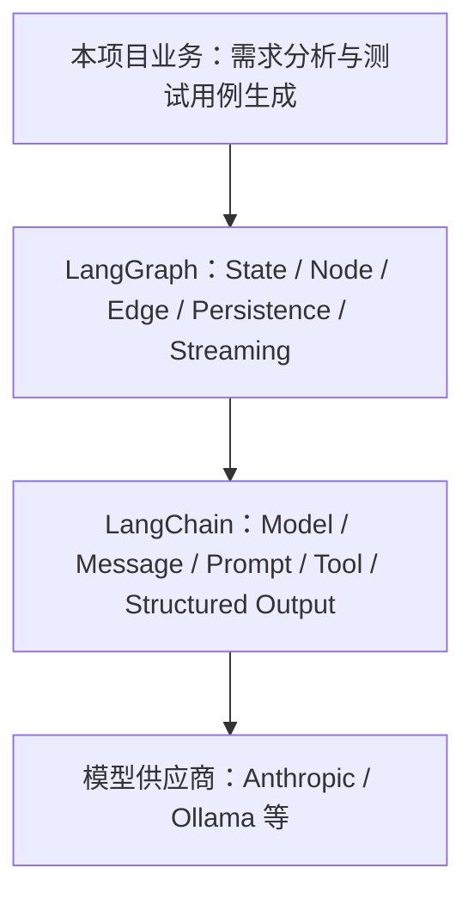

# LangChain 与 LangGraph：从核心概念到项目实践

> 面向团队内部的 45–60 分钟知识分享稿

## 1. 分享目标与阅读地图

完成本次分享后，读者应能够：

- 区分 LangChain 与 LangGraph 的职责；
- 按状态、节点、工具、路由、持久化和流式输出的顺序搭建工作流；
- 沿本项目代码定位一次 Agent 请求的完整执行过程；
- 根据项目约束初步选择 LangGraph、Dify 及可观测性工具。

### 时间分配

- 基础概念与框架关系：约 15 分钟；
- LangGraph 开发模式：约 15 分钟；
- 本项目代码走读：约 20 分钟；
- 对比、可观测性与讨论：约 5–10 分钟。

### 先记住的三个结论

1. **LangChain 提供 AI 应用组件**：模型、消息、Prompt、Tool 与结构化输出等能力可被统一组合。
2. **LangGraph 提供有状态编排运行时**：它负责节点、分支、循环、持久化与流式执行。
3. **本项目在 LangGraph 节点中组合 LangChain 组件**：前者控制业务流程，后者完成模型交互和工具能力。

接下来先建立两者的边界，再依次进入核心概念、开发流程和本项目的一次真实请求链路。

## 2. LangChain 是什么

LangChain 是面向模型、消息、Prompt、Tool 和常见 Agent 循环的高层框架与集成层。它把不同模型供应商和常用 AI 应用组件抽象为相对一致的接口，让应用代码更专注于业务规则，而不是逐个适配模型 API。

可以把它理解为“搭建 AI 能力的组件库”：选择模型、组织消息、编写 Prompt、声明工具和约束结构化结果，通常都在这一层完成。它也提供高层 Agent 能力，用于处理常见的“模型判断—调用工具—继续回答”循环。

官方产品定位可参阅 [LangChain products](https://docs.langchain.com/oss/python/concepts/products)。

## 3. LangGraph 是什么，以及它与 LangChain 的关系

LangGraph 是面向长时运行、有状态、可循环、可分支工作流的低层编排框架和运行时。它把业务流程表达为状态（State）、节点（Node）和边（Edge），并提供持久化、恢复与流式输出等运行能力。

它解决的重点不是“怎样调用一次模型”，而是“复杂任务如何在多步、多分支、可恢复的流程中稳定运行”。例如，需求分析完成后，流程可以进入工具调用、业务子图、人工确认或结束节点，并把每一步状态保存下来。

LangGraph 可以独立使用，但通常会配合 LangChain 的模型与工具抽象。LangChain 的高层 Agent 能力建立在 LangGraph 之上；当我们手写 `StateGraph` 时，则能获得更细粒度的状态、路由和恢复控制。

该图表示本项目的主要依赖方向，不表示 LangGraph 必须依赖 LangChain。

官方概览可参阅 [LangGraph overview](https://docs.langchain.com/oss/python/langgraph/overview)。
