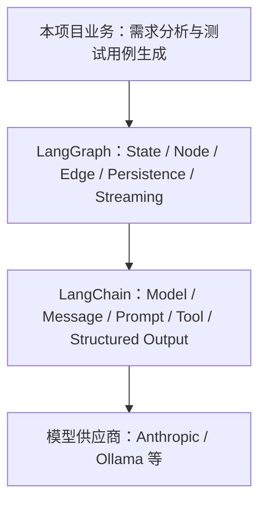

# LangChain 与 LangGraph：从核心概念到项目实践

> 面向团队内部的 45–60 分钟知识分享稿

## 1. 分享目标与阅读地图

完成本次分享后，读者应能够：

- 区分 LangChain 与 LangGraph 的职责；
- 按状态、节点、工具、路由、持久化和流式输出的顺序搭建工作流；
- 沿本项目代码定位一次 Agent（智能体）请求的完整执行过程；
- 根据项目约束初步选择 LangGraph、Dify 及可观测性工具。

### 时间分配

- 基础概念与框架关系：约 15 分钟；
- LangGraph 开发模式：约 15 分钟；
- 本项目代码走读：约 20 分钟；
- 对比、可观测性与讨论：约 5–10 分钟。

### 先记住的三个结论

1. **LangChain 提供 AI（人工智能）应用组件**：模型、消息、Prompt（提示词）、Tool（工具）与结构化输出等能力可被统一组合。
2. **LangGraph 提供有状态编排运行时**：它负责节点、分支、循环、持久化与流式执行。
3. **本项目在 LangGraph 节点中组合 LangChain 组件**：前者控制业务流程，后者完成模型交互和工具能力。

接下来先建立两者的边界，再依次进入核心概念、开发流程和本项目的一次真实请求链路。

## 2. LangChain 是什么

LangChain 是面向模型、消息、Prompt、Tool 和常见 Agent 循环的高层框架与集成层。它把不同模型供应商和常用 AI 应用组件抽象为相对一致的接口，让应用代码更专注于业务规则，而不是逐个适配模型 API（应用程序编程接口）。

可以把它理解为“搭建 AI 能力的组件库”：选择模型、组织消息、编写 Prompt、声明工具和约束结构化结果，通常都在这一层完成。它也提供高层 Agent 能力，用于处理常见的“模型判断—调用工具—继续回答”循环。

**最小示意：** 用统一模型接口发送消息即可把供应商调用留在组件层。

```python
model = init_chat_model(model="your-model", model_provider="your-provider")
reply = model.invoke("请总结这份需求")
```

**项目定位：** `src/graphs/common/llms.py` 用 `init_chat_model` 初始化模型；节点再组合消息、Prompt 与 Tool。**注意：** LangChain 统一了组件接口，但不应把多步业务路由全部塞进一个 Agent；流程控制交给 LangGraph。

官方产品定位可参阅 [LangChain products](https://docs.langchain.com/oss/python/concepts/products)。

## 3. LangGraph 是什么，以及它与 LangChain 的关系

LangGraph 是面向长时运行、有状态、可循环、可分支工作流的低层编排框架和运行时。它把业务流程表达为状态（State）、节点（Node）和边（Edge），并提供持久化、恢复与流式输出等运行能力。

它解决的重点不是“怎样调用一次模型”，而是“复杂任务如何在多步、多分支、可恢复的流程中稳定运行”。例如，需求分析完成后，流程可以进入工具调用、业务子图、人工确认或结束节点，并把每一步状态保存下来。

LangGraph 可以独立使用，但通常会配合 LangChain 的模型与工具抽象。LangChain 的高层 Agent 能力建立在 LangGraph 之上；当我们手写 `StateGraph` 时，则能获得更细粒度的状态、路由和恢复控制。

**最小示意：** 先声明状态，再把处理步骤接成可编译的图。

```python
builder = StateGraph(State)
builder.add_node("product_manager_node", product_manager_node)
graph = builder.compile()
```

**项目定位：** `src/graphs/graph.py` 的 `create_agent()` 创建主 `StateGraph(State)` 并编译。**注意：** 节点只返回自己负责的状态更新；先定义状态契约与合并规则，再增加分支或循环，避免流程变复杂后难以恢复和排查。



该图表示本项目的主要依赖方向，不表示 LangGraph 必须依赖 LangChain。

官方概览可参阅 [LangGraph overview](https://docs.langchain.com/oss/python/langgraph/overview)。

## 4. LangChain 核心概念

这一节把 LangChain 看作节点内部的“能力工具箱”。先记住：模型负责推理，工具负责执行，状态和流程仍由 LangGraph 管理。

| 概念 | 职责 | 本项目位置 |
| --- | --- | --- |
| Chat Model | 统一不同模型供应商的调用接口，接收消息并生成回复或工具调用意图。 | `src/graphs/common/llms.py` 使用 `init_chat_model` 初始化 Ollama、MiniMax 等模型。 |
| Message | 用带角色的对象保存对话：`SystemMessage` 规定系统规则，`HumanMessage` 表示用户输入，`AIMessage` 保存模型回复，`ToolMessage` 保存工具执行结果。 | `src/graphs/state.py` 继承 `MessagesState`；`src/graphs/tools.py` 在工具返回中构造 `ToolMessage`。 |
| Prompt | 把业务规则、检索到的上下文和当前输入组织为模型可执行的指令。 | 各业务节点在调用模型前组合项目状态、指令模板和消息。 |
| Tool 与 Tool Calling | 用函数及其 schema 声明可用能力；模型只产生“想调用哪个工具、传什么参数”的意图，执行器才真正运行函数。 | `src/graphs/tools.py` 以 `@tool` 声明工具；主图注册工具节点。 |
| Structured Output | 用 Pydantic 模型或 schema 约束输出字段、类型和格式，让结果可被程序稳定消费。 | `src/graphs/schemas.py` 与 `src/graphs/common/utils/structured_output_utils.py` 定义并处理结构化结果。 |
| Runnable 与 `RunnableConfig` | 将模型、Prompt、工具等统一为可调用组件；`RunnableConfig` 是传递调用配置、callbacks、tags 和 metadata 的入口。 | `src/graphs/nodes.py`、`src/graphs/common/base/nodes.py` 的节点参数接收 `RunnableConfig`。 |

**最小示例：** 这里刻意采用本项目当前的导入风格。把工具绑定给模型后，模型才知道自己可以查询项目进度。

```python
from langchain.chat_models import init_chat_model
from langchain.messages import HumanMessage
from langchain.tools import tool

model = init_chat_model(model="your-model", model_provider="your-provider")

@tool
def get_project_progress(project_id: str) -> str:
    """查询项目当前阶段。"""
    return "requirement_outline_design"

response = model.bind_tools([get_project_progress]).invoke(
    [HumanMessage(content="项目下一步做什么？")]
)
```

模型返回 tool call 不等于工具已经执行：它只是 `AIMessage` 中的一项调用请求。本项目用 `ToolNode` 接收该请求、执行函数并写回 `ToolMessage`，由此形成“模型判断—工具执行—模型继续回答”的闭环。

## 5. LangGraph 核心概念

如果说 LangChain 解决“节点里能做什么”，LangGraph 解决的就是“这些节点以什么状态、什么顺序、能否恢复地协作”。下面的概念可以直接对照项目走读。

| 概念 | 含义与本项目映射 |
| --- | --- |
| State | 图内共享的数据契约。项目的 `src/graphs/state.py:State` 保存消息、项目进度、需求、风险等字段。 |
| Node | 读取当前状态、完成单一职责工作并返回局部更新的执行单元；例如 `product_manager_node`。 |
| Edge | 固定流转关系；主图中的 `add_edge` 将确定的后继节点连接起来。 |
| Conditional Edge | 根据当前状态或路由函数选择下一节点；项目使用 `add_conditional_edges` 处理下一步、工具调用和业务分支。 |
| Reducer | 同一 State 字段多次收到更新时的合并规则。项目的 `rewrite_reducer` 覆盖旧值，`distinct_reducer` 支持去重追加和清空。 |
| `ToolNode` | 读取模型产生的工具调用、执行对应 `@tool` 函数，并把结果写回消息状态。主图的 `product_manager_tool_node` 即为此类节点。 |
| `Command` | 工具或节点返回的状态更新载体，也可以表达控制指令。`src/graphs/tools.py` 的确认、重置等工具通过 `Command(update=...)` 同时更新业务字段和工具消息。 |
| `Send` | 为并行任务动态创建分支，每个分支带自己的状态输入。项目路由会为每个待评审角色生成一个 `Send`。 |
| Subgraph | 将可复用的流程编译为节点后嵌入父图。项目把需求、架构、数据库、API、测试用例等流程拆为子图。 |
| Checkpoint | 按 `thread_id` 保存每一步状态快照，支持中断后恢复；主图编译时传入 SQLite checkpointer。 |
| Streaming | 在运行过程中逐步消费状态更新、消息 token 或自定义进度事件。项目通过 `get_stream_writer()` 写出自定义进度消息。 |

**最小图示例：** `notes` 字段使用 `add` 作为 reducer，表示每次节点返回的新笔记会追加到已有笔记，而不是覆盖。

```python
from typing import Annotated, TypedDict
from operator import add
from langgraph.graph import StateGraph, START, END

class DemoState(TypedDict):
    topic: str
    notes: Annotated[list[str], add]

def collect_note(state: DemoState) -> dict:
    return {"notes": [f"分析：{state['topic']}"]}

builder = StateGraph(DemoState)
builder.add_node("collect_note", collect_note)
builder.add_edge(START, "collect_note")
builder.add_edge("collect_note", END)
graph = builder.compile()
```

Reducer 对并发写入尤其重要：如果两个由 `Send` 创建的分支都更新列表字段，没有明确合并规则，结果可能发生覆盖、顺序不确定或运行时冲突。状态字段应在设计时明确“覆盖、追加、去重还是拒绝”的语义，而不是把决定留给节点实现细节。

## 6. LangChain/LangGraph 标准开发流程

下面按“先契约、后能力、再编排和运行”的顺序推进。走读项目时，每一步都应落到明确产物和一个可回答的检查问题上。

1. **定义输入、输出和状态字段。**
   - 产物：输入/输出 schema，以及 State 字段说明和所有权。
   - 检查问题：两个并发节点同时更新此字段时，应覆盖、追加、去重还是拒绝？
2. **确定 reducer，尤其是列表和并发字段。**
   - 产物：每个可更新 State 字段的 reducer 及其边界行为说明。
   - 检查问题：重试、清空和相同 ID 的重复更新会得到可预期结果吗？
3. **初始化模型并设计 Prompt。**
   - 产物：模型配置、系统指令、上下文拼装策略，以及必要的结构化输出 schema。
   - 检查问题：模型不知道的信息是否已被放入 Prompt 或通过 Tool 提供，且输出是否能被下游消费？
4. **编写单一职责节点与 schema 明确的 Tool。**
   - 产物：只读写必要 State 字段的节点，以及参数、返回值和副作用清晰的 `@tool` 函数。
   - 检查问题：模型提出 tool call 后，究竟由哪个 `ToolNode` 执行，失败结果又如何回到模型？
5. **添加固定边、条件路由、循环和子图。**
   - 产物：可读的图拓扑、路由函数与可复用子图边界。
   - 检查问题：每个分支和循环是否都有明确退出条件，异常或人工确认会流向哪里？
6. **选择 Checkpointer，并约定稳定的 `thread_id`。**
   - 产物：持久化实现、线程 ID 生成规则和恢复策略。
   - 检查问题：同一业务会话重试时能否恢复正确快照，不同用户或项目之间会不会串状态？
7. **编译、调用、消费 Streaming，并分层测试。**
   - 产物：已编译图、调用配置、流式事件消费者，以及 reducer/节点/路由/端到端测试。
   - 检查问题：调用方是否正确处理状态更新、消息 token 和自定义进度事件，并能定位失败的节点与 thread？

实际落地时，先以一个线性、可打印 State 的最小图验证第 1–4 步；再逐步加入条件路由、`ToolNode`、`Send`、子图、Checkpoint 和 Streaming。这样每次复杂度增加都有可观察、可回退的基线。
