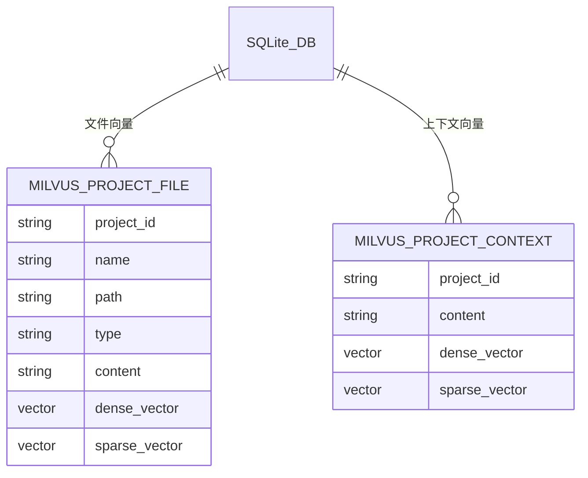

# AI 测试用例生成平台 - Milvus 向量数据库设计

## 概述

本文档描述 AI Case Generator Demo 的 Milvus 向量数据库 Collection 结构设计。采用 **Milvus Lite** 本地部署，配合 **BGE-M3**
混合嵌入模型实现语义搜索。

---

## 技术架构

### 嵌入模型

- **模型名称：** gpahal/bge-m3-onnx-int8
- **向量类型：** 混合向量（稠密 + 稀疏）
    - 稠密向量：1024 维，metric_type=COSINE
    - 稀疏向量：BM25 风格，metric_type=IP
- **设备：** CPU（可配置为 CUDA 加速）

### 搜索策略

- **混合搜索：** 稠密向量 + 稀疏向量联合检索
- **重排序：** WeightedRanker (稠密权重 0.7, 稀疏权重 0.3)

---

## Collection 设计

### 1. 项目文件 Collection (project_file)

存储项目中所有文件的向量表示，支持按项目隔离检索。

#### Schema

| 字段名                   | 数据类型                | 说明              |
|-----------------------|---------------------|-----------------|
| id                    | INT64               | 主键，自增 ID        |
| project_id            | VARCHAR(64)         | 项目 ID           |
| name                  | VARCHAR(256)        | 文件名             |
| path                  | VARCHAR(1024)       | 文件路径            |
| type                  | VARCHAR(32)         | 文件类型/扩展名        |
| content               | VARCHAR(65535)      | 文件原始内容          |
| summary               | VARCHAR(4096)       | 文件摘要      |
| content_dense_vector  | FLOAT_VECTOR(1024)  | 稠密向量嵌入          |
| content_sparse_vector | SPARSE_FLOAT_VECTOR | 稀疏 BM25 向量      |
| create_time           | VARCHAR(32)         | 创建时间 (ISO 8601) |
| metadata              | JSON                | 额外元数据（动态字段）     |

#### 索引配置

| 字段                    | 索引类型                  | Metric Type |
|-----------------------|-----------------------|-------------|
| content_dense_vector  | AUTOINDEX             | COSINE      |
| content_sparse_vector | SPARSE_INVERTED_INDEX | IP          |

#### 用途

- 项目文件内容语义搜索
- 支持按 project_id 过滤
- 返回文件路径和内容用于上下文增强

---

### 2. 项目上下文 Collection (project_context)

存储 AI 总结后的对话上下文，用于跨对话的长期记忆检索。

#### Schema

| 字段名                   | 数据类型                | 说明              |
|-----------------------|---------------------|-----------------|
| id                    | INT64               | 主键，自增 ID        |
| project_id            | VARCHAR(64)         | 项目 ID           |
| content               | VARCHAR(65535)      | 总结后的上下文内容       |
| content_dense_vector  | FLOAT_VECTOR(1024)  | 稠密向量嵌入          |
| content_sparse_vector | SPARSE_FLOAT_VECTOR | 稀疏 BM25 向量      |
| create_time           | VARCHAR(32)         | 创建时间 (ISO 8601) |
| metadata              | JSON                | 额外元数据（动态字段）     |

#### 索引配置

| 字段                    | 索引类型                  | Metric Type |
|-----------------------|-----------------------|-------------|
| content_dense_vector  | AUTOINDEX             | COSINE      |
| content_sparse_vector | SPARSE_INVERTED_INDEX | IP          |

#### 用途

- 项目历史对话上下文检索
- 必须按 project_id 过滤
- 存储 AI 总结的关键信息

---

## ER 关系

