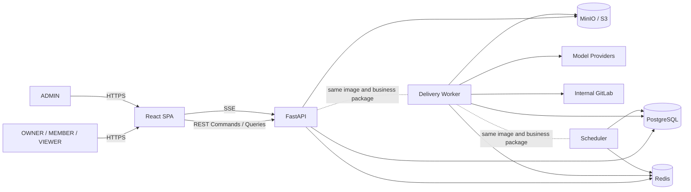
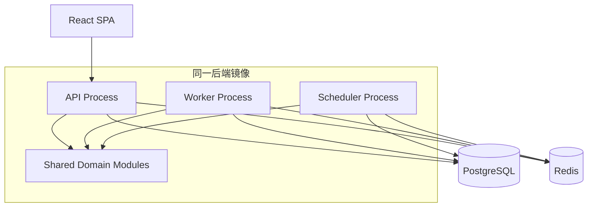
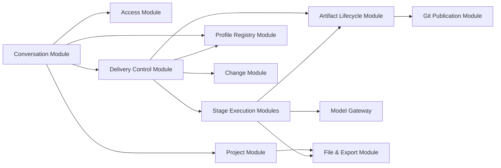
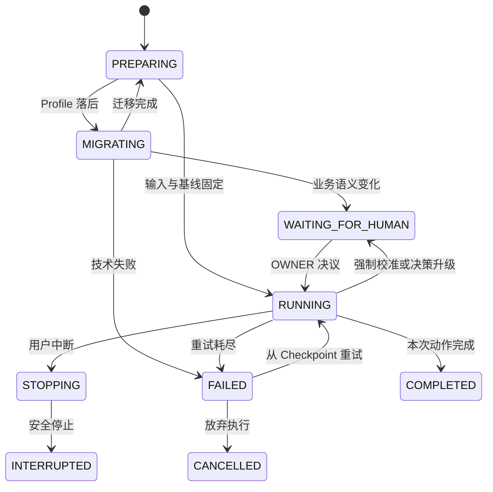
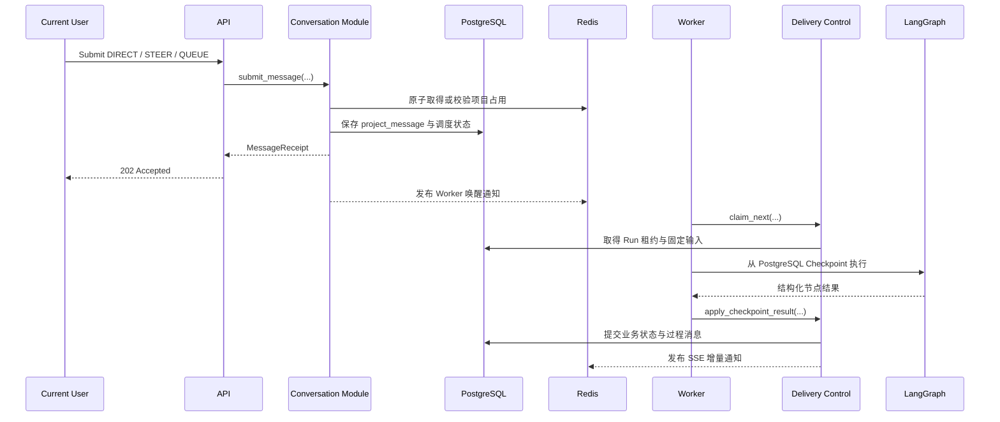
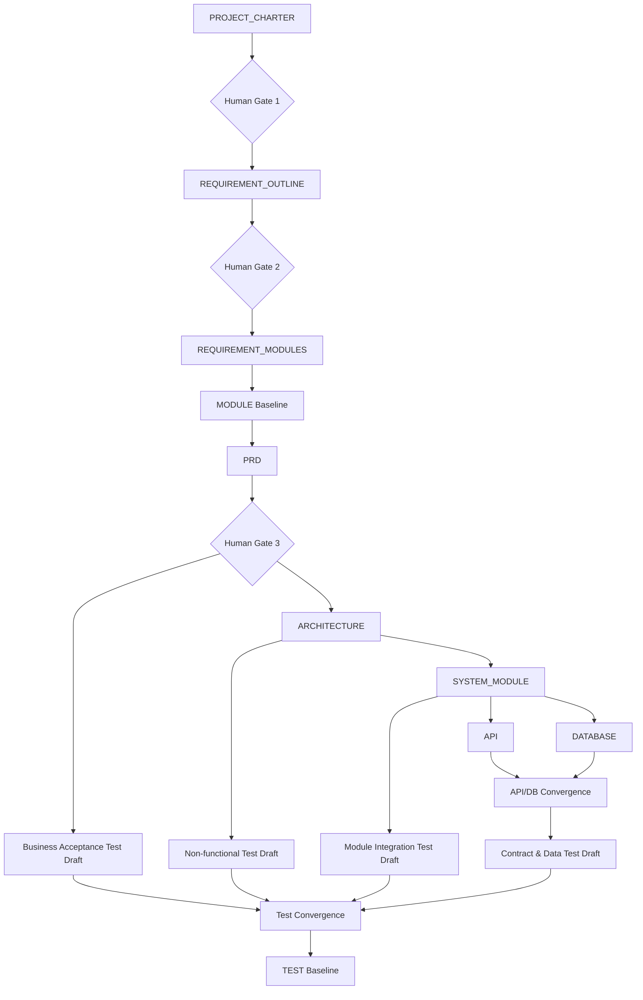
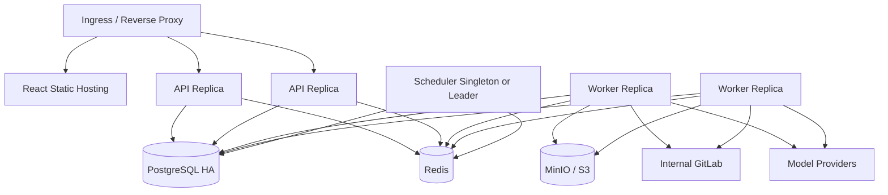

# AI 软件交付平台 V2 总体架构设计

| 属性 | 内容 |
| --- | --- |
| 文档状态 | `APPROVED` |
| 文档版本 | 1.0 |
| 日期 | 2026-08-05 |
| 批准日期 | 2026-08-05 |
| 上游基线 | `docs/product/platform-v2-prd.md` 1.0 `APPROVED` |
| 决策依据 | ADR 0001—0024 |

## 1. 文档目的

本文定义 V2 的系统上下文、运行进程、深模块、关键 interface、Graph 编排、数据流、外部 seam、可靠性、安全和部署方式。数据库字段、索引、完整 HTTP 契约和每类产物 Schema 分别在后续数据库、API 和阶段设计文档中展开。

V2 是破坏性替换，不在 V1 代码上增加兼容层或双轨开关。架构设计允许复用经过验证的 LangGraph、FastAPI 和提示模板经验，但 V1 的 Streamlit 页面、SQLite 业务模型、SQLite Checkpoint、请求内长时 Graph、单字段文档存储和 `conversation_message` 模型不进入 V2 运行链路。

## 2. 架构目标

### 2.1 关键质量属性

1. **业务正确性**：未经确认的事实不能进入批准基线，Agent 不能越权改变项目真相。
2. **一致性**：同一项目只有一个顶层写入者；候选、批准投影与 Git 基线的状态边界明确。
3. **可恢复性**：API、浏览器或 Worker 断开后，Run 可以从 PostgreSQL Checkpoint 恢复。
4. **可审计性**：人类决议、阶段门禁、模型调用摘要、Git Commit 和 Profile Hash 可追溯。
5. **可演进性**：领域知识通过 Profile 扩展，模型通过统一 Gateway 替换，未来开发和测试执行可接入同一基线。
6. **可测试性**：业务规则通过深模块 interface 验证，外部系统通过明确 adapter 替换，不从 HTTP 或 ORM 细节反推业务行为。
7. **可运维性**：API、Worker、Scheduler 独立伸缩；Redis 或 SSE 丢失不改变项目真相。

### 2.2 约束

- 后端采用 Python、FastAPI 和 LangGraph。
- 前端采用 React + TypeScript SPA。
- PostgreSQL 是业务状态与 Checkpoint 的权威来源。
- Redis 只用于短期 Session、缓存、占用锁、唤醒和事件通知。
- MinIO/S3 保存附件、大体积运行证据和导出包。
- 内部 GitLab 保存批准产物和历史基线。
- 首发采用模块化单体，不拆业务微服务，不引入额外消息中间件。
- API、Worker 和 Scheduler 使用同一镜像、同一业务包、不同启动入口。

## 3. V1 现状与替换边界

### 3.1 当前主要问题

| V1 形态 | V2 风险 | V2 处理 |
| --- | --- | --- |
| Streamlit 前端内置业务展示模型 | 前后端类型重复，复杂状态难表达 | React SPA + OpenAPI 生成 Client |
| SSE 请求内直接执行 `main_agent.astream` | 连接生命周期与长时 Run 绑定 | 命令快速返回，后台 Worker 执行，SSE 只订阅 |
| 主 Graph 同时负责意图、阶段选择和副作用 | LLM 判断可直接改变项目状态 | PM 提议动作，确定性策略授权和落库 |
| `project` 单行保存多份 Markdown 文档 | 无产物身份、版本、追踪和阶段基线 | `artifact_draft`、`artifact`、`project_stage` 分离 |
| SQLite 业务库和 SQLite Checkpoint | 难以多进程恢复和并发控制 | PostgreSQL 事务与 PostgreSQL Checkpoint |
| `conversation_message.metadata` 承载可变含义 | 队列、状态和过程不可查询 | V2 `project_message` 使用固定列与受控 JSONB |
| 全量项目状态注入 Graph | 上下文膨胀、职责越界、意图漂移 | 任务级 Context Projection |
| Repository/Service 多层薄转发 | interface 面积大，规则分散 | 按业务能力组织深模块与事务入口 |

### 3.2 可复用与废弃

可复用：LangGraph 的子图和并行执行能力、FastAPI 基础设施、现有提示模板中的领域经验、SSE 展示经验、文件安全检查经验。

直接废弃：Streamlit、V1 Graph 路由和状态模型、V1 文档列、V1 `conversation_message`、SQLite Checkpoint、V1 历史数据及为 V1 添加兼容的接口。

## 4. 系统上下文



### 4.1 外部参与者

- 项目用户通过平台完成对话、校准、预览、变更和下载，不直接访问 GitLab 或模型供应商。
- ADMIN 维护用户、领域 Profile、模型 Profile和迁移重试，并查看诊断。
- 模型供应商只接收 ModelGateway 组装的最小任务上下文。
- GitLab 只接受平台服务账号写入专用 Group 的项目仓库。

## 5. 运行进程



### 5.1 API Process

- 完成 Session、CSRF、角色和项目成员校验。
- 接受短事务命令：项目消息、人工决议、取消、中断、成员与 Profile 管理。
- 提供项目、阶段、产物、历史、差异和诊断查询。
- 提供 SSE 订阅；断线重连时先从 PostgreSQL 获取持久化消息快照，再订阅 Redis 增量通知。
- 不运行长时 Graph，不持有 Worker 租约，不直接调用模型。

### 5.2 Worker Process

- 以 PostgreSQL 租约领取可执行 `delivery_run`。
- 执行 Profile 迁移、PM 控制 Graph、阶段子图、校验、评审、返工、汇合和封存。
- 更新助手 `project_message.process` 和管理员 `diagnostics`，并通过 Redis 发布可丢失通知。
- 在安全 Checkpoint 响应 `STEER`、`STOPPING` 和人工恢复。
- 通过外部 adapter 调用模型、GitLab 和对象存储。

### 5.3 Scheduler Process

- 扫描待领取、租约超时、需重试和 Git 封存待补全的当前任务。
- 只更新调度和租约状态，不执行业务 Graph，不生成产物。
- 使用 PostgreSQL 作为工作事实源；Redis 通知仅用于降低轮询延迟。

## 6. 模块化单体

V2 以业务能力组织深模块。每个模块提供少量事务级 interface，隐藏 ORM、状态转换和幂等细节。模块之间不得跨表直接写入，也不为每张表建立一套公开 Repository interface。



### 6.1 Access Module

负责用户、密码、Session、账户状态、系统角色和项目成员授权。

主要 interface：

```text
authenticate(credentials) -> SessionGrant
authorize(actor, project, action) -> AuthorizationDecision
change_password(actor, current_password, new_password) -> Result
set_user_status(admin, user, status) -> Result
```

模块隐藏密码哈希、独立 Salt、Redis Session Key、用户缓存、滑动过期、CSRF 和多端 Session 细节。HTTP Cookie 是 API adapter 的职责，不进入领域 interface。

### 6.2 Project Module

负责项目基本信息、成员关系、项目真相、项目修订号和当前 Profile 绑定。项目真相是结构化事实、目标、范围、决策、问题和基线引用的聚合，不由对话摘要替代。

主要 interface：

```text
create_project(command) -> ProjectRef
load_truth(project_id, revision?) -> ProjectTruth
apply_truth_patch(project_id, expected_revision, authorized_patch) -> NewRevision
project_snapshot(project_id) -> ProjectSnapshot
```

所有改变项目真相的写入必须携带期望修订号，在项目级单写之外继续使用乐观锁防止重复 Worker。

### 6.3 Conversation Module

负责共享时间线、当前对话用户、`DIRECT/STEER/QUEUE`、排队取消、中断请求和用户可见过程。

主要 interface：

```text
submit_message(actor, project_id, content, delivery_mode, files) -> MessageReceipt
cancel_queued_message(actor, message_id) -> Result
request_interrupt(actor, project_id) -> StopReceipt
release_conversation(actor, project_id) -> Result
list_timeline(project_id, cursor) -> TimelinePage
```

模块在一个事务入口内完成权限、Redis 原子占用、Profile 预检、消息持久化和 Run/队列调度，不向调用者暴露 Lua、Redis Key 或状态组合。

### 6.4 Delivery Control Module

负责每项目唯一当前 Run、输入基线固定、租约、Checkpoint Thread、PM 动作授权、阶段调度、人工等待和失败恢复。

主要 interface：

```text
start_or_route(message_id) -> DeliveryDecision
claim_next(worker_id, lease_duration) -> ClaimedRun?
apply_checkpoint_result(run_id, expected_state, graph_result) -> RunTransition
resolve_human_gate(actor, run_id, decision) -> RunTransition
retry_failed(actor, run_id) -> RunTransition
abandon_failed(actor, run_id) -> RunTransition
```

LangGraph 只实现可 Checkpoint 的执行计划，不拥有业务状态转换权限。Graph 节点返回结构化提议，Delivery Control 依据当前数据库状态、角色、基线和确定性策略提交结果。

### 6.5 Artifact Lifecycle Module

负责候选产物、固定追踪、校验状态、正式编号、阶段状态、基线封存与当前投影。

主要 interface：

```text
save_candidate(stage_task, candidate) -> DraftRef
record_quality(draft_ref, validation, review) -> DraftDecision
prepare_stage_seal(project_id, stage) -> SealPlan
seal_stage(seal_plan, expected_project_revision) -> BaselineRef
invalidate_by_change(change_impact) -> InvalidationResult
```

`seal_stage` 是深 interface：内部完成引用校验、重复检测、连续编号预留、确定性 YAML/Markdown 渲染、Git 幂等发布、当前 `artifact` 投影更新、阶段状态更新和草稿清理。调用者不逐步编排这些副作用。

### 6.6 Profile Registry Module

负责 Profile 草稿、发布版本、自动匹配、运行时 Schema 合成、相邻迁移和管理员重试。

主要 interface：

```text
match_profile(project_intake) -> ProfileBinding
load_runtime_profile(profile_id, version, hash) -> RuntimeProfile
publish(admin, draft_id, migration) -> PublishedProfile
ensure_project_current(project_id, trigger_message_id) -> MigrationOutcome
```

Profile 内容、迁移和发布历史由 PostgreSQL 管理。普通用户 interface 不暴露 Profile 名称、版本或匹配过程。

### 6.7 Change Module

负责已批准基线上的项目变更、影响分析、决议、失效和重新基线化。

主要 interface：

```text
propose_change(source_message, target_refs) -> ChangeRef
analyze_impact(change_ref) -> ImpactReport
decide_change(actor, change_ref, decision) -> ChangeDecision
apply_change(change_ref, baseline_refs) -> AppliedChange
```

影响分析使用 Artifact Lifecycle 提供的固定逻辑引用。无法证明边界时返回保守影响范围，不允许调用者自行缩小。

### 6.8 Stage Execution Modules

按阶段提供 Requirements、Architecture、System Design、API Design、Database Design 和 Test Design 模块。它们共享统一执行骨架，但各自拥有独立内容契约、Validator 和 Reviewer 规则。

统一外部 interface：

```text
execute_stage(StageTask) -> StageResult
```

`StageTask` 固定任务范围、上游基线、项目事实投影、Profile、允许修改的产物和质量预算。`StageResult` 只包含候选产物、校验报告、评审发现、覆盖报告、假设、问题和建议路由，不直接改项目、阶段或 Git。

各阶段实现内部可拆分 Author、Validator、Reviewer 和 Reviser，但这些内部 seam 不暴露给 Delivery Control。

### 6.9 Model Gateway

为结构化生成、普通文本、流式展示和用量审计提供统一 interface：

```text
generate_structured(model_profile, messages, output_schema) -> ModelResult[T]
generate_text(model_profile, messages) -> ModelResult[str]
```

Provider adapter 负责供应商 SDK、重试、限速和错误归一化；Model Gateway 负责模型 Profile、结构化输出验证、Token/成本统计和诊断。Graph 与阶段模块不得引用供应商模型名称。

### 6.10 Git Publication Module

封装内部 GitLab 项目创建、文件树读取、差异、Commit 和 Tag。

```text
ensure_project_repository(project_ref) -> RepositoryRef
publish_baseline(repository, publish_key, file_set, tag) -> GitBaselineRef
read_baseline(repository, commit_or_tag) -> BaselineTree
compare(repository, from_ref, to_ref) -> ArtifactDiff
```

生产使用 GitLab adapter，测试使用内存 Git adapter；幂等键和确定性 Tag 使重试不产生重复历史。该模块不决定何时可以封存，只执行 Artifact Lifecycle 已批准的 `SealPlan`。

### 6.11 File & Export Module

负责附件校验、对象存储、文本提取、证据引用和批准基线导出。附件与大体积证据不进入 Git，批准下载包只按 Git Commit/Tag 生成。

## 7. PM 控制 Graph

### 7.1 控制原则

- PM 是协调角色，不直接写数据库或 Git。
- LLM 负责理解和提出结构化动作，策略代码负责授权和状态迁移。
- 每次 Run 固定 Profile 和输入基线，运行中不读取浮动的“最新版本”。
- 完整聊天不默认注入所有节点；Context Projection 只提供任务所需事实和证据。
- Agent 间不采用自由对话协商，使用结构化 `StageTask`、`Finding` 和 `StageResult`。

### 7.2 顶层状态机



`STOPPING` 只属于当前 `delivery_run`。项目消息最终状态使用 `INTERRUPTED`，不增加 `CANCEL_REQUESTED`。

### 7.3 消息接收与执行序列



API 返回表示消息已接受，不表示 Run 已完成。SSE 断线不影响 Worker；客户端重连后以持久化消息过程版本为游标恢复。

## 8. 设计交付 Graph

### 8.1 阶段依赖



### 8.2 通用阶段子图

```text
Build Context Projection
  -> Author Candidate
  -> Deterministic Validate
  -> Semantic Review
  -> Aggregate Findings
  -> [Pass | Targeted Revision | Human Escalation | Failed]
  -> StageResult
```

返工循环必须有预算并定位到具体产物和规则。模型调用失败与业务缺口分开处理；业务缺口不能伪装为技术重试，技术故障不能伪装为人工决策。

### 8.3 API/数据库汇合

API 与数据库分支共享系统模块基线，但不直接读写对方草稿。两侧分别就绪后，Convergence 节点加载两个候选集合并检查：

- 业务字段和语义一致性。
- 状态、枚举和错误行为。
- API 操作与数据读写关系。
- 数据所有权、事务边界和幂等。
- 必填、唯一、约束、索引与查询需求。

发现问题后返回责任阶段。只有汇合通过，Artifact Lifecycle 才分别封存 API 和 DATABASE 基线。

### 8.4 分层测试汇合

测试分支分别消费已封存上游，候选统一保存在 `artifact_draft`。最终 Test Convergence 检查重复、矛盾、需求覆盖和跨层完整性，补齐端到端与回归用例，然后一次封存唯一 TEST 基线。

## 9. 产物与基线架构

### 9.1 权威边界

| 内容 | 权威存储 | 消费者 |
| --- | --- | --- |
| 当前候选产物 | PostgreSQL `artifact_draft` | 工作区、Validator、Reviewer |
| 当前批准投影 | PostgreSQL `artifact` | 列表、关系查询、影响分析 |
| 批准内容与历史 | GitLab Commit/Tag | 下游 Graph、历史、下载 |
| 阶段进度与当前基线指针 | PostgreSQL `project_stage` | UI、Delivery Control |
| Graph 可恢复状态 | PostgreSQL Checkpoint | Worker |
| 用户可见过程 | PostgreSQL `project_message.process` | UI、SSE |
| 管理员模型诊断 | PostgreSQL `project_message.diagnostics` | ADMIN |
| 上传附件与导出包 | MinIO/S3 | Stage、用户下载 |

### 9.2 产物文件

- YAML 是权威源，Markdown 由 YAML 确定性渲染。
- 文件路径稳定，文件名不含版本号。
- 产物自身保存 Schema 版本和内容 Hash，不建立 Manifest。
- 逻辑编号只在阶段封存时批量发放。
- 产物间引用使用项目内逻辑编号，数据库内部关联使用 UUID。

### 9.3 阶段封存事务

```text
Acquire project writer + project_stage row lock
  -> Validate stage completeness and references
  -> Deduplicate candidates
  -> Reserve contiguous artifact codes
  -> Render deterministic YAML/Markdown file set
  -> Set project_stage = SEALING with publish_key
  -> GitPublication.publish_baseline(...)
  -> Persist commit SHA and tag
  -> Upsert current artifact projections and counters
  -> Set project_stage = SEALED
  -> Delete sealed drafts
```

Git 与 PostgreSQL 不能组成分布式事务，因此依赖 `publish_key`、确定性 Tag 和状态补全实现幂等。Scheduler 发现 `SEALING` 时先查询 Git 是否已有相同发布结果，再补全数据库；不建立 `git_publish_outbox`。

## 10. 一致性与并发

### 10.1 项目级单写

- `delivery_run.project_id` 唯一，保证一个当前顶层 Run。
- Worker 使用带期限租约领取 Run，重复 Worker 只能有一个成功更新版本。
- Project Module 的项目修订号提供乐观锁。
- Artifact Lifecycle 在封存时取得项目写锁和 `project_stage` 行锁。
- 内部 API/数据库和测试分支只能产生候选，不能独立封存或改项目真相。

### 10.2 对话占用

Redis 以项目 ID 保存当前对话用户，TTL 300 秒。取得、同用户续期、异用户拒绝、OWNER 治理接管和安全停止后的转交均使用原子脚本。

自动处理及待执行队列存在时由 Worker 续期；`WAITING_FOR_HUMAN` 停止后台续期。Redis 丢失可能导致重新竞争，但 PostgreSQL 项目单写保证不会产生两个修改基线的 Run。

### 10.3 并行分支

并行分支获得不可变 `StageTask`，不得共享可变内存状态。结果以分支 ID 和固定输入 Hash 落入候选；汇合前再次验证输入基线未变化，过期结果直接失效，不尝试自动合并。

## 11. 失败、恢复与中断

| 场景 | 处理 |
| --- | --- |
| API 或浏览器断开 | Run 不受影响；重连读取持久化时间线 |
| Worker 崩溃 | 租约到期后其他 Worker 从 PostgreSQL Checkpoint 恢复 |
| 模型或外部依赖短暂失败 | 同一 Run 按节点策略重试并记录诊断 |
| 重试耗尽 | Run `FAILED`，保留 Checkpoint，阻止新业务消息 |
| 用户从失败点重试 | 继续同一 `run_id` 与 Checkpoint |
| 用户放弃失败 Run | Run `CANCELLED`，清理 Checkpoint |
| 用户中断运行 | Run `STOPPING`，安全停止后消息 `INTERRUPTED`，清理 Checkpoint |
| 中断时有待执行队列 | 全部 `QUEUE` 变为 `CANCELLED` 并保留消息 |
| 中断时有未封存草稿 | 当前 Run 正在处理的各阶段草稿保留并统一退回 `REVISING` |
| 中断发生在 Git/封存原子区 | 完成或失败后停止；成功基线不回滚 |
| `WAITING_FOR_HUMAN` 长期无人处理 | 释放 Worker 租约，保留 Run 与 Checkpoint，不自动取消 |

## 12. Profile 架构

### 12.1 内容聚合

Profile 作为单一 JSONB 聚合管理，包含适用/排除条件、术语、能力、产物扩展、校验、评审、Prompt 上下文、追踪、门禁和渲染规则。平台基础 Schema 与 Profile `domain_extensions` 确定性合成运行时 Schema。

### 12.2 发布

```text
Edit domain_profile_draft
  -> Compare with current domain_profile_version
  -> Generate adjacent migration draft
  -> ADMIN review and edit
  -> Static validation
  -> Atomic insert version + migration and advance current_version
```

发布不扫描项目。历史版本在数据库永久审计但不可重新选择执行。

### 12.3 项目迁移

每次业务消息进入 PM 前执行 `ensure_project_current`。跨多版本时逐个相邻步骤原子提交；失败停在最后成功版本。项目只保存 `profile_id`、整数版本和内容 Hash，迁移执行只记录规则 Hash，不复制规则快照。

技术迁移完成后继续原消息；业务语义变化进入人工校准；技术失败将原消息标记为处理前失败并阻止业务写入，但保留旧基线读取。

## 13. 外部 seam 与 adapter

| Seam | 生产 Adapter | 测试 Adapter | 归一化责任 |
| --- | --- | --- | --- |
| 模型调用 | Provider SDK Adapter | Deterministic Fake Model | 结构化输出、错误、Token、成本 |
| Git 版本库 | GitLab Adapter | In-memory Git Adapter | Commit、Tag、Diff、幂等发布 |
| 对象存储 | S3/MinIO Adapter | In-memory Object Adapter | 上传、读取、导出、内容 Hash |
| 短期协调 | Redis Adapter | Real Redis integration fixture | Session、锁、通知、TTL |

PostgreSQL 是平台自身权威存储，不在每个业务模块外公开通用 Repository port。模块内部使用事务仓储实现，测试优先使用真实 PostgreSQL Schema 验证约束和并发语义。

## 14. API 与前端架构

### 14.1 HTTP 风格

- Command 接口执行权限和状态转换，成功后返回资源、命令回执或 `202 Accepted`。
- Query 接口不触发模型或隐式状态迁移。
- 人工确认、中断、取消、重试和 Profile 发布均是明确 Command，不复用普通聊天文本猜测操作。
- FastAPI OpenAPI 是 React Client 的类型来源。

### 14.2 SSE

- SSE 只推送项目消息过程版本、状态和轻量变更通知。
- Redis Pub/Sub 用于在线增量通知，但不是历史来源；首发不使用 Redis Streams 保存事件历史。
- 客户端携带最后过程版本重连；API 从 PostgreSQL 返回当前持久化消息后继续订阅。
- 心跳不写数据库、不续期 Session 或项目对话占用。

### 14.3 React 状态

- 服务端状态使用查询缓存管理，前端不复制 Graph 状态机。
- 当前占用者、TTL 倒计时和按钮禁用只是提示，提交时由服务端重验。
- 阶段视图直接展示多个 `project_stage`，支持 API/数据库和测试分支同时 `BUILDING`。
- 人工校准界面必须展示变化、排除项、推导、假设和将解锁阶段。

## 15. 安全架构

- 用户表保存密码 Hash 与独立 Salt；登录日志独立保存。
- 随机不透明 Token 只以 Hash 作为 Redis Session Key 的一部分；浏览器通过 `HttpOnly`、`Secure`、`SameSite` Session Cookie 持有原 Token。
- CSRF Token 只在 React 内存保存，写请求携带自定义 Header，并校验 Origin 和 Fetch Metadata。
- `session:<token_hash>` 与 `user:<user_id>` 均使用两小时滑动过期；账户状态以数据库为最终权威、Redis 为请求路径缓存。
- 禁用更新数据库和 Redis 用户状态，不删除 Session；重新启用后未过期 Session 恢复。
- 内部 GitLab、模型和对象存储凭据只存在于对应进程的 Secret 配置，不写项目产物、消息、诊断或日志。
- 普通用户接口永不返回完整 Prompt、模型原始输出、GitLab 写凭据或内部 Checkpoint。

## 16. 可观测性

### 16.1 用户可见

- 助手消息保存阶段、Agent、校验、发现、返工、决策摘要和产物变化。
- 项目页显示 Run 状态、阶段状态、并行分支、等待原因、重试和恢复动作。
- 失败信息必须归一化为可行动提示，同时保留管理员关联 ID。

### 16.2 管理员可见

- 助手消息 `diagnostics` 按节点记录 Provider、模型、模型 Profile、参数摘要、Prompt Hash、Schema Hash、Token、延迟、重试、成本和结果。
- 系统指标至少覆盖 Run 等待时间、节点耗时、失败率、返工次数、门禁通过率、模型成本、Git 发布重试和 Profile 迁移失败。
- 日志携带 `project_id`、`run_id`、`message_id`、`stage`、`node` 和事务关联 ID，不记录密码、Token、完整 Prompt 或项目附件正文。

## 17. 部署拓扑



Scheduler 可多副本部署但必须通过 PostgreSQL Leader Lease 保证同一调度分区只有一个活跃实例。Worker 可水平扩展，不同项目并行执行；同一项目由租约和项目单写限制串行化。

## 18. 建议代码结构

```text
web/                              # React + TypeScript SPA
src/
  bootstrap/
    api.py                        # FastAPI entrypoint
    worker.py                     # Worker entrypoint
    scheduler.py                  # Scheduler entrypoint
  modules/
    access/
    projects/
    conversation/
    delivery/
    artifacts/
    profiles/
    changes/
    files/
    stages/
      requirements/
      architecture/
      system_design/
      api_design/
      database_design/
      test_design/
  integrations/
    models/
    gitlab/
    object_store/
    redis/
  transport/
    http/
    sse/
  persistence/
    postgres/
  shared/
    ids/
    errors/
    time/
```

`transport`、`persistence` 和 `integrations` 是 adapter 所在位置；业务规则只能依赖模块内类型和外部 port，不能反向依赖 FastAPI、React、GitLab SDK 或供应商 SDK。

## 19. 测试策略

### 19.1 模块 interface 测试

- Access：多端 Session、禁用/启用、滑动过期和权限矩阵。
- Conversation：占用原子性、DIRECT/STEER/QUEUE、取消和 OWNER 接管。
- Delivery Control：Run 状态机、租约、Checkpoint、人工等待、失败和中断。
- Artifact Lifecycle：引用、编号、门禁、封存幂等、失效和重新基线化。
- Profile Registry：匹配、发布、相邻迁移、失败重试和业务校准。

### 19.2 集成测试

- 使用真实 PostgreSQL Schema 验证事务、唯一约束、锁和并发。
- 使用 Redis 测试环境验证 TTL 和原子脚本。
- GitLab adapter 执行契约测试，主测试套件使用内存 Git adapter。
- ModelGateway 使用确定性 Fake Model 注入结构化成功、Schema 失败、超时和限速。

### 19.3 端到端测试

- 新项目从简报到 TEST 基线。
- API/数据库并行与汇合返工。
- Profile 多版本迁移后恢复原消息。
- Worker 在模型节点、Git 成功后数据库提交前等故障点恢复。
- MEMBER 长时 Run、OWNER 强制中断与发言权转交。

## 20. V2 切换策略

1. 在 V2 新 Schema 和新模块上完成测试，不读取 V1 项目数据。
2. 部署 PostgreSQL、Redis、MinIO 和内部 GitLab 依赖。
3. 初始化管理员、通用 Profile、模型 Profile 和基础产物 Schema。
4. 部署 React、API、Worker 和 Scheduler，执行内部验收项目。
5. 停止 V1 入口并一次性切换 V2；不提供项目导入和回退到 V1 的产品能力。
6. 保留 V1 代码只限于切换前开发参考，正式 V2 分支在上线前删除 V1 运行入口和无用数据模型。

## 21. 后续设计文档

本架构批准后，按以下文档继续细化：

1. Graph 与阶段模块设计：状态、节点、Context Projection、质量门禁和并行汇合。
2. 数据库设计：表、字段、约束、索引、事务和保留策略。
3. API 设计：资源、Command、Query、SSE、错误和权限。
4. 产物 Schema 设计：基础字段、各阶段正文和追踪关系。
5. 测试设计：架构验收、故障注入和首发端到端用例。

后续设计不得改变 PRD 的产品范围、角色、人工校准点、批准边界或首发终点；如需改变，必须先变更已批准 PRD。

## 22. 架构验收检查

- [ ] API 请求生命周期不承载长时 Graph。
- [ ] PostgreSQL 是 Run、Checkpoint、候选和阶段状态权威来源。
- [ ] Redis 丢失不改变项目真相和批准基线。
- [ ] 同一项目只有一个顶层写入 Run，内部并行只能产生候选。
- [ ] LLM 不能直接推进阶段、批准产物或写 Git。
- [ ] 三个人工校准点与临时决策升级均可恢复。
- [ ] API/数据库只在汇合通过后封存。
- [ ] 分层测试只形成一个 TEST 基线。
- [ ] Git 发布可在部分失败后幂等补全且不需要 Outbox 表。
- [ ] Profile 发布不扫描项目，项目在消息前按需迁移。
- [ ] `STEER/QUEUE/STOPPING/INTERRUPTED` 与对话占用规则一致。
- [ ] V2 不依赖 V1 表、V1 Graph 或兼容开关。

## 23. ADR 追踪

| 架构主题 | 决策来源 |
| --- | --- |
| V2 替换与首发边界 | ADR 0001、0002 |
| GitLab、仓库、结构化产物和阶段基线 | ADR 0003—0010、0023 |
| 存储、Run、单写与变更 | ADR 0011—0014、0024 |
| 模块化单体、React、FastAPI、SSE | ADR 0015、0016 |
| 认证与权限 | ADR 0017—0019 |
| 模型与 Profile | ADR 0020—0022 |
