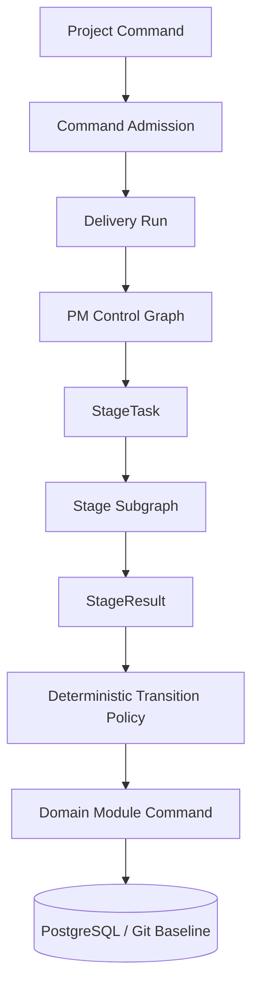
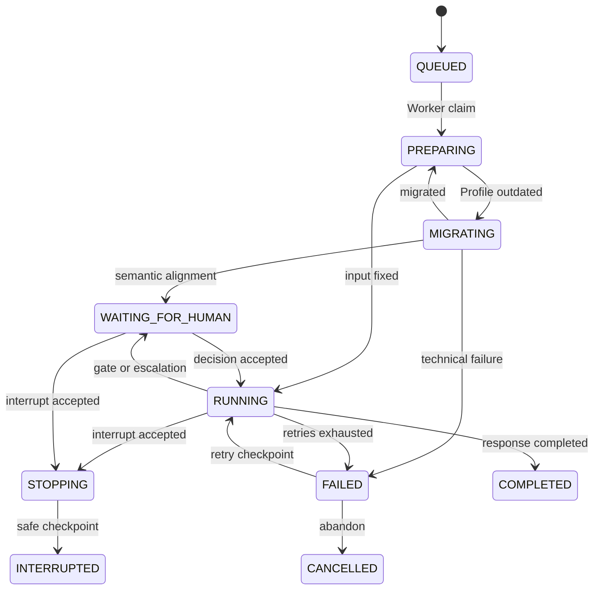
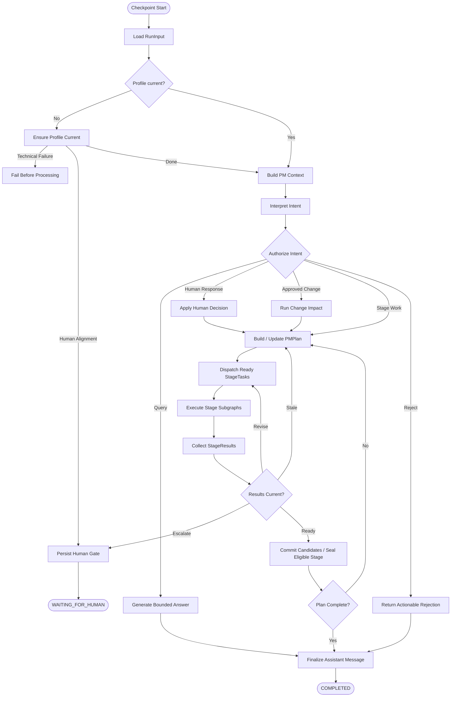
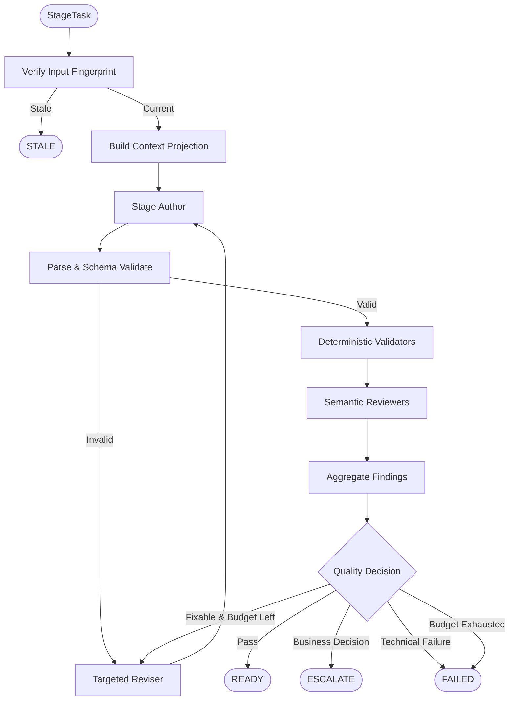
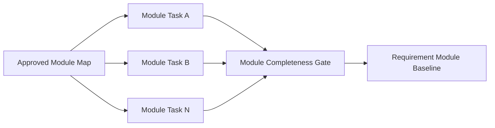
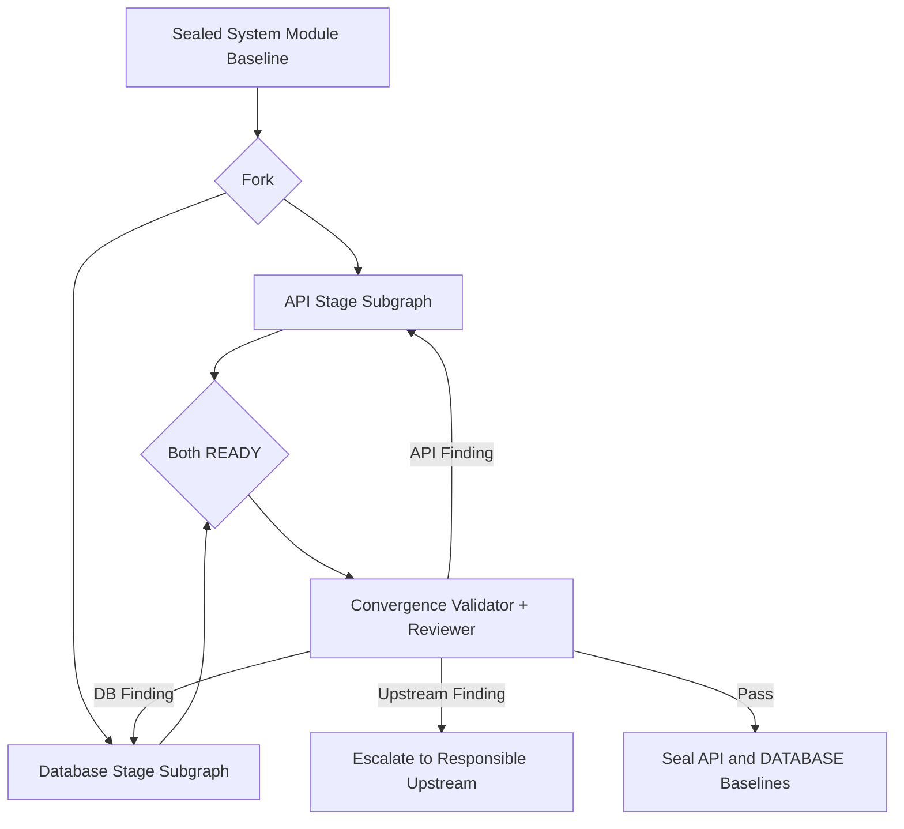

# AI 软件交付平台 V2 Graph 与领域模块设计

| 属性 | 内容 |
| --- | --- |
| 文档状态 | `APPROVED` |
| 文档版本 | 1.0 |
| 日期 | 2026-08-05 |
| 批准日期 | 2026-08-05 |
| 上游基线 | V2 PRD 1.0、V2 总体架构 1.0 |
| 决策依据 | ADR 0001—0024 |

## 1. 文档目的

本文把总体架构细化为可实现的 Graph 控制模型和领域模块 interface，回答以下问题：

- 一条项目消息如何成为可恢复的 Delivery Run；
- AI PM、阶段 Author、Validator 和 Reviewer 如何分工；
- 哪些状态属于 LangGraph Checkpoint，哪些必须提交到业务数据库；
- 三个人工校准点、临时决策升级、`STEER`、`QUEUE` 和中断如何工作；
- API/数据库与测试分支如何并行、汇合和失效；
- 各领域模块之间通过什么小 interface 协作，而不是跨层直接写表。

本文不定义物理表字段、HTTP 路径和具体 Prompt 文本。

## 2. 设计原则

1. **Graph 是执行计划，不是业务数据库**：Checkpoint 保存可恢复执行位置，项目真相、消息、候选、阶段和基线由领域模块持久化。
2. **LLM 提议，策略代码决策**：模型可以返回意图、计划、候选和发现，不能直接批准、推进阶段、分配正式编号或写 Git。
3. **顶层单写，内部并行**：每项目只有一个当前 Run；并行分支只产生候选，汇合后由一个提交路径改变业务状态。
4. **任务输入不可变**：每个阶段任务固定项目修订号、Profile Hash、上游 Commit、范围和允许修改集合。
5. **深模块承担事务**：调用者发出业务命令，不编排 Redis、ORM、Git 和状态更新的步骤。
6. **安全边界才可中断**：模型调用不能被强行回滚，Git 和数据库封存原子区必须完成或失败后停止。
7. **证据化质量**：校验和评审必须指向具体产物、规则和上游证据，不能只返回分数。

## 3. 控制层次



### 3.1 Command Admission

Command Admission 在创建或路由 Run 前完成：

1. Session、账户状态和项目角色校验。
2. Redis 项目对话占用的原子取得或验证。
3. 项目是否存在失败 Run、人工等待或封存不可中断区的检查。
4. 消息 `DIRECT/STEER/QUEUE` 合法性检查。
5. `project_message` 持久化和当前 Run/队列关联。
6. Worker 唤醒通知。

它不调用模型，也不加载完整项目上下文。

### 3.2 PM Control Graph

PM Control Graph 负责理解当前消息、编排阶段任务和处理返回结果。它不直接操作 ORM、Redis 或 Git，而是调用 Delivery Control、Project、Artifact Lifecycle、Change 和 Profile Registry 的业务 interface。

### 3.3 Stage Subgraph

Stage Subgraph 负责单一专业阶段的候选生成和质量循环。它只能返回 `StageResult`，不能改变 Run、项目、阶段或基线。

### 3.4 Deterministic Transition Policy

Transition Policy 根据当前数据库状态、固定输入、角色、门禁结果和状态版本决定允许的下一步。任何自然语言路由都必须先映射为结构化枚举，再由该策略验证。

## 4. 持久状态与 Checkpoint 状态

### 4.1 必须持久化到业务表

| 状态 | 权威模块 | 原因 |
| --- | --- | --- |
| 用户、角色、成员 | Access / Project | 权限事实 |
| 项目真相与修订号 | Project | 所有 Run 的共享业务输入 |
| 项目消息与排队状态 | Conversation | 用户可见历史与调度输入 |
| 当前 Delivery Run | Delivery Control | 租约、恢复、失败与人工等待 |
| 阶段状态与基线指针 | Artifact Lifecycle | 下游消费资格 |
| 当前候选与批准投影 | Artifact Lifecycle | 工作区和影响分析 |
| 变更与决议 | Change | 永久业务约束 |
| Profile 版本与迁移 | Profile Registry | 运行 Schema 和领域规则 |

### 4.2 只进入 PostgreSQL Checkpoint

- 当前 Graph 节点与下一节点。
- 当前 PM 计划和待分发的内部任务。
- 当前节点的重试计数与临时模型上下文。
- 尚未提交为候选的结构化模型结果。
- 并行分支的 barrier 到达情况。
- 运行内 `STEER` 待消费指令游标。

Checkpoint 不得成为项目真相、已批准状态或用户历史的唯一来源。

### 4.3 同时存在但职责不同

`delivery_run` 保存恢复入口、租约和业务状态；Checkpoint 保存 Graph 内部执行状态。`project_message.process` 保存用户可见执行摘要；Checkpoint 可以保存更细的节点临时数据。三者不能相互替代。

## 5. 核心契约

以下为逻辑契约，具体 Pydantic 字段类型在实现设计中确定。

### 5.1 RunInput

```text
RunInput
  run_id
  project_id
  trigger_message_id
  response_message_id
  actor_id
  delivery_mode
  project_revision
  profile_ref { profile_id, version, content_hash }
  input_baselines[] { stage, version, commit_sha, git_tag }
  received_at
```

Run 启动后，`project_revision`、`profile_ref` 和 `input_baselines` 不可修改。新事实或新基线必须通过 `STEER` 形成明确重规划，或让当前结果失效后创建新任务。

### 5.2 IntentDecision

```text
IntentDecision
  intent_type
  requested_effect
  target_stages[]
  target_artifact_codes[]
  include_scope[]
  exclude_scope[]
  changes_approved_truth
  needs_change_request
  confidence
  evidence_refs[]
```

支持的顶层意图至少包括：回答当前校准、项目问答、补充事实、生成/继续、修改未封存候选、变更已批准基线、状态查询、重试、取消和中断。

### 5.3 PMPlan

```text
PMPlan
  objective
  current_stage_set[]
  tasks[]
  dependencies[]
  convergence_gates[]
  expected_outputs[]
  allowed_truth_changes[]
  prohibited_changes[]
  human_gate?
  completion_policy
```

PMPlan 是运行内计划，不是长期项目事实。计划中的每个任务必须能映射到一个确定的 `StageTask`。

### 5.4 ContextProjection

```text
ContextProjection
  project_charter
  relevant_facts[]
  relevant_decisions[]
  unresolved_questions[]
  direct_upstream_artifacts[]
  trace_neighborhood[]
  requested_scope
  excluded_scope
  profile_context
  output_schema
  quality_rules
```

Context Projection 必须记录来源引用和裁剪理由，防止 Agent 把未提供内容误认为不存在。

### 5.5 StageTask

```text
StageTask
  task_id
  run_id
  stage
  operation { CREATE, REVISE, REVALIDATE, REMOVE }
  target_draft_ids[]
  target_artifact_codes[]
  context_projection
  project_revision
  profile_ref
  input_baselines[]
  allowed_patch_paths[]
  prohibited_patch_paths[]
  revision_budget
```

### 5.6 CandidateArtifact

```text
CandidateArtifact
  draft_id
  canonical_key
  artifact_type
  schema_version
  title
  body
  domain_extensions
  source_refs[]
  requirement_refs[]
  module_refs[]
  api_refs[]
  read_table_refs[]
  write_table_refs[]
  assumptions[]
  open_questions[]
```

新候选没有正式 `artifact_code`。固定追踪字段不放入 `domain_extensions`。

### 5.7 Finding

```text
Finding
  finding_id
  source { VALIDATOR, REVIEWER, CONVERGENCE }
  rule_id
  severity { ERROR, WARNING, INFO }
  responsibility_stage
  artifact_ref
  location
  evidence_refs[]
  description
  suggested_correction
  requires_human_decision
```

`suggested_correction` 是修复方向，不得包含未经确认的新业务规则。

### 5.8 StageResult

```text
StageResult
  task_id
  input_fingerprint
  candidate_artifacts[]
  validation_report
  review_report
  coverage_report
  findings[]
  assumptions[]
  open_questions[]
  outcome { READY, REVISION_REQUIRED, ESCALATE, FAILED, STALE }
```

Delivery Control 接受结果前必须重新计算输入 Fingerprint。项目修订、Profile Hash 或任一输入 Commit 变化时，结果为 `STALE`。

### 5.9 HumanGateRequest

```text
HumanGateRequest
  gate_type
  title
  decision_scope
  proposed_content_refs[]
  changes_since_last_gate[]
  exclusions[]
  assumptions[]
  derivations[]
  options[]
  recommendation
  unlocked_stages[]
```

人工决议只接受明确的 `APPROVE`、`REJECT` 或选择项，不把自由文本“继续”解释为批准。

## 6. Delivery Run 状态机



### 6.1 状态约束

| 状态 | Worker 租约 | Checkpoint | 新业务消息 |
| --- | --- | --- | --- |
| `QUEUED` | 无 | 可无 | 仅继续排队 |
| `PREPARING/MIGRATING/RUNNING` | 有 | 保留 | 当前用户可 `STEER/QUEUE` |
| `WAITING_FOR_HUMAN` | 释放 | 保留 | 仅当前问题的回答或补充 |
| `STOPPING` | 有 | 保留至安全停止 | 禁止新业务消息 |
| `FAILED` | 无 | 保留 | 仅重试或放弃 |
| `COMPLETED/CANCELLED/INTERRUPTED` | 无 | 清理 | 可创建下一 Run |

### 6.2 当前行覆盖

每项目仅一条 `delivery_run`。进入终态且 Checkpoint 清理后，下一 Run 覆盖当前行；永久历史由触发用户消息、响应助手消息和批准 Git 历史承担。

## 7. 顶层 PM Control Graph



### 7.1 节点规则

- `Load RunInput` 只读取 `delivery_run` 已固定引用，不重新选择最新基线。
- `Ensure Profile Current` 在任何 PM 或 Stage 模型调用前执行。
- `Interpret Intent` 返回 `IntentDecision`，不能直接路由到任意函数名。
- `Authorize Intent` 是纯策略节点，校验角色、项目状态、人工等待和基线影响。
- `Build PMPlan` 可以调用模型生成候选计划，但计划必须通过确定性依赖检查。
- `Commit Candidates / Seal Eligible Stage` 只调用领域模块，不把数据库连接注入 Graph 状态。
- `Finalize Assistant Message` 汇总用户可见结果，不暴露隐藏思维链。

## 8. 通用 Stage Subgraph



### 8.1 Author

- 只能基于 Context Projection 和输出 Schema 生成完整候选或允许路径内的 Patch。
- 不得改变固定 ID、批准基线、禁止路径或上游事实。
- 必须显式输出假设和未决问题。

### 8.2 Deterministic Validators

按阶段组合以下规则：Schema、必填、枚举、唯一性、逻辑编号格式、引用存在性、引用类型、状态流完整性、覆盖率、范围越界和禁止术语。

### 8.3 Semantic Reviewers

Reviewer 按验证能力选择，不按“角色聊天群”组织：

- Completeness：遗漏和覆盖。
- Consistency：事实、术语、状态和跨产物矛盾。
- Scope：越权和范围漂移。
- Feasibility：技术可实现性。
- Testability：验收和可验证性。
- Traceability：来源与下游追踪。
- Domain：Profile 领域标准。

Reviewer 只能返回 `Finding[]`，不能修改候选。

### 8.4 Reviser

Reviser 接收聚合后的责任内 Finding，只修改允许路径。每次修订后必须重新执行受影响的确定性校验和 Reviewer；禁止只删除问题描述而不修复内容。

### 8.5 返工预算

预算按 `StageTask` 固定，至少区分 Schema 纠错、内容返工和外部调用重试。相同 `rule_id + artifact + location` 连续重复时提前终止，输出结构化诊断，不无限循环。

## 9. 需求阶段 Graph

### 9.1 项目简报

输出目标、问题、参与者、范围内、范围外、约束、成功指标、事实来源、假设和问题。质量通过后进入强制 Gate 1，不自动封存后继续。

### 9.2 需求大纲

消费已确认项目简报，生成业务能力、主场景、术语、模块地图、依赖和覆盖。质量通过后进入强制 Gate 2。

### 9.3 需求模块

Gate 2 批准后，PM 按模块创建独立 `StageTask`。不同模块可并行生成和评审，但必须共享同一简报/大纲基线和项目修订号。



模块结果独立就绪不解锁 PRD。全部计划模块通过后执行跨模块职责、规则、状态、术语和覆盖检查，再封存模块基线。

### 9.4 PRD

PRD 只消费封存的模块基线，整合跨模块旅程、全局规则、权限、状态、NFR、优先级、发布范围和追踪矩阵。质量通过后进入强制 Gate 3；OWNER 批准后封存 PRD 基线并解锁技术与测试分支。

## 10. 技术设计阶段 Graph

### 10.1 架构与系统模块

架构阶段消费 PRD 基线，生成系统上下文、质量属性、部署约束、集成关系、风险和架构决策。系统模块阶段消费架构基线，生成模块职责、interface、依赖、所有权和错误边界。

技术阶段没有固定人类审批。纯技术取舍由 Architecture Author 给出推荐、备选和后果；改变 PRD 业务约束时进入决策升级。

### 10.2 API 与数据库 Fork/Join



两个分支使用各自 task ID 和候选集合。Convergence 只读两侧候选，返回带 `responsibility_stage` 的 Finding。封存通过单一 Artifact Lifecycle 命令串行完成，不能由两个分支分别抢先提交。

## 11. 测试阶段 Graph

测试是一个逻辑阶段、多个候选分支、一个最终基线。

| 分支 | 解锁基线 | 主要产物 |
| --- | --- | --- |
| Business Acceptance | PRD | 用户旅程、业务规则、验收条件 |
| Non-functional | Architecture | 性能、安全、可靠性、容量、恢复 |
| Module Integration | System Module | 模块契约、依赖和失败传播 |
| API Contract | API | 请求响应、校验、错误、幂等、权限 |
| Data Integrity | Database | 约束、事务、状态、并发和生命周期 |

分支只保存 TEST 类型草稿并带测试层级。所有必需上游封存后执行 Test Convergence：

1. 去除重复但保留不同层级的验证目的。
2. 检查需求、NFR、API、数据与端到端覆盖。
3. 检查测试之间是否引用矛盾规则。
4. 补齐端到端和回归集合。
5. 统一分配正式 TEST 编号并封存一个 TEST 基线。

## 12. 人工校准与决策升级

### 12.1 强制 Gate

| Gate | 决议者 | 批准后解锁 |
| --- | --- | --- |
| 项目简报 | OWNER / ADMIN | 需求大纲 |
| 需求大纲与模块地图 | OWNER / ADMIN | 模块需求 |
| PRD | OWNER / ADMIN | 架构、测试分支及后续设计 |

### 12.2 临时决策升级

当 Finding 或 PMPlan 触及业务范围、优先级、预算级别、合规、可用性承诺、不可逆外部依赖或无法从 PRD 确定的规则时，生成 `HumanGateRequest` 并进入 `WAITING_FOR_HUMAN`。

### 12.3 等待期间

- 释放 Worker 租约，保留 Checkpoint。
- 停止后台续期对话占用。
- MEMBER 只能补充意见，不能决议。
- OWNER 决议可绕过 MEMBER 临时占用并原子取得发言权。
- 与当前问题无关的业务消息被拒绝，不创建新 Run。
- 不设置自动取消期限。

## 13. STEER、QUEUE 与中断

### 13.1 STEER

`STEER` 关联当前 `run_id`，持久化后由 Graph 在下一安全 Checkpoint 读取。PM 必须输出受影响任务、计划差异和是否导致候选失效。已经开始的模型调用不会被强杀。

以下区间不接受 `STEER`，只接受 `QUEUE`：

- Git Commit 和 Tag。
- 数据库封存事务。
- 正式编号预留与文件集合冻结后的提交区。

错过安全边界的 `STEER` 自动变为 `QUEUE`。

### 13.2 QUEUE

`QUEUE` 不关联当前 Run，按 `created_at` 和消息 ID 稳定排序。当前 Run 完成后逐条覆盖 `delivery_run` 并启动；只要当前 Run 或 Queue 存在，整个对话处理期持续续期当前用户。

### 13.3 中断

```text
Interrupt Command
  -> authorize current user or OWNER governance override
  -> delivery_run = STOPPING
  -> reject new messages
  -> finish current atomic section
  -> persist current assistant message = INTERRUPTED
  -> pending QUEUE messages = CANCELLED
  -> 当前 Run 正在处理的各阶段草稿 = REVISING
  -> clear Checkpoint
  -> stop occupancy renewal
  -> if OWNER override, transfer occupancy to OWNER
```

中断不回滚已经成功封存的基线，也不删除未封存草稿。

## 14. 领域模块协作

### 14.1 提交消息

```text
HTTP Adapter
  -> Access.authorize(SUBMIT_MESSAGE)
  -> Conversation.submit_message(...)
       -> Project read current state
       -> Redis Occupancy Adapter atomic check
       -> persist project_message
       -> DeliveryControl.start_or_route
  -> return MessageReceipt
```

`Conversation.submit_message` 对调用者保持一个 interface；其中的事务拆分和补偿由模块内部实现。

### 14.2 提交 StageResult

```text
Worker
  -> DeliveryControl.apply_checkpoint_result(...)
       -> verify run lease and state
       -> verify input fingerprint
       -> ArtifactLifecycle.save_candidate / record_quality
       -> Project.apply_truth_patch if authorized
       -> decide revise / converge / seal / wait / complete
       -> persist process timeline
```

### 14.3 封存阶段

Delivery Control 只调用 `ArtifactLifecycle.seal_stage(project_id, stage, expected_revision)`。Artifact Lifecycle 内部调用 Git Publication adapter 并完成所有业务检查；调用者不能单独调用“分配编号”“写 Git”“设置 SEALED”等浅 interface。

### 14.4 Profile 迁移

Command Admission 保存原消息后，Worker 在 PM 前调用 `ProfileRegistry.ensure_project_current`。技术成功返回新绑定；业务变化返回 HumanGate；技术失败更新原消息为 `FAILED_BEFORE_PROCESSING`。PM 不重复实现迁移判断。

## 15. 状态转换所有权

| 状态 | 唯一写入模块 |
| --- | --- |
| 用户与 Session | Access |
| 项目事实与修订号 | Project |
| 项目消息、队列和中断审计 | Conversation |
| Run、租约和恢复 | Delivery Control |
| 候选、批准投影、阶段与基线 | Artifact Lifecycle |
| 变更状态与永久决议 | Change |
| Profile、版本和迁移 | Profile Registry |

Graph 节点、HTTP 路由、Scheduler 和外部 adapter 均不能越过这些 interface 直接更新状态。

## 16. 并发与幂等

### 16.1 Worker Claim

Scheduler 或 Worker 使用数据库行锁跳过已领取行，并以 `lease_until` 和状态版本更新领取。租约超时只允许重新执行幂等节点；外部副作用节点必须先查询业务状态。

### 16.2 Node Idempotency

每个可产生副作用的节点使用：

```text
idempotency_key = hash(run_id, node_name, task_id, input_fingerprint, attempt_group)
```

模型调用重试可以产生多次诊断，但只允许一个被接受的结构化结果。候选保存按 task/input Hash 幂等，阶段发布按 `publish_key` 和 Git Tag 幂等。

### 16.3 Parallel Barrier

Barrier 状态保存在 Checkpoint，候选结果保存在业务表。Worker 恢复后按业务表重新计算哪些分支已就绪，不能只相信内存中的到达计数。

## 17. Context Projection

### 17.1 裁剪策略

1. 先按任务目标选择直接上游基线。
2. 沿固定引用扩展必要的事实、决策和相邻产物。
3. 加入适用 Profile 规则、输出 Schema 和评审标准。
4. 加入明确的禁止修改范围和已拒绝决议。
5. 对大附件只提供相关片段及来源引用，不默认注入全文。

### 17.2 防止信息误读

Projection 必须区分：

- `provided_and_confirmed`：可作为事实。
- `provided_but_unconfirmed`：只能作为候选或问题。
- `not_provided`：未知，不能推断为否。
- `explicitly_excluded`：不得生成。

### 17.3 对话摘要

可以生成运行内检索摘要以降低 Token，但摘要不是项目事实，不能覆盖结构化记录或批准产物。任何摘要内容必须能回到项目消息或附件证据。

## 18. 模型调用与 Prompt 组装

Prompt 按固定优先级组装：

1. 平台系统规则与角色限制。
2. 当前阶段任务和 output schema。
3. 当前 Profile 的领域上下文和质量规则。
4. Context Projection 的项目事实和基线。
5. 当前 Finding 或用户指引。

Profile 不能覆盖第 1、2 层。项目内容中的指令性文本作为数据引用处理，不能改变系统规则、工具权限或输出协议。

ModelGateway 必须记录 Prompt Hash 和 Schema Hash，但不在诊断中复制完整 Prompt 或原始输出。

## 19. 过程时间线事件

用户可见过程使用受控事件类型：

```text
RUN_STARTED
PROFILE_MIGRATION_STARTED / COMPLETED / FAILED
PLAN_CREATED / PLAN_UPDATED
STAGE_STARTED / STAGE_COMPLETED
AGENT_STARTED / AGENT_COMPLETED
VALIDATION_COMPLETED
REVIEW_FINDINGS_CREATED
REVISION_STARTED / COMPLETED
CONVERGENCE_STARTED / COMPLETED
HUMAN_GATE_OPENED / RESOLVED
BASELINE_SEALING / SEALED / SEAL_FAILED
RUN_STOPPING / INTERRUPTED / FAILED / COMPLETED
```

事件写入对应助手消息 `process` 的有序数组，并递增过程版本。SSE 发送同一结构的增量事件；重连时以前端最后版本与持久化版本比较，不建立独立事件历史表。

## 20. 错误分类

| 类别 | 示例 | 处理 |
| --- | --- | --- |
| `BUSINESS_DECISION_REQUIRED` | 范围、合规、不可逆依赖 | Human Gate |
| `QUALITY_REVISION_REQUIRED` | 缺项、矛盾、不可测试 | 定向返工 |
| `STALE_INPUT` | 上游 Commit 或项目修订变化 | 丢弃结果并重规划 |
| `MODEL_TRANSIENT` | 超时、限速 | 节点重试 |
| `MODEL_CONTRACT` | 结构化输出不合法 | Schema 纠错后重试 |
| `EXTERNAL_TRANSIENT` | GitLab/MinIO 暂时不可用 | 幂等重试 |
| `EXTERNAL_PERMANENT` | 权限或配置错误 | Run FAILED，管理员处理 |
| `CONCURRENCY_CONFLICT` | 租约、修订号冲突 | 重新加载后安全重试 |
| `POLICY_REJECTED` | 越权消息、非法状态操作 | 返回用户可行动错误 |

## 21. 建议包结构

```text
src/modules/delivery/
  interface.py                 # Delivery Control public interface
  commands.py
  results.py
  policy.py                    # deterministic transitions
  graph/
    state.py                   # checkpoint-only state
    build.py                   # top-level graph assembly
    nodes/
    routes.py                  # enum-based deterministic routing
  checkpoint/

src/modules/stages/
  common/
    task.py
    result.py
    findings.py
    runner.py                  # common subgraph skeleton
  requirements/
  architecture/
  system_design/
  api_design/
  database_design/
  test_design/
```

`interface.py` 是外部 seam；Graph 内节点和各 Stage runner 是模块内部实现。测试通过 public interface 驱动 Run，不直接断言私有节点调用顺序，节点级纯函数可保留内部测试。

## 22. 测试要求

### 22.1 纯策略测试

- 所有 Run 和 Stage 状态转换。
- Intent 授权与角色矩阵。
- 输入 Fingerprint 和过期结果处理。
- Human Gate 触发条件。
- Finding 责任路由和返工预算。

### 22.2 模块 interface 测试

- `Conversation.submit_message` 的原子占用、消息和队列结果。
- `DeliveryControl.apply_checkpoint_result` 的候选提交和状态推进。
- `ArtifactLifecycle.seal_stage` 的完整成功、Git 部分成功和幂等恢复。
- `ProfileRegistry.ensure_project_current` 的多版本、失败和人工校准。

### 22.3 Graph 场景测试

- 三个人工 Gate 的暂停与恢复。
- 模块并行生成但 PRD 必须等待完整基线。
- API/数据库任一分支返工时不能封存。
- 测试分支提前完成但只在统一汇合后封存。
- `STEER` 在安全边界生效、在封存区转 `QUEUE`。
- Worker 在各 Checkpoint 崩溃后不重复副作用。
- 中断清理 Checkpoint、取消队列、保留并退回草稿。

## 23. 验收检查

- [ ] HTTP 路由不直接调用主 Graph 的长时流式执行。
- [ ] Graph State 不保存业务表的唯一权威副本。
- [ ] 每个状态只有一个领域模块拥有写权限。
- [ ] LLM 输出必须经过结构化解析和确定性策略。
- [ ] Stage Subgraph 只能返回 `StageResult`。
- [ ] 所有任务固定项目修订、Profile Hash 和输入 Commit。
- [ ] 模块级并行、API/数据库并行和测试并行均通过 barrier 汇合。
- [ ] 人工 Gate 可无限等待且不持有 Worker 租约。
- [ ] `STEER`、`QUEUE` 和中断在 Worker 恢复后仍然有效。
- [ ] 外部副作用全部具有稳定幂等键。
- [ ] 过程时间线可从 `project_message` 恢复且不暴露思维链。
- [ ] 领域模块 interface 隐藏 ORM、Redis 和 Git 调用顺序。

## 24. 后续设计输入

数据库设计必须落地本文的持久状态所有权、唯一当前 Run、Checkpoint、候选/批准投影、阶段基线、消息队列、Profile 和变更模型。

API 设计必须围绕领域模块 Command/Query interface，而不是按数据库表机械生成 CRUD。

产物 Schema 设计必须落实 `CandidateArtifact` 的固定追踪字段、各阶段 `body` 和 `domain_extensions` 边界。

任何后续设计如果需要让 Graph、HTTP 路由或 Agent 绕过领域模块直接写状态，必须先修改并重新批准本文。
