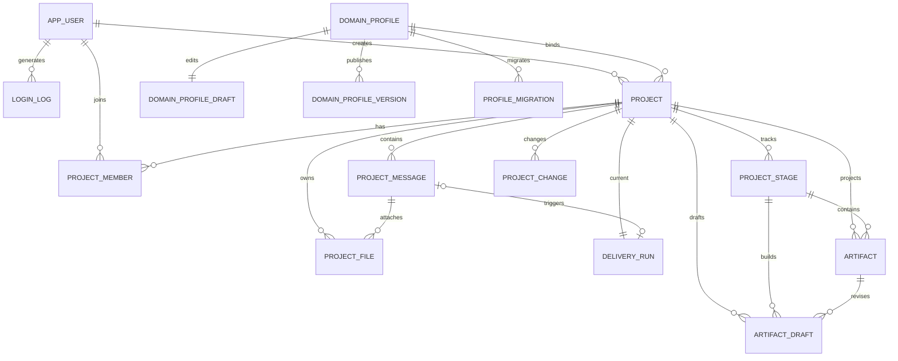

# AI 软件交付平台 V2 数据库设计

| 属性 | 内容 |
| --- | --- |
| 文档状态 | `APPROVED` |
| 文档版本 | 1.1 |
| 日期 | 2026-08-06 |
| 上游基线 | V2 PRD 1.0、总体架构 1.0、Graph/模块设计 1.0 |
| 数据库 | PostgreSQL |

## 1. 文档目的

本文定义 V2 首发版的 PostgreSQL 表、字段、约束、索引、事务和数据保留策略，并补充 Redis Key 设计。设计目标是让数据库准确表达当前项目真相和可恢复运行，同时避免把 Git 历史、模型调用流水和临时任务复制成无限增长的关系表。

V2 直接创建新 Schema，不迁移 V1 SQLite 数据。V1 的 `module`、`api`、`test_case`、`conversation_message`、`conversation_summary`、`operation_log` 和项目文档列全部废弃。

## 2. 核心取舍

### 2.1 PostgreSQL 保存什么

- 用户、登录日志、项目和项目成员。
- 当前结构化项目真相和乐观锁修订号。
- 项目共享消息、当前队列和用户可见过程。
- 每项目唯一当前 Delivery Run 和 PostgreSQL Checkpoint。
- 每阶段当前状态和当前基线 Git 指针。
- 当前候选产物与当前批准产物投影。
- 项目变更的运行状态和 Git 决议指针。
- 领域 Profile、版本、迁移和模型 Profile。
- 上传附件的元数据和对象存储定位。

### 2.2 PostgreSQL 不保存什么

- 不保存完整批准产物历史；历史在 Git Commit 和 Tag 中。
- 不保存 Artifact Manifest；阶段 Commit 的文件树就是基线内容。
- 不建立阶段基线历史表；`project_stage` 只保存当前基线指针。
- 不建立产物关系表；固定逻辑引用使用数组列。
- 不建立 `git_publish_outbox`；发布恢复状态在 `project_stage`。
- 不建立 Delivery Run 历史表；每项目只保留一条当前 Run。
- 不建立模型调用历史表；诊断随助手 `project_message` 保存。
- 不建立 Conversation、Thread、Queue 或 Conversation Summary 表。
- 不建立 Session、密码重置、Profile Revision、迁移历史或迁移规则快照表。
- 不保存模型完整 Prompt、原始输出、附件二进制或导出包正文。

## 3. 命名与通用约定

- 业务表放在 `public` 或统一应用 Schema；LangGraph Checkpoint 使用独立 `langgraph` Schema。
- 主键使用应用生成的 UUID，避免全局自增序列影响不同项目。
- 时间统一使用 `timestamptz`，数据库写入 UTC，界面按用户时区展示。
- 状态使用 `varchar` + `CHECK`，不创建 PostgreSQL ENUM，便于后续增加状态。
- JSONB 聚合必须经过应用层 Pydantic/JSON Schema 校验；固定查询和关联字段必须拆为列。
- 内容 Hash 使用小写十六进制 SHA-256，列类型 `varchar(64)`。
- Git Commit SHA 使用 `varchar(64)`，同时兼容 SHA-1 和 SHA-256 仓库。
- 所有可更新行包含 `created_at`、`updated_at`；不可变发布行使用 `created_at` 或 `published_at`。
- 用户不物理删除，只禁用；项目首发只归档，不级联删除审计数据。

## 4. 表清单

| 领域 | 表 | 用途 |
| --- | --- | --- |
| 认证 | `app_user` | 用户账户、状态和密码 |
| 认证 | `login_log` | 登录成功与失败记录 |
| 项目 | `project` | 项目、项目真相、Profile 和 GitLab 当前绑定 |
| 项目 | `project_member` | 项目角色关系 |
| 文件 | `project_file` | 附件与对象存储元数据 |
| 对话 | `project_message` | 共享时间线、排队、过程和诊断 |
| 运行 | `delivery_run` | 每项目唯一当前后台运行 |
| 阶段 | `project_stage` | 每阶段状态与当前基线指针 |
| 产物 | `artifact_draft` | 当前候选产物 |
| 产物 | `artifact` | 当前批准产物投影 |
| 变更 | `project_change` | 已封存基线变更的运行状态 |
| Profile | `domain_profile` | Profile 稳定身份和当前版本 |
| Profile | `domain_profile_draft` | 当前可编辑 Profile 草稿 |
| Profile | `domain_profile_version` | 不可变发布版本 |
| Profile | `profile_migration` | 当前相邻版本迁移规则 |
| 模型 | `model_profile` | 阶段模型和参数配置 |
| Checkpoint | LangGraph 管理表 | Graph Checkpoint、Blob 和 Writes |

首发业务表共 16 张，不含 LangGraph 官方 Checkpoint 表。

## 5. 关系概览



## 6. 认证与用户

### 6.1 `app_user`

| 字段 | 类型 | 约束 | 含义 |
| --- | --- | --- | --- |
| `id` | uuid | PK | 用户 ID |
| `username` | varchar(100) | NOT NULL | 登录名；通过 `lower(username)` 唯一索引保证不区分大小写唯一 |
| `display_name` | varchar(200) | NOT NULL | 界面显示名 |
| `password_hash` | text | NOT NULL | 安全密码哈希结果 |
| `password_salt` | bytea | NOT NULL | 每个用户独立随机 Salt |
| `system_role` | varchar(16) | NOT NULL, CHECK | `ADMIN`、`USER` |
| `status` | varchar(16) | NOT NULL, CHECK | `ACTIVE`、`DISABLED` |
| `must_change_password` | boolean | NOT NULL DEFAULT true | 是否必须在登录后修改临时密码 |
| `created_by_user_id` | uuid | FK `app_user`, NULL | 创建该账户的管理员；初始管理员为空 |
| `last_login_at` | timestamptz | NULL | 最近一次成功登录时间，用于展示，不替代登录日志 |
| `created_at` | timestamptz | NOT NULL | 创建时间 |
| `updated_at` | timestamptz | NOT NULL | 更新时间 |

约束与索引：

- `UNIQUE INDEX uq_app_user_username_lower ON app_user(lower(username))`。
- 禁止物理删除已创建用户，禁用只更新 `status`。
- 修改密码只更新 Hash、Salt、`must_change_password` 和 `updated_at`，不更新或删除 Redis Session。

### 6.2 `login_log`

| 字段 | 类型 | 约束 | 含义 |
| --- | --- | --- | --- |
| `id` | uuid | PK | 登录日志 ID |
| `user_id` | uuid | FK `app_user`, NULL | 成功识别的用户；未知用户名失败时为空 |
| `username_attempted` | varchar(100) | NOT NULL | 本次尝试的登录名 |
| `result` | varchar(16) | NOT NULL, CHECK | `SUCCESS`、`FAILED` |
| `failure_code` | varchar(32) | NULL | `INVALID_CREDENTIALS`、`USER_DISABLED` 等归一化原因 |
| `ip_address` | inet | NULL | 客户端 IP |
| `user_agent` | text | NULL | 客户端 User-Agent |
| `created_at` | timestamptz | NOT NULL | 登录时间 |

索引：`(user_id, created_at DESC)`、`(username_attempted, created_at DESC)`、`(created_at DESC)`。

不建立密码重置表。管理员重置密码直接更新 `app_user` 并生成一次安全审计日志；首发可写入应用安全日志，不新增通用操作日志表。

## 7. 项目

### 7.1 `project`

| 字段 | 类型 | 约束 | 含义 |
| --- | --- | --- | --- |
| `id` | uuid | PK | 项目 ID |
| `creation_idempotency_key` | uuid | NOT NULL | 创建者提交项目时的重试标识，不是项目 ID |
| `creation_request_hash` | varchar(64) | NOT NULL | 规范化创建请求的 SHA-256 |
| `name` | varchar(255) | NOT NULL | 项目名称；允许不同项目重名 |
| `description` | text | NULL | 创建时项目描述 |
| `status` | varchar(24) | NOT NULL, CHECK | `ACTIVE`、`REBASELINING`、`BLOCKED`、`COMPLETED`、`ARCHIVED` |
| `truth` | jsonb | NOT NULL DEFAULT `{}` | 当前结构化项目真相：目标、范围、事实、决策和未决问题 |
| `revision` | bigint | NOT NULL DEFAULT 0 | 项目真相乐观锁版本，每次授权修改递增 |
| `profile_id` | uuid | FK `domain_profile`, NOT NULL | 当前绑定 Profile |
| `profile_version` | integer | NOT NULL | 项目已完成迁移的整数版本 |
| `profile_hash` | varchar(64) | NOT NULL | 当前项目版本对应的 Profile 内容 Hash |
| `profile_migration_status` | varchar(16) | NOT NULL, CHECK | `CURRENT`、`MIGRATING`、`WAITING`、`FAILED` |
| `profile_migration_error` | jsonb | NULL | 最近一次技术迁移错误；成功后清空 |
| `artifact_counters` | jsonb | NOT NULL DEFAULT `{}` | 按产物类型保存项目内已发放最大编号 |
| `gitlab_project_id` | bigint | NULL, UNIQUE | 内部 GitLab 数字项目 ID |
| `gitlab_path` | text | NULL, UNIQUE | GitLab 专用 Group 下的项目路径 |
| `default_branch` | varchar(100) | NOT NULL DEFAULT `main` | 批准产物保护分支 |
| `created_by_user_id` | uuid | FK `app_user`, NOT NULL | 项目创建者 |
| `created_at` | timestamptz | NOT NULL | 创建时间 |
| `updated_at` | timestamptz | NOT NULL | 更新时间 |

设计说明：

- 不保存单值 `current_stage`；并行阶段状态来自 `project_stage`。
- `truth` 是经过 Schema 校验的项目聚合，不存聊天摘要，不保存批准产物正文。
- `artifact_counters` 示例：`{"REQ": 12, "API": 8, "TABLE": 5, "TEST": 31}`。只在阶段封存成功事务中前进，删除不回退。
- Profile 多步迁移每成功一步立即更新 `profile_version` 和 `profile_hash`。

索引：`UNIQUE(created_by_user_id, creation_idempotency_key)`、`(status, updated_at DESC)`、`(profile_id, profile_version)`、`(created_by_user_id, created_at DESC)`。

### 7.2 `project_member`

| 字段 | 类型 | 约束 | 含义 |
| --- | --- | --- | --- |
| `id` | uuid | PK | 关系 ID |
| `project_id` | uuid | FK `project`, NOT NULL | 项目 |
| `user_id` | uuid | FK `app_user`, NOT NULL | 用户 |
| `role` | varchar(16) | NOT NULL, CHECK | `OWNER`、`MEMBER`、`VIEWER` |
| `created_by_user_id` | uuid | FK `app_user`, NOT NULL | 添加成员的用户 |
| `created_at` | timestamptz | NOT NULL | 添加时间 |
| `updated_at` | timestamptz | NOT NULL | 角色更新时间 |

约束与索引：

- `UNIQUE(project_id, user_id)`。
- `INDEX(user_id, project_id)` 支持用户项目列表。
- 每个项目至少一个 OWNER。删除或降级最后一个 OWNER 必须由 Project Module 拒绝；不使用复杂触发器实现跨行规则。

### 7.3 `project_file`

| 字段 | 类型 | 约束 | 含义 |
| --- | --- | --- | --- |
| `id` | uuid | PK | 附件 ID |
| `project_id` | uuid | FK `project`, NOT NULL | 所属项目 |
| `message_id` | uuid | FK `project_message`, NOT NULL | 上传该附件的项目消息 |
| `filename` | text | NOT NULL | 原始文件名 |
| `content_type` | varchar(200) | NOT NULL | MIME 类型 |
| `size_bytes` | bigint | NOT NULL, CHECK `>= 0` | 文件大小 |
| `sha256` | varchar(64) | NOT NULL | 原文件内容 Hash |
| `object_key` | text | NOT NULL, UNIQUE | MinIO/S3 原文件 Key |
| `extracted_text_key` | text | NULL, UNIQUE | 提取文本对象 Key；正文不写 PostgreSQL |
| `summary` | text | NULL | 供列表和 Context Projection 初筛的摘要 |
| `status` | varchar(24) | NOT NULL, CHECK | `UPLOADED`、`SCANNING`、`PROCESSING`、`READY`、`FAILED` |
| `error` | jsonb | NULL | 最近处理错误 |
| `created_at` | timestamptz | NOT NULL | 上传时间 |
| `updated_at` | timestamptz | NOT NULL | 更新时间 |

约束：`UNIQUE(project_id, filename)` 保持首发“不允许同项目同名附件”的行为。索引：`(project_id, created_at DESC)`、`(message_id)`、`(project_id, sha256)`。

## 8. 项目消息与运行

### 8.1 `project_message`

V2 的共享时间线表，直接替换 `conversation_message`。

| 字段 | 类型 | 约束 | 含义 |
| --- | --- | --- | --- |
| `id` | uuid | PK | 消息 ID；统一由服务端生成，不接受客户端指定 |
| `project_id` | uuid | FK `project`, NOT NULL | 所属项目 |
| `user_id` | uuid | FK `app_user`, NULL | 用户消息提交者；助手/系统消息为空 |
| `idempotency_key` | uuid | NULL | 用户提交消息时由客户端生成的重试标识；助手/系统消息为空 |
| `request_hash` | varchar(64) | NULL | 用户消息规范化请求的 SHA-256，用于识别同 Key 不同请求 |
| `role` | varchar(16) | NOT NULL, CHECK | `USER`、`ASSISTANT`、`SYSTEM` |
| `agent_role` | varchar(32) | NULL | 助手专业角色，如 `PM`、`ARCHITECT`；用户消息为空 |
| `content` | text | NOT NULL DEFAULT `''` | 最终用户可见文本；运行中可暂为空 |
| `delivery_mode` | varchar(16) | NULL, CHECK | 用户消息的 `DIRECT`、`STEER`、`QUEUE`；助手/系统消息为空 |
| `target_run_id` | uuid | NULL | 关联的逻辑 Run ID；不设 FK，因为 `delivery_run` 当前行会被覆盖 |
| `status` | varchar(32) | NOT NULL, CHECK | 见消息状态定义 |
| `process` | jsonb | NOT NULL DEFAULT `[]` | 助手消息的用户可见有序过程事件 |
| `process_version` | bigint | NOT NULL DEFAULT 0 | SSE 重连和乐观更新游标 |
| `diagnostics` | jsonb | NOT NULL DEFAULT `[]` | 仅 ADMIN 可见的节点模型诊断 |
| `stopped_by_user_id` | uuid | FK `app_user`, NULL | 执行取消或中断的用户 |
| `stopped_at` | timestamptz | NULL | 实际进入 `CANCELLED` 或 `INTERRUPTED` 的时间 |
| `created_at` | timestamptz | NOT NULL | 创建时间；也是 Queue 主排序键 |
| `updated_at` | timestamptz | NOT NULL | 内容、状态或过程更新时间 |

消息状态集合：

```text
PENDING
QUEUED
RUNNING
WAITING_FOR_HUMAN
COMPLETED
FAILED
FAILED_BEFORE_PROCESSING
CANCELLED
INTERRUPTED
```

约束与索引：

- `CHECK(role = 'USER' AND user_id IS NOT NULL OR role <> 'USER' AND user_id IS NULL)`。
- `CHECK(role = 'USER' AND idempotency_key IS NOT NULL AND request_hash IS NOT NULL OR role <> 'USER' AND idempotency_key IS NULL AND request_hash IS NULL)`。
- `UNIQUE(project_id, user_id, idempotency_key) WHERE idempotency_key IS NOT NULL`；幂等键只在同一项目、同一用户内唯一。
- `CHECK(status IN ('CANCELLED','INTERRUPTED') OR stopped_at IS NULL)`；进入终止状态时应用事务同时写操作者和时间。
- 时间线索引 `(project_id, created_at DESC, id DESC)`。
- 待执行 Queue 部分索引 `(project_id, created_at, id) WHERE delivery_mode='QUEUE' AND status='QUEUED'`。
- Run 查询索引 `(project_id, target_run_id, created_at)`。
- 不为 `process` 和 `diagnostics` 建 GIN 索引，它们按消息读取，不承担业务过滤。

### 8.2 `delivery_run`

每个项目只保留一条当前行，新 Run 在上一 Run 终态且 Checkpoint 已清理后覆盖该行。

| 字段 | 类型 | 约束 | 含义 |
| --- | --- | --- | --- |
| `project_id` | uuid | PK, FK `project` | 同时保证每项目一条当前 Run |
| `run_id` | uuid | NOT NULL, UNIQUE | 当前逻辑 Run 和 Checkpoint Thread ID |
| `trigger_message_id` | uuid | FK `project_message`, NOT NULL | 触发用户消息 |
| `response_message_id` | uuid | FK `project_message`, NOT NULL | 保存过程和最终回复的助手消息 |
| `status` | varchar(32) | NOT NULL, CHECK | 见 Run 状态定义 |
| `project_revision` | bigint | NOT NULL | Run 启动时固定的项目修订号 |
| `profile_id` | uuid | FK `domain_profile`, NOT NULL | Run 固定 Profile |
| `profile_version` | integer | NOT NULL | Run 固定 Profile 整数版本 |
| `profile_hash` | varchar(64) | NOT NULL | Run 固定 Profile 内容 Hash |
| `input_baselines` | jsonb | NOT NULL DEFAULT `[]` | 本 Run 消费的阶段、版本、Commit SHA 和 Tag 列表 |
| `lease_owner` | varchar(200) | NULL | 当前 Worker 实例 ID |
| `lease_until` | timestamptz | NULL | Worker 租约截止时间 |
| `retry_count` | integer | NOT NULL DEFAULT 0 | 当前 Run 自动/人工恢复累计次数 |
| `last_error` | jsonb | NULL | 最近一次归一化错误 |
| `started_at` | timestamptz | NOT NULL | Run 创建时间 |
| `updated_at` | timestamptz | NOT NULL | 最近状态或租约更新时间 |

Run 状态集合：

```text
QUEUED
PREPARING
MIGRATING
RUNNING
WAITING_FOR_HUMAN
STOPPING
COMPLETED
FAILED
CANCELLED
INTERRUPTED
```

索引：

- `(status, lease_until)` 支持 Worker 领取和租约恢复。
- `(updated_at)` 支持 Scheduler 扫描异常滞留。
- 不保存 `progress`；用户过程在 `project_message.process`。
- 不保存 Run 历史、完整 Prompt 或模型原始输出。

### 8.3 LangGraph Checkpoint 表

使用 LangGraph PostgreSQL Checkpointer 官方表结构，放在 `langgraph` Schema。典型表包括迁移版本、Checkpoint、Blob 和 Writes，确切名称以所用 LangGraph 版本的官方迁移为准。

约束：

- `thread_id = delivery_run.run_id`。
- 不由业务 ORM 自行复制 Checkpoint 表。
- `COMPLETED`、`CANCELLED`、`INTERRUPTED` 以及明确放弃的失败 Run 必须清理对应 Thread。
- `FAILED` 和 `WAITING_FOR_HUMAN` 保留 Thread。
- Checkpoint 丢失不得改变 `project`、`project_stage`、`artifact` 或 Git 基线。

## 9. 阶段与产物

### 9.1 `project_stage`

项目创建时预置每个阶段一行。该表同时表达阶段进度和当前基线指针，不建立独立 Baseline 表。

| 字段 | 类型 | 约束 | 含义 |
| --- | --- | --- | --- |
| `id` | uuid | PK | 阶段行 ID |
| `project_id` | uuid | FK `project`, NOT NULL | 所属项目 |
| `stage` | varchar(40) | NOT NULL, CHECK | 阶段代码 |
| `status` | varchar(32) | NOT NULL, CHECK | 阶段状态 |
| `revision` | bigint | NOT NULL DEFAULT 0 | 阶段乐观锁版本 |
| `baseline_version` | integer | NOT NULL DEFAULT 0 | 当前基线版本；0 表示尚未封存 |
| `git_commit_sha` | varchar(64) | NULL | 当前基线 Commit |
| `git_tag` | text | NULL | 当前确定性 Tag |
| `profile_id` | uuid | FK `domain_profile`, NULL | 当前基线使用的 Profile |
| `profile_version` | integer | NULL | 当前基线使用的 Profile 整数版本 |
| `profile_hash` | varchar(64) | NULL | 当前基线使用的 Profile 内容 Hash |
| `publish_key` | varchar(64) | NULL | 当前/最近封存操作幂等键 |
| `publish_attempts` | integer | NOT NULL DEFAULT 0 | 当前封存尝试次数 |
| `publish_error` | jsonb | NULL | 最近 Git 或数据库补全错误 |
| `created_at` | timestamptz | NOT NULL | 创建时间 |
| `updated_at` | timestamptz | NOT NULL | 更新时间 |

阶段代码：

```text
PROJECT_CHARTER
REQUIREMENT_OUTLINE
REQUIREMENT_MODULE
PRD
ARCHITECTURE
SYSTEM_MODULE
API
DATABASE
TEST
```

阶段状态：

```text
NOT_STARTED
BUILDING
WAITING_FOR_HUMAN
SEALING
SEALED
SEAL_FAILED
INVALIDATED
```

约束与索引：

- `UNIQUE(project_id, stage)`。
- `UNIQUE(project_id, git_tag) WHERE git_tag IS NOT NULL`。
- `UNIQUE(publish_key) WHERE publish_key IS NOT NULL`。
- `CHECK(status <> 'SEALED' OR (baseline_version > 0 AND git_commit_sha IS NOT NULL AND git_tag IS NOT NULL))`。
- 索引 `(project_id, status)`、`(status, updated_at)`。
- API、DATABASE 和 TEST 等多行可同时 `BUILDING`；`project` 不复制当前阶段。

### 9.2 产物共同固定字段

`artifact` 与 `artifact_draft` 共享以下业务列，不能只塞进 JSONB：

| 字段 | 类型 | 含义 |
| --- | --- | --- |
| `project_id` | uuid | 所属项目 |
| `stage` | varchar(40) | 生产阶段 |
| `artifact_type` | varchar(40) | 产物类型 |
| `artifact_code` | varchar(40), NULL for new draft | 项目内稳定逻辑编号 |
| `canonical_key` | varchar(300) | 未分配编号前的稳定去重键 |
| `title` | text | 标题 |
| `artifact_version` | integer | 当前内容版本，更新批准产物时递增 |
| `schema_version` | integer | 平台基础 Schema 版本 |
| `body` | jsonb | 各产物类型的结构化正文，包含 `domain_extensions` |
| `source_refs` | text[] | 消息、附件、事实或上游来源引用 |
| `requirement_refs` | text[] | 需求逻辑编号 |
| `module_refs` | text[] | 系统/业务模块逻辑编号 |
| `decision_refs` | text[] | 业务或架构决策逻辑编号 |
| `architecture_refs` | text[] | 架构产物逻辑编号 |
| `api_refs` | text[] | API 逻辑编号 |
| `read_table_refs` | text[] | 读取的数据表逻辑编号 |
| `write_table_refs` | text[] | 写入的数据表逻辑编号 |
| `content_hash` | varchar(64) | 规范化结构化内容 Hash |
| `profile_id/version/hash` | 多列 | 生成或验证该内容的 Profile 引用 |

数组列默认空数组而不是 NULL。引用使用逻辑编号且不做逐元素外键；候选保存、删除和封存时由 Artifact Lifecycle 做项目内存在性、类型和方向校验。

### 9.3 `artifact`

只保存每个稳定产物身份的当前批准投影。

| 字段 | 类型 | 约束 | 含义 |
| --- | --- | --- | --- |
| `id` | uuid | PK | 内部产物 ID |
| 共同固定字段 | 见 9.2 | NOT NULL（按定义） | 当前批准内容及追踪 |
| `baseline_version` | integer | NOT NULL | 当前内容进入的生产阶段基线版本 |
| `git_path` | text | NOT NULL | 稳定 YAML 文件路径；渲染路径可确定性推导 |
| `git_commit_sha` | varchar(64) | NOT NULL | 当前内容所在 Commit |
| `created_at` | timestamptz | NOT NULL | 首次批准时间 |
| `updated_at` | timestamptz | NOT NULL | 当前投影更新时间 |

约束与索引：

- `UNIQUE(project_id, artifact_code)`。
- `UNIQUE(project_id, artifact_type, canonical_key)`。
- `UNIQUE(project_id, git_path)`。
- 索引 `(project_id, stage)`、`(project_id, artifact_type)`。
- 对 `requirement_refs`、`module_refs`、`decision_refs`、`architecture_refs`、`api_refs`、`read_table_refs`、`write_table_refs` 建 GIN 索引，支持反向影响分析。
- 不保存历史行。新基线成功后更新当前行；批准删除成功后删除当前行，历史只从 Git 查询。

### 9.4 `artifact_draft`

每个项目只保存当前候选投影，不保存模型每次尝试的历史版本。

| 字段 | 类型 | 约束 | 含义 |
| --- | --- | --- | --- |
| `id` | uuid | PK | 草稿 ID |
| `base_artifact_id` | uuid | FK `artifact`, NULL | 更新/删除现有产物时指向当前批准行；新建为空 |
| 共同固定字段 | 见 9.2 | `artifact_code` 可 NULL | 当前候选内容及追踪 |
| `operation` | varchar(16) | NOT NULL, CHECK | `CREATE`、`UPDATE`、`DELETE` |
| `status` | varchar(24) | NOT NULL, CHECK | `DRAFT`、`VALIDATING`、`REVISING`、`READY_TO_SEAL`、`DELETING` |
| `validation_result` | jsonb | NOT NULL DEFAULT `{}` | 当前确定性校验结果；覆盖更新，不保存历史 |
| `review_result` | jsonb | NOT NULL DEFAULT `{}` | 当前语义评审结果；覆盖更新，不保存历史 |
| `created_at` | timestamptz | NOT NULL | 当前候选创建时间 |
| `updated_at` | timestamptz | NOT NULL | 最近修改或质量状态时间 |

约束与索引：

- `UNIQUE(project_id, artifact_type, canonical_key)`，保证每个候选身份只有一行。
- `UNIQUE(project_id, artifact_code) WHERE artifact_code IS NOT NULL`，保护封存时预留编号。
- `CHECK(operation = 'CREATE' OR base_artifact_id IS NOT NULL)`。
- 索引 `(project_id, stage, status)`、`(base_artifact_id)`。
- 对固定引用数组建立与 `artifact` 相同的 GIN 索引，支持候选影响检查。
- 新草稿 `artifact_code` 为空；进入 `SEALING` 时批量预留。Git 失败保留预留编号供原号重试；成功后更新 `artifact_counters` 并删除草稿。
- 中断不增加来源 Run 字段或专用状态；当前 Run 正在处理的各阶段草稿统一回到 `REVISING`。

## 10. 项目变更

### 10.1 `project_change`

保存变更处理的当前及终态索引。完整终态决议作为批准产物进入 Git；不建立独立 Change Decision 表。

| 字段 | 类型 | 约束 | 含义 |
| --- | --- | --- | --- |
| `id` | uuid | PK | 变更 ID |
| `project_id` | uuid | FK `project`, NOT NULL | 所属项目 |
| `source_message_id` | uuid | FK `project_message`, NOT NULL | 发起变更的消息 |
| `requested_by_user_id` | uuid | FK `app_user`, NOT NULL | 发起用户 |
| `request_content` | text | NOT NULL | 规范化变更请求 |
| `target_artifact_codes` | text[] | NOT NULL DEFAULT `{}` | 用户明确指定或 PM 识别的目标产物 |
| `base_baselines` | jsonb | NOT NULL | 发起时相关阶段版本、Commit 和 Tag |
| `status` | varchar(24) | NOT NULL, CHECK | 变更状态 |
| `impact` | jsonb | NULL | 受影响产物、阶段、理由和保守扩大标记 |
| `decision` | varchar(16) | NULL, CHECK | `APPROVED`、`REJECTED`、`WITHDRAWN` |
| `decided_by_user_id` | uuid | FK `app_user`, NULL | 决议人 |
| `decided_at` | timestamptz | NULL | 决议时间 |
| `decision_artifact_code` | varchar(40) | NULL | Git 中永久变更决议产物编号 |
| `decision_git_commit_sha` | varchar(64) | NULL | 决议所在 Commit |
| `applied_baselines` | jsonb | NULL | 应用后替代的阶段基线引用 |
| `last_error` | jsonb | NULL | 最近应用错误 |
| `created_at` | timestamptz | NOT NULL | 创建时间 |
| `updated_at` | timestamptz | NOT NULL | 更新时间 |

状态集合：

```text
PROPOSED
ANALYZING
WAITING_FOR_HUMAN
APPROVED
APPLYING
APPLIED
REJECTED
WITHDRAWN
FAILED
```

约束与索引：

- `(project_id, created_at DESC)` 项目变更历史。
- `(project_id, status, updated_at)` 当前处理查询。
- `GIN(target_artifact_codes)` 目标查询。
- 终态 `APPLIED/REJECTED/WITHDRAWN` 必须有 `decision`、决议人、决议时间和 Git 决议指针。
- 表保留紧凑运行索引，不重复保存 Git 中完整决议正文。

## 11. 领域 Profile

### 11.1 `domain_profile`

| 字段 | 类型 | 约束 | 含义 |
| --- | --- | --- | --- |
| `id` | uuid | PK | 稳定 Profile ID |
| `code` | varchar(100) | NOT NULL, UNIQUE | 稳定机器代码 |
| `name` | varchar(200) | NOT NULL | 管理员显示名 |
| `description` | text | NULL | 管理说明 |
| `status` | varchar(16) | NOT NULL, CHECK | `ACTIVE`、`INACTIVE` |
| `is_builtin_general` | boolean | NOT NULL DEFAULT false | 是否系统通用兜底 Profile |
| `current_version` | integer | NOT NULL DEFAULT 0 | 当前可执行整数版本；0 表示尚未首次发布 |
| `created_by_user_id` | uuid | FK `app_user`, NOT NULL | 创建人 |
| `created_at` | timestamptz | NOT NULL | 创建时间 |
| `updated_at` | timestamptz | NOT NULL | 更新时间 |

约束：全系统仅一行 `is_builtin_general=true`；该行不能停用或删除。`current_version` 只能单向递增。

### 11.2 `domain_profile_draft`

| 字段 | 类型 | 约束 | 含义 |
| --- | --- | --- | --- |
| `id` | uuid | PK | 草稿 ID |
| `profile_id` | uuid | FK `domain_profile`, NOT NULL, UNIQUE | 每个 Profile 一个当前草稿 |
| `base_version` | integer | NOT NULL | 本草稿从哪个发布版本开始编辑 |
| `content` | jsonb | NOT NULL | 完整可编辑 Profile 聚合 |
| `content_hash` | varchar(64) | NOT NULL | 草稿规范化 Hash |
| `lock_version` | bigint | NOT NULL DEFAULT 0 | 管理界面乐观锁 |
| `updated_by_user_id` | uuid | FK `app_user`, NOT NULL | 最近编辑人 |
| `created_at` | timestamptz | NOT NULL | 草稿创建时间 |
| `updated_at` | timestamptz | NOT NULL | 最近编辑时间 |

草稿覆盖术语、适用/排除条件、能力、产物扩展、验证、评审、Prompt 上下文、追踪、门禁和渲染规则，保持一个 JSONB 聚合，不拆大量表。

### 11.3 `domain_profile_version`

| 字段 | 类型 | 约束 | 含义 |
| --- | --- | --- | --- |
| `id` | uuid | PK | 发布行 ID |
| `profile_id` | uuid | FK `domain_profile`, NOT NULL | 所属 Profile |
| `version` | integer | NOT NULL, CHECK `> 0` | 连续整数版本 |
| `content` | jsonb | NOT NULL | 不可变完整发布内容 |
| `content_hash` | varchar(64) | NOT NULL | 发布内容 Hash |
| `validation_result` | jsonb | NOT NULL | 发布时静态检查结果 |
| `published_by_user_id` | uuid | FK `app_user`, NOT NULL | 发布人 |
| `published_at` | timestamptz | NOT NULL | 发布时间 |

约束：`UNIQUE(profile_id, version)`、`UNIQUE(profile_id, content_hash)`。应用权限禁止 UPDATE/DELETE；被项目或基线引用的版本永久保留。

### 11.4 `profile_migration`

迁移规则允许管理员直接修正，因此只保存当前规则和 Hash，不保存修订历史。

| 字段 | 类型 | 约束 | 含义 |
| --- | --- | --- | --- |
| `id` | uuid | PK | 迁移规则 ID |
| `profile_id` | uuid | FK `domain_profile`, NOT NULL | 所属 Profile |
| `from_version` | integer | NOT NULL | 来源整数版本 |
| `to_version` | integer | NOT NULL | 目标版本，必须等于 `from_version + 1` |
| `definition` | jsonb | NOT NULL | 当前迁移动作定义 |
| `content_hash` | varchar(64) | NOT NULL | 当前规则 Hash |
| `updated_by_user_id` | uuid | FK `app_user`, NOT NULL | 最近修改管理员 |
| `created_at` | timestamptz | NOT NULL | 首次创建时间 |
| `updated_at` | timestamptz | NOT NULL | 最近修改时间 |

约束：`UNIQUE(profile_id, from_version, to_version)`、`CHECK(to_version = from_version + 1)`。规则修正原行并更新 Hash；已经成功迁移的项目不因 Hash 改变而回退或重跑。

## 12. 模型配置

### 12.1 `model_profile`

| 字段 | 类型 | 约束 | 含义 |
| --- | --- | --- | --- |
| `id` | uuid | PK | 模型 Profile ID |
| `code` | varchar(100) | NOT NULL, UNIQUE | 稳定配置代码 |
| `name` | varchar(200) | NOT NULL | 管理员显示名 |
| `purpose` | varchar(40) | NOT NULL | `INTENT`、`AUTHOR`、`REVIEWER`、`TEST_DESIGN` 等职责 |
| `provider` | varchar(100) | NOT NULL | ModelGateway Provider adapter 代码 |
| `model_name` | varchar(200) | NOT NULL | 供应商模型名，仅管理员可见 |
| `parameters` | jsonb | NOT NULL DEFAULT `{}` | 温度、最大输出等允许参数 |
| `secret_ref` | varchar(200) | NOT NULL | Secret 管理系统引用，不保存密钥值 |
| `status` | varchar(16) | NOT NULL, CHECK | `ACTIVE`、`INACTIVE` |
| `is_default` | boolean | NOT NULL DEFAULT false | 是否为该 purpose 默认配置 |
| `created_by_user_id` | uuid | FK `app_user`, NOT NULL | 创建人 |
| `updated_by_user_id` | uuid | FK `app_user`, NOT NULL | 最近修改人 |
| `created_at` | timestamptz | NOT NULL | 创建时间 |
| `updated_at` | timestamptz | NOT NULL | 更新时间 |

约束：每个 `purpose` 最多一个启用的默认项，使用部分唯一索引 `(purpose) WHERE status='ACTIVE' AND is_default=true`。

模型调用记录不单独建表，实际 Provider、模型、参数摘要、Hash、Token、耗时、重试、成本和结果写入对应助手消息的 `diagnostics`。

## 13. Redis Key 设计

Redis 数据均可重建或自然过期，不承载项目真相。

### 13.1 Session

```text
session:<sha256(token)>
TTL: 7200 秒滑动
Value: { user_id, csrf_hash }
```

浏览器 Cookie 保存原始随机 Token，不设置持久过期时间；Redis 只保存 Token Hash 对应信息。

### 13.2 用户缓存

```text
user:<user_id>
TTL: 7200 秒滑动
Value: { id, username, display_name, system_role, status, must_change_password }
```

每次有效请求同时延长 Session 和用户缓存。禁用/启用直接更新数据库和该缓存状态，不删除 Session。

### 13.3 项目对话占用

```text
project:conversation-owner:<project_id>
TTL: 300 秒滑动或 Worker 续期
Value: user_id
```

取得、同用户续期、异用户拒绝、OWNER 治理接管和释放使用 Lua 原子脚本。自动处理及 Queue 存在时 Worker 续期；`WAITING_FOR_HUMAN` 停止后台续期。

### 13.4 在线事件

```text
project:events:<project_id>
Type: Pub/Sub channel
Payload: { message_id, process_version, event_type }
```

Pub/Sub 只通知在线 SSE。断线后从 PostgreSQL `project_message` 恢复，不使用 Redis Streams 保存历史。

### 13.5 Worker 唤醒

```text
delivery:wakeup
Type: Pub/Sub channel
Payload: { project_id }
```

通知丢失时 Scheduler 仍从 PostgreSQL 扫描 `delivery_run`，因此不影响执行正确性。

## 14. 关键事务

### 14.1 创建项目

同一 PostgreSQL 事务：

1. 从 `Idempotency-Key` Header 读取 UUID 并计算规范化请求 Hash；同一创建者、相同 Key 和 Hash 返回已有项目，相同 Key 不同 Hash 返回冲突。
2. 插入 `project`，由服务端生成项目 ID，绑定通用或已匹配 Profile 当前版本。
3. 插入创建者 `project_member(OWNER)`。
4. 为九个阶段批量插入 `project_stage(NOT_STARTED)`。

事务提交后异步调用 GitLab 创建项目仓库；成功回写 GitLab 字段。仓库创建失败时项目保持 `BLOCKED`，允许管理员重试，不删除项目。

### 14.2 接收 DIRECT 消息

1. Redis 原子取得/校验项目对话占用。
2. PostgreSQL 事务锁定 `project` 与当前 `delivery_run`：
   - 校验项目可写、无未解决 FAILED Run；
   - 插入用户 `project_message`；
   - 插入助手 `project_message(RUNNING)`；
   - 插入或覆盖 `delivery_run(QUEUED)`。
3. 提交后发布 Worker 唤醒。

API 从 `Idempotency-Key` Header 读取 UUID，按规范化请求计算 `request_hash`。相同项目、用户和 Key 且 Hash 相同时返回已有 MessageReceipt，不重复创建 Run；相同 Key 但 Hash 不同时返回 `IDEMPOTENCY_KEY_REUSED`。真正的消息 UUID 由服务端生成。

### 14.3 接收 STEER/QUEUE

- `STEER`：校验当前 Run 和安全状态，插入 `project_message` 并写 `target_run_id`；Worker 在 Checkpoint 按消息顺序消费。
- `QUEUE`：插入 `project_message(status=QUEUED)`，不创建新的 `delivery_run`；当前 Run 终态后在事务中选取最早 Queue 并覆盖当前 Run。
- 排序固定使用 `(created_at, id)`，避免相同时间戳顺序不确定。

### 14.4 Worker Claim

使用 `SELECT ... FOR UPDATE SKIP LOCKED` 领取 `QUEUED` 或租约过期的可恢复 Run，原子更新 `lease_owner`、`lease_until` 和状态。业务提交必须同时校验 `run_id`、`lease_owner` 和租约未被其他 Worker 替代。

### 14.5 Profile 逐步迁移

每个相邻版本独立事务：

1. 锁定 `project`。
2. 校验当前 `profile_version = from_version`。
3. 加载当前迁移规则并验证 Hash。
4. 应用项目和候选转换、重渲染或重校验。
5. 成功后更新项目 `profile_version/profile_hash`。

后续步骤失败时保留最后成功版本。技术失败写 `profile_migration_error`；业务语义变化先进入人工等待，不提交未经确认的新事实。

### 14.6 阶段封存

封存分为可恢复的数据库—Git—数据库流程：

**事务 A：冻结发布**

1. 取得项目写锁和 `project_stage` 行锁。
2. 校验全部计划候选 `READY_TO_SEAL`、引用有效和输入基线未变化。
3. 按类型从 `artifact_counters` 之后连续预留正式编号并写入草稿。
4. 生成 `publish_key`，设置阶段 `SEALING` 并提交。

**外部步骤：GitLab**

5. 从冻结草稿确定性生成完整文件集合。
6. 按 `publish_key` 查询或创建 Commit，并创建确定性 Tag。

**事务 B：完成封存**

7. 再次锁定项目和阶段并校验 `publish_key`。
8. 写入/更新当前 `artifact`，更新 `artifact_counters`。
9. 写阶段 `baseline_version/git_commit_sha/git_tag/profile_*` 和 `SEALED`。
10. 删除本阶段草稿。

任何进程崩溃后，Scheduler 根据 `SEALING + publish_key` 查询 Git 并重做事务 B。不存在 Outbox，也不通过 commit SHA 是否为空推断完整业务状态。

### 14.7 中断

1. 设置 `delivery_run.status=STOPPING`。
2. Worker 到达安全边界后，同一事务：
   - 响应助手消息改为 `INTERRUPTED`，写 `stopped_by_user_id/stopped_at`；
   - 所有待执行 Queue 消息改为 `CANCELLED` 并写相同停止审计；
   - 当前 Run 正在处理的各阶段草稿改为 `REVISING`；
   - Run 改为 `INTERRUPTED`，清空租约。
3. 事务提交后清理 Checkpoint；失败可幂等重试。

中断不删除草稿，不回滚已完成的 Git/基线封存。

## 15. 锁与并发

| 资源 | 并发策略 |
| --- | --- |
| 项目真相 | `project.revision` 乐观锁 + 修改事务行锁 |
| 当前 Run | `delivery_run.project_id` PK + `run_id/lease_owner` 条件更新 |
| 项目对话用户 | Redis Lua 原子脚本，数据库单写兜底 |
| 阶段封存 | 项目写锁 + `project_stage` 行锁 + `publish_key` |
| 产物编号 | 在项目/阶段封存锁内更新 `artifact_counters` |
| Profile 草稿 | `lock_version` 乐观锁 |
| Profile 发布 | `domain_profile` 行锁 + 连续版本检查 |
| Profile 项目迁移 | `project` 行锁，每个相邻步骤独立事务 |

项目写锁可以使用 PostgreSQL Transaction Advisory Lock，Key 由项目 UUID 稳定 Hash 得到；它只用于跨多表业务临界区，普通单表更新仍使用行锁和版本条件。

## 16. 索引汇总

必须覆盖的高频查询：

- 用户按登录名查询、用户项目列表。
- 项目时间线倒序分页和 Queue 正序领取。
- Scheduler 按 Run 状态/租约和阶段 `SEALING` 扫描。
- 项目各阶段状态列表。
- 按项目、阶段、类型查询当前产物和草稿。
- 按固定逻辑引用数组执行反向影响分析。
- 项目变更时间线和当前处理中变更。
- Profile 当前版本、相邻迁移和项目落后版本查询。

不为低选择度布尔字段单独建普通索引；使用带业务条件的部分索引。JSONB 只有出现明确查询条件后才建表达式或 GIN 索引，首发不对 `truth/body/process/diagnostics` 做全量通用 GIN。

## 17. 数据保留与清理

| 数据 | 策略 |
| --- | --- |
| 用户与成员 | 不物理删除；用户禁用、项目归档 |
| 登录日志 | 首发保留；上线前由合规要求确定归档周期 |
| 项目消息 | 随项目长期保留，承担共享历史和运行证据 |
| Delivery Run | 每项目一条，终态后被下一 Run 覆盖 |
| Checkpoint | FAILED/WAITING 保留；完成、放弃和中断后清理 |
| Artifact Draft | 当前候选；封存成功删除，中断保留并退回修订 |
| Artifact | 只保留当前批准投影；历史由 Git 保存 |
| Project Stage | 每项目每阶段一条当前行；历史由 Git Tag 保存 |
| Project Change | 保留紧凑索引；完整终态决议在 Git |
| Profile Version | 永久保留不可变发布版本 |
| Profile Migration | 只保留每个相邻版本当前规则 |
| 模型诊断 | 随项目助手消息保留，不另建流水表 |
| 附件/导出包 | 对象存储生命周期策略管理；数据库只保留定位和 Hash |

不在缺少业务保留政策时擅自硬编码删除天数。对象存储清理不得先于数据库引用和 Git 基线要求。

## 18. 权限与敏感数据

- 应用数据库账户按 API/Worker/Scheduler 的最小必要权限划分；迁移账户单独管理。
- `password_hash/password_salt` 不出现在普通查询 DTO、日志或诊断。
- `project_message.diagnostics` 仅 ADMIN 查询路径可访问。
- `model_profile.secret_ref` 只是 Secret 标识，真实密钥不进入数据库。
- PostgreSQL 备份加密，连接强制 TLS；生产日志不输出 `truth/body/process/diagnostics` 全文。
- GitLab、MinIO 和模型凭据不在任何 JSONB 字段保存。

## 19. V1 到 V2

不编写 V1 数据迁移脚本。V2 上线迁移只负责：

1. 创建新的 PostgreSQL Schema 和约束。
2. 创建 LangGraph PostgreSQL Checkpoint Schema。
3. 初始化第一个 ADMIN。
4. 初始化通用 Profile 及其版本 1。
5. 初始化基础模型 Profile。

V1 SQLite 文件可以在切换验证完成后离线归档，但 V2 应用不读取它，也不提供导入入口。

## 20. 明确不建立的表

```text
session
password_reset
conversation
conversation_summary
message_queue
delivery_run_history
artifact_history
artifact_relation
stage_baseline_history
artifact_manifest
git_publish_outbox
model_invocation
profile_revision
profile_migration_history
profile_migration_run
operation_log
```

这些信息分别由 Redis、`project_message`、当前投影、Git 历史、Profile 当前规则或领域业务行承担。未来如果出现真实查询、合规或容量证据，再通过独立 ADR 引入，不为假设需求预建。

## 21. 数据库验收检查

- [ ] V2 Schema 不包含 V1 文档列和 V1 独立 API/TestCase/Module 表。
- [ ] 每项目只能有一个当前 `delivery_run`，每阶段只能有一条 `project_stage`。
- [ ] 多个 `project_stage` 可同时 `BUILDING`，项目不保存单值当前阶段。
- [ ] `project_message` 可完整表达 DIRECT/STEER/QUEUE、过程、取消和中断。
- [ ] `artifact_draft` 新建时不消耗正式编号，Git 失败可原号重试。
- [ ] `artifact` 和 `artifact_draft` 使用固定引用列，未建立关系表。
- [ ] 当前基线可由 `project_stage` 的 Commit/Tag 唯一定位，无 Manifest。
- [ ] Git 成功、数据库失败后可按 `publish_key` 幂等补全，无 Outbox。
- [ ] Profile 使用整数相邻迁移，规则可直接修正且只保存 Hash。
- [ ] Session 与项目对话占用只在 Redis，Redis 丢失不改变业务真相。
- [ ] Checkpoint 清理规则与 Run 终态一致。
- [ ] 所有固定状态和权限字段有 CHECK 或唯一约束保护。

## 22. 后续文档输入

API 设计必须以本数据库的领域边界为基础，但不得把每张表直接暴露成 CRUD。Command 接口调用领域模块完成事务，Query 接口按角色投影字段。

实现计划必须进一步产出：

1. PostgreSQL DDL 与迁移顺序。
2. 每个 CHECK、部分唯一索引和外键的可执行 SQL。
3. LangGraph Postgres Checkpointer 的固定版本与官方 Schema。
4. Redis Lua 脚本及并发测试。
5. 封存故障注入和幂等恢复测试。

任何实现如果要新增本文“明确不建立”的表，必须先提交 ADR 并说明真实负载或合规证据。
