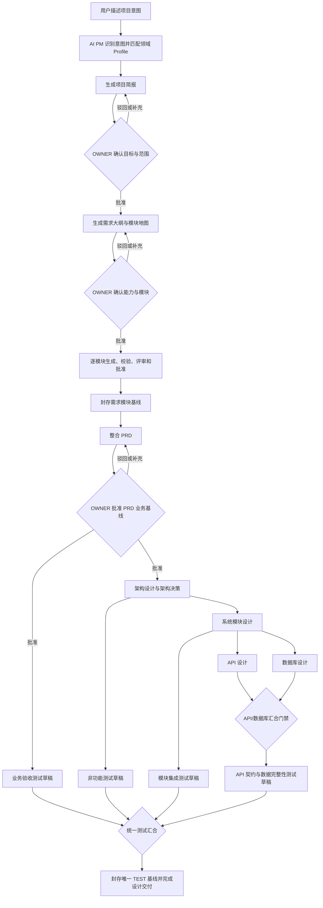

# AI 软件交付平台 V2 产品需求文档

| 属性 | 内容 |
| --- | --- |
| 文档状态 | `APPROVED` |
| 文档版本 | 1.0 |
| 日期 | 2026-08-05 |
| 批准日期 | 2026-08-05 |
| 产品范围 | V2 首次正式上线 |
| 决策依据 | `CONTEXT.md`、ADR 0001—0024 |

## 1. 文档目的

本文定义 AI 软件交付平台 V2 首次正式上线的产品目标、用户角色、业务流程、功能范围、质量要求和验收标准。它回答“平台必须解决什么问题、用户如何使用、什么结果才算可交付”，不定义物理表结构、接口参数、部署拓扑或具体 Graph 节点实现。

V2 直接替换当前 Demo 版本。现有 V1 Graph、接口、数据模型及历史 Demo 数据不迁移、不兼容，也不与 V2 共存。

## 2. 背景与问题

当前 Demo 能展示多 Agent 生成大纲、需求和 PRD 的基本能力，但生成内容偏浅，缺少稳定的项目事实、阶段边界、质量门禁、跨产物追踪和变更控制，不能直接交给研发与测试使用。多 Agent 协同时还可能出现意图漂移、角色越界、上下游输入不一致，以及一个 Agent 用自己的假设补写业务事实等问题。

平台要从“文档生成 Demo”升级为“设计交付系统”：AI PM 对整个项目负责，各专业 Agent 只对本阶段产物负责；每个阶段消费明确的上游基线，产出可校验、可评审、可追踪、可版本化的批准产物。需要人决定的问题必须停下来确认，其余专业工作由平台持续推进。

## 3. 产品愿景

用户通过一条共享项目对话描述目标、补充信息并完成关键确认；AI PM 将这些输入逐步转化为研发和测试可以直接使用的完整设计基线，并持续维护项目真相、决策、版本和变更影响。

首发版交付终点是：需求、PRD、架构、系统模块、API、数据库和测试用例设计全部完成并形成批准基线。未来自动开发、测试执行、缺陷回流和发布门禁直接消费这些基线，不重新解释原始对话。

## 4. 产品目标

### 4.1 核心目标

1. 将模糊项目意图转化为足以指导研发和测试的深度设计产物。
2. 通过 AI PM、专业 Author、Validator 和 Reviewer 分工降低意图漂移和单 Agent 自我确认风险。
3. 通过三个人工校准点尽早发现方向偏差，避免错误理解扩散到全部技术设计。
4. 通过阶段基线、固定追踪关系和 Git 历史建立唯一、可审计的项目真相。
5. 支持项目变更、影响分析和重新基线化，而不是覆盖已批准历史。
6. 建立可恢复的后台交付运行，使长时间生成不依赖浏览器或单次 HTTP 请求。
7. 为后续 AI 开发和测试执行提供稳定、机器可读的产物契约。

### 4.2 首发成功标准

- 所有下游阶段只消费已封存上游基线，不消费聊天文本或未批准草稿。
- 项目简报、需求大纲和 PRD 三个强制人工校准点均有明确的人类决议。
- 每份批准产物均有结构化权威源、确定性渲染文档、稳定逻辑编号和 Git 历史。
- 需求、模块、接口、数据表和测试之间可以正向追踪，也可以执行反向影响分析。
- API 与数据库设计完成汇合检查后才封存；分层测试完成统一汇合后才形成唯一 TEST 基线。
- Worker 故障、页面刷新或 SSE 断线不会丢失项目真相或已封存基线。
- 未经确认的业务事实不得由 Profile、Author 或 Reviewer 静默补写。

## 5. 非目标

首发版不包含：

- AI 编码、代码提交、合并请求和代码评审。
- 测试执行、缺陷自动回流和发布门禁。
- 生产部署、环境编排和应用发布。
- V1 数据迁移、V1/V2 双轨运行或兼容开关。
- 公开注册、邮件邀请、自助找回密码或 OIDC/Keycloak。
- 普通用户选择模型、模型供应商或领域 Profile。
- 用户或 Agent 直接写入内部 GitLab。
- 项目内私聊、多 Thread 或多人同时向项目提交消息。
- Profile 叠加、继承、灰度发布或历史版本回退执行。

## 6. 用户与权限

### 6.1 系统角色

| 角色 | 权限 |
| --- | --- |
| `ADMIN` | 管理用户、全部项目、领域 Profile、迁移规则和模型 Profile；查看管理员诊断信息；可完成项目人工校准。 |
| `USER` | 按项目成员角色使用平台，不可进入系统配置和 Profile 管理。 |

### 6.2 项目角色

| 角色 | 权限 |
| --- | --- |
| `OWNER` | 对项目业务方向和基线拥有最终确认权；可完成三个人工校准点、处理决策升级、管理成员、取消排队消息并强制中断运行。 |
| `MEMBER` | 可提交项目输入、补充信息、发起变更并参与评审；不能批准人工校准点。 |
| `VIEWER` | 只读查看共享时间线、项目状态和可见产物；只能下载批准产物。 |

项目创建者自动成为 `OWNER`。系统角色与项目角色彼此独立。

## 7. 核心业务原则

1. **项目真相优先**：Agent 必须依据当前事实、决策和基线工作，不能把聊天摘要当作唯一事实源。
2. **阶段职责隔离**：每个专业 Agent 只修改本阶段职责内的候选产物，跨阶段缺陷必须反馈给责任阶段。
3. **先校准再扩展**：强制人工校准点未通过前，不得解锁对应下游阶段。
4. **先批准再消费**：单个产物通过不代表阶段完成，只有完整阶段基线封存后才能被下游消费。
5. **结构化源权威**：YAML 产物源文件承载完整语义，Markdown 仅用于阅读和下载展示。
6. **历史不可覆盖**：已批准版本通过 Git Commit 和 Tag 保留；变更产生替代基线，不修改历史基线。
7. **项目级单写**：同一项目同一时间只有一个顶层交付运行改变项目真相；运行内部允许受控并行。
8. **业务决策归人**：业务范围、优先级、成本、合规和不可逆选择必须由人决定；纯技术方案可由 AI 记录取舍后推进。

## 8. 端到端设计交付流程

PRD 批准后，架构、系统模块、API、数据库和测试阶段不设置固定人工审批。各阶段通过确定性校验、语义评审、定向返工和必要汇合门禁后自动封存；发现新的业务决策时，AI PM 必须临时发起决策升级。

## 9. 功能需求

### 9.1 用户与认证

**FR-AUTH-001** 平台必须使用本地用户体系，不依赖外部身份提供商。

**FR-AUTH-002** 首次部署必须可创建初始管理员；后续用户由管理员创建，不开放公开注册。

**FR-AUTH-003** 管理员创建用户时设置临时密码，新用户首次登录必须修改；用户可在验证当前密码后自行修改密码；忘记密码由管理员重置临时密码。

**FR-AUTH-004** 平台必须支持多端登录和两小时滑动闲置 Session。浏览器关闭后 Session Cookie 不持久保存，但服务端 Session 在闲置过期前保持有效。

**FR-AUTH-005** 账户禁用后所有请求必须立即按禁用状态拒绝；重新启用后尚未过期的原 Session 无需重新登录。修改密码不主动撤销已有 Session。

**FR-AUTH-006** 平台必须记录登录日志，但不建立密码重置记录表。

### 9.2 项目创建与领域匹配

**FR-PROJ-001** 用户创建项目时只提交项目目标、范围、背景和附件，不选择领域 Profile 或模型。

**FR-PROJ-002** AI PM 必须根据 Profile 的适用条件和排除条件自动匹配一个专业 Profile；无法明确匹配时使用不可停用的通用 Profile。

**FR-PROJ-003** 第一个人工校准点通过前，AI PM 可根据新增事实静默调整 Profile；通过后切换 Profile 必须先执行影响分析和重新基线化。

**FR-PROJ-004** 每个平台项目必须关联一个独立的内部 GitLab 项目仓库，普通用户不直接获得仓库写权限。

### 9.3 共享项目对话

**FR-MSG-001** 每个项目只有一条共享时间线，所有项目消息直接属于项目，不建立 Conversation 或 Thread。

**FR-MSG-002** `OWNER`、`MEMBER` 和 `VIEWER` 查看同一条可见时间线；只有 `OWNER` 和 `MEMBER` 可以提交业务消息。

**FR-MSG-003** 同一时间只能有一个当前对话用户。首个成功发言者取得五分钟滑动占用；同一用户成功提交消息时续期，其他用户只能查看。

**FR-MSG-004** 自动处理以及等待执行的 `QUEUE` 存在时，平台必须持续续期当前对话用户，其他用户不得抢占。进入 `WAITING_FOR_HUMAN` 后停止后台续期，恢复五分钟空闲竞争。

**FR-MSG-005** 项目空闲时消息以 `DIRECT` 启动 Run；运行中消息必须由当前对话用户明确选择：

- `STEER`：在下一安全 Checkpoint 调整当前 Run。
- `QUEUE`：当前 Run 结束后按创建时间启动新 Run。

**FR-MSG-006** 不可中断的封存区间只允许 `QUEUE`。未及时消费的 `STEER` 必须自动转为 `QUEUE`，不得丢失。

**FR-MSG-007** 当前对话用户可在没有当前 Run 且队列为空时主动结束对话并释放占用；页面关闭、断网或退出登录不自动释放。

**FR-MSG-008** 待执行 `QUEUE` 的提交者可以取消自己的消息，`OWNER` 可以取消任意待执行消息。取消保留原消息并标记为 `CANCELLED`。

### 9.4 AI PM 与多 Agent 协作

**FR-AGENT-001** AI PM 必须维护当前项目目标、范围、事实、假设、决策、问题、阶段基线和执行位置，并为专业 Agent 组装最小充分上下文。

**FR-AGENT-002** 每个阶段必须区分 Author、确定性 Validator、语义 Reviewer 和 PM 协调职责；Author 不得审批自己的输出，Reviewer 不得直接补写业务规则。

**FR-AGENT-003** Validator 必须检查 Schema、必填、枚举、唯一性、引用、状态和追踪覆盖；相同输入必须得到相同确定性结果。

**FR-AGENT-004** Reviewer 必须检查完整性、合理性、歧义、可实现性和可测试性，并引用具体产物证据；不得只给出笼统评分。

**FR-AGENT-005** 质量门禁失败时，PM 必须把具体问题退回责任 Agent 定向返工；返工不能无界循环，耗尽策略后必须进入失败或人工决策。

**FR-AGENT-006** 专业 Agent 发现不属于本阶段的缺陷时，只能创建带证据的反馈，不能越权修改其他阶段或自行创造业务事实。

### 9.5 三个人工校准点

**FR-GATE-001** 项目简报校准必须展示目标、范围、排除项、关键参与者、约束、假设和待确认问题；`OWNER` 批准后才可生成需求大纲。

**FR-GATE-002** 需求大纲校准必须展示能力边界、模块地图、模块依赖、覆盖关系和排除项；`OWNER` 批准后才可开始模块级需求设计。

**FR-GATE-003** PRD 校准必须展示相对上次确认的变化、全部业务规则、验收条件、非功能目标、未决项和将解锁的技术阶段；只有 `OWNER` 或 `ADMIN` 可以批准。

**FR-GATE-004** 校准操作必须明确为批准或驳回，不能用无语义的“继续”替代；驳回必须回到对应候选阶段修订。

**FR-GATE-005** 任意技术阶段遇到业务范围、成本、合规、不可逆依赖或 PRD 无法确定的规则时，必须进入额外决策升级；存在多个纯技术可行方案本身不触发升级。

**FR-GATE-006** `WAITING_FOR_HUMAN` 不自动取消。平台释放 Worker 租约但保留当前 Run 和 Checkpoint，直到 `OWNER` 决策或主动中断。

### 9.6 需求与 PRD

**FR-REQ-001** 需求大纲批准后，平台必须按计划模块分别生成候选需求；模块可独立评审和批准，但 PRD 不得在全部计划模块完成并封存模块基线前开始。

**FR-REQ-002** 每个需求必须至少描述业务目标、参与者、触发条件、主流程、异常流程、业务规则、状态变化、数据要求、验收条件、排除项、假设和追踪关系。

**FR-REQ-003** PRD 必须整合全部已封存需求模块，消除跨模块重复和矛盾，并形成统一术语、范围、业务规则、质量属性和验收基线。

**FR-REQ-004** 无法从用户事实或已确认产物证明的内容必须标记为假设或待确认问题，不能以确定事实写入批准 PRD。

### 9.7 架构与系统模块

**FR-ARCH-001** 架构阶段必须从已批准 PRD 推导系统边界、上下文关系、核心质量属性、部署约束、集成约束、技术风险和关键架构决策。

**FR-ARCH-002** 关键技术取舍必须形成架构决策产物，记录问题、约束、选定方案、备选方案、理由、后果、风险和相关需求。

**FR-ARCH-003** 系统模块阶段必须定义模块职责、提供能力、依赖、输入输出、所有权、状态、错误边界和需求追踪，禁止形成职责重叠或无人负责的能力。

### 9.8 API 与数据库并行设计

**FR-DESIGN-001** API 和数据库设计必须共同消费已封存系统模块基线，并作为一个顶层 Run 内的两个受控并行分支执行。

**FR-DESIGN-002** API 分支负责业务契约、操作、请求响应、校验、授权、错误语义、幂等和需求追踪，不得自行定义数据库实现。

**FR-DESIGN-003** 数据库分支负责实体、字段语义、关系、约束、索引、事务、状态持久化和数据生命周期，不得自行增加未批准业务规则。

**FR-DESIGN-004** 两个分支均就绪后必须执行汇合门禁，检查字段语义、状态、枚举、读写关系、所有权、事务、约束、索引和错误行为的一致性。

**FR-DESIGN-005** 汇合缺陷必须按责任返回 API、数据库、系统模块或需求阶段；汇合通过前，API 和数据库均不得封存或成为测试正式输入。

### 9.9 分层测试设计

**FR-TEST-001** 测试设计必须按已封存上游基线逐步启动：

- PRD 基线解锁业务验收测试。
- 架构基线解锁非功能测试。
- 系统模块基线解锁模块集成测试。
- API 与数据库汇合并封存后解锁契约和数据完整性测试。

**FR-TEST-002** 分支测试只作为候选草稿存在，不得形成多个独立测试基线。

**FR-TEST-003** 所有测试分支就绪后必须执行统一测试汇合，检查重复、矛盾、需求覆盖、设计覆盖，并补齐端到端和回归测试。

**FR-TEST-004** 测试用例必须包含测试意图、前置条件、测试数据、步骤、预期结果和追踪关系，不能反向创造业务规则。

**FR-TEST-005** 测试用例不要求逐条人工审批。统一校验和评审通过后，由 AI PM 自动封存唯一 `TEST` 基线；业务规则缺失时必须升级给 `OWNER`。

### 9.10 产物、基线与 GitLab

**FR-ART-001** 候选产物保存在 PostgreSQL，仅批准产物进入内部 GitLab。模型原始输出、失败尝试和运行诊断不得写入项目仓库。

**FR-ART-002** 每份批准产物必须包含符合版本化基础 Schema 和领域扩展的 YAML 权威源，以及由该源确定性渲染的 Markdown 文档。

**FR-ART-003** 文件使用稳定路径，不在文件名中附加版本号；Git Commit 和 `baseline/<stage>/<version>` Tag 管理历史。

**FR-ART-004** 产物逻辑编号在项目内按类型独立递增。新草稿在阶段封存前不消耗编号；已发布后删除的编号不得复用。

**FR-ART-005** 同一阶段产物可以独立生成和评审，但必须作为一个批次完成整体检查、Git Commit、Tag 和数据库封存。

**FR-ART-006** 平台界面必须提供候选工作区、批准产物预览、版本差异、阶段基线浏览和批准产物下载；用户不直接操作 GitLab。

**FR-ART-007** 下游运行、历史查看和批准下载必须按阶段基线 Commit 或 Tag 读取 GitLab，不能用可能包含未封存修改的数据库当前投影代替。

### 9.11 变更与重新基线化

**FR-CHG-001** 修改尚未封存阶段时，只将受影响候选及其依赖退回修订，未受影响候选的已有评审结论可以保留。

**FR-CHG-002** 修改已封存基线必须创建项目变更，记录来源、目标、基线、状态、影响分析和执行进度。

**FR-CHG-003** 平台必须沿固定产物引用计算影响范围。无法证明影响边界时，应保守扩大到相关阶段及下游。

**FR-CHG-004** 受影响旧基线必须退出新的下游消费，但保留查看、下载和审计能力；未受影响产物可在新基线中复用。

**FR-CHG-005** 批准、拒绝和用户撤销都必须形成永久变更决议并进入项目仓库；只有新 Git 结果成功并记录 Commit 后，变更才可成为 `APPLIED`。

### 9.12 领域 Profile

**FR-PROFILE-001** 平台支持多个领域 Profile，但一个项目同时只绑定一个；通用 Profile 永远可用并作为兜底。

**FR-PROFILE-002** 每个 Profile 只有一个当前可执行整数版本；历史发布版本不可修改、不可回退执行，仅用于审计和迁移。

**FR-PROFILE-003** Profile 必须可定义适用条件、排除条件、术语、领域能力、产物扩展、确定性校验、语义评审、Prompt 上下文、追踪规则、质量门禁和渲染规则。

**FR-PROFILE-004** Profile 只能在平台基础 Schema 的 `domain_extensions` 中增加领域结构，不得删除、重命名或覆盖平台基础字段，也不得覆盖平台权限、Graph 或人工校准规则。

**FR-PROFILE-005** 发布新版本时，平台必须生成相邻整数版本迁移草稿，`ADMIN` 检查并确认后与新版本原子发布；发布时不扫描或升级真实项目。

**FR-PROFILE-006** 每次处理项目消息前必须检查 Profile 版本。项目落后时按相邻版本依次迁移；技术迁移可自动完成，新增或改变业务语义时必须进入人工校准。

**FR-PROFILE-007** 迁移技术失败必须阻止本次及后续业务写入，但继续允许查看和下载旧基线。每次新对话仍必须自动尝试迁移，管理员也可手动重试。

**FR-PROFILE-008** 项目只记录 Profile 标识、整数版本和内容哈希；迁移规则只记录执行时 Hash，不为项目复制规则快照。

### 9.13 后台运行、恢复与中断

**FR-RUN-001** Graph 必须在后台 Worker 中运行，不依赖浏览器连接；每个项目最多保留一条当前 `delivery_run`。

**FR-RUN-002** Run 必须固定启动时消费的阶段基线和 Profile 版本，运行中不得随默认分支或 Profile 发布变化。

**FR-RUN-003** Worker 或外部依赖异常时必须在同一 Run 自动重试；耗尽后进入 `FAILED`，保留 Checkpoint 并提供“从失败点重试”和“放弃执行”。

**FR-RUN-004** 用户主动中断时，Run 进入内部 `STOPPING`，完成当前不可中断原子区后在最近安全 Checkpoint 停止。对应助手消息最终为 `INTERRUPTED`，尚未执行的 `QUEUE` 全部为 `CANCELLED`。

**FR-RUN-005** `INTERRUPTED` Run 不允许恢复，停止后清理 Checkpoint；`FAILED` Run 保留 Checkpoint。中断时当前 Run 正在处理的各阶段草稿统一退回已有 `REVISING`，但不删除。

**FR-RUN-006** 当前对话用户可中断自己的 Run；`OWNER` 可以绕过 MEMBER 的对话占用强制中断。强制中断完成后，发言权必须原子转交给该 `OWNER`。

**FR-RUN-007** Git 提交、基线 Tag 和数据库封存必须作为不可中断区处理。中断到达时若封存成功，已封存基线保持有效，不回滚。

### 9.14 过程时间线与管理员诊断

**FR-OBS-001** 平台必须在助手项目消息中持续更新用户可见的过程时间线，并通过可断线续传的 SSE 推送。

**FR-OBS-002** 过程时间线应记录阶段、Agent、校验、发现、返工、决策理由摘要和产物变化，不展示隐藏思维链、系统 Prompt、流式 Token、心跳或调试日志。

**FR-OBS-003** 管理员诊断必须按节点记录模型配置、Prompt Hash、Schema Hash、Token、耗时、重试、成本和结果；普通用户不可访问。

**FR-OBS-004** 平台不建立无限增长的独立模型调用历史表；运行诊断随对应助手消息保存。

## 10. 关键用户旅程

### 10.1 新项目完成设计交付

1. `OWNER` 创建项目并输入目标、范围、背景和附件。
2. AI PM 自动匹配领域 Profile，生成项目简报。
3. `OWNER` 完成目标与范围校准。
4. AI PM 生成需求大纲和模块地图，`OWNER` 完成第二次校准。
5. 平台逐模块生成、校验、评审和批准需求，完成模块基线后生成 PRD。
6. `OWNER` 批准 PRD 业务基线。
7. 平台自动完成架构和系统模块设计。
8. API 与数据库并行设计并通过汇合门禁。
9. 各层测试按上游基线穿插生成，最后统一汇合并封存 TEST 基线。
10. 用户在平台查看、比较并下载完整批准产物包。

### 10.2 运行中补充方向

1. 当前对话用户看到 Run 过程时间线。
2. 用户选择 `STEER`，说明需要调整的理解或重点。
3. 平台在安全 Checkpoint 消费指引，更新 PM 计划并展示调整结果。
4. 若当前处于不可中断区，消息自动转为 `QUEUE`，封存完成后处理。

### 10.3 修改已批准需求

1. `OWNER` 或 `MEMBER` 提交改变已批准事实的消息。
2. AI PM 创建项目变更并执行影响分析。
3. `OWNER` 批准、拒绝或撤销变更。
4. 批准后受影响基线失效，平台只重建受影响产物和必要下游。
5. 新基线封存后替代旧基线，旧 Git 历史继续可查。

### 10.4 Profile 自动迁移

1. 用户向历史项目提交新消息。
2. 平台发现项目 Profile 版本落后，先取得项目写锁并执行相邻迁移。
3. 技术迁移自动完成；涉及业务语义时暂停并请求 `OWNER` 校准。
4. 全部迁移成功后自动恢复原消息；技术失败时阻止业务写入并展示错误。

### 10.5 中断错误运行

1. 当前对话用户或 `OWNER` 发起中断。
2. 平台停止创建新节点，完成当前不可中断原子区。
3. 助手消息进入 `INTERRUPTED`，待执行队列进入 `CANCELLED`。
4. 当前 Run 正在处理的各阶段草稿保留但退回 `REVISING`，Checkpoint 被清理。
5. 下一条消息创建新 Run，AI PM 自动判断草稿应复用、修改或替换。

## 11. 产品界面范围

首发 React 界面至少包含：

- 登录、首次改密、修改密码。
- 项目列表、项目创建、项目成员管理。
- 项目共享对话、当前占用者和剩余时间提示。
- `DIRECT`、`STEER`、`QUEUE`、取消排队、中断和结束对话操作。
- 阶段状态与并行分支视图。
- 三个人工校准点和临时决策升级界面。
- 候选工作区、质量问题、返工状态和追踪关系。
- 批准产物预览、版本差异、历史基线和下载。
- 变更影响与重新基线化进度。
- 管理员用户管理、领域 Profile、迁移重试、模型 Profile 和诊断界面。

前端展示状态仅作用户体验优化，所有权限、占用、状态迁移和审批必须由服务端最终校验。

## 12. 非功能需求

### 12.1 一致性与可靠性

- 已封存基线不得依赖 Redis、浏览器内存或 SSE 连接。
- 同一项目的基线写入必须串行化并防止重复 Worker 并发提交。
- Git 写入成功但数据库未完成时必须支持幂等补全，不能产生重复基线。
- 页面刷新或 SSE 重连后必须从持久化项目消息恢复过程时间线。
- `WAITING_FOR_HUMAN` 可无限期保留，不占用 Worker 租约。

### 12.2 安全

- Session 使用随机不透明 Token，并通过 `HttpOnly`、`Secure`、`SameSite` Cookie 传递。
- 所有写请求必须通过 CSRF Header、Origin 和 Fetch Metadata 校验。
- 内部 GitLab 服务账号遵循最小权限，只能写平台专用 Group 的保护分支。
- 管理员诊断、模型参数和成本信息必须与普通项目内容隔离授权。
- 用户密码必须使用独立 Salt 和安全密码哈希算法，明文密码不得持久化或记录日志。

### 12.3 可审计性

- 人工校准、决策升级、变更决议、产物封存、Profile 发布和迁移必须可追溯到操作者、时间和输入基线。
- 每个阶段基线必须能定位唯一 Git Commit、Tag 和 Profile 标识、版本、Hash。
- 取消和中断必须在项目消息历史中保留操作者和完成时间。

### 12.4 可扩展性

- API、Worker 和 Scheduler 可独立部署和扩容，但共享同一业务规则。
- 模型供应商与模型名称不得写死在 Graph 和领域模块中。
- 产物基础 Schema 保持稳定，领域差异通过 Profile 扩展。
- 首发产物必须具备未来代码实现和测试执行所需的稳定逻辑编号及追踪关系。

### 12.5 可用性

- 长时间运行必须提供持续过程反馈、当前阶段、等待原因和下一步动作。
- 失败状态必须提供用户可执行的恢复入口，不能只展示内部异常。
- 普通用户不需要理解 Git、Profile、Checkpoint 或模型配置即可完成项目交付。

## 13. 验收标准

### 13.1 流程验收

- [ ] 未批准项目简报时不能生成需求大纲。
- [ ] 未批准需求大纲时不能开始模块需求设计。
- [ ] 任一计划需求模块未批准时不能开始 PRD。
- [ ] 未批准 PRD 时不能开始技术设计。
- [ ] API 或数据库任一分支未就绪、汇合未通过时均不能封存两侧基线。
- [ ] 分层测试未全部汇合时不能形成 TEST 基线。
- [ ] 未封存候选产物不能被任何下游 Run 使用。

### 13.2 产物质量验收

- [ ] 每类产物通过基础 Schema 和当前领域 Profile 的确定性校验。
- [ ] 每项语义评审问题引用具体产物位置和违反的评审标准。
- [ ] 需求到模块、API、数据表和测试的引用均可验证，缺失引用会阻止封存。
- [ ] YAML 与 Markdown 确定性一致，修改渲染文档不能改变项目真相。
- [ ] 批准下载包只包含指定 Git 基线，不包含草稿或运行诊断。

### 13.3 运行与协作验收

- [ ] 同一项目不能同时启动两个顶层写入 Run。
- [ ] 对话占用、续期、超时、OWNER 绕过确认和强制中断均由服务端原子校验。
- [ ] Run 超过五分钟时，只要仍在自动处理或队列未清空，其他用户不能抢占。
- [ ] `WAITING_FOR_HUMAN` 停止后台续期，五分钟无新消息后其他成员可补充；OWNER 始终可完成校准。
- [ ] Worker 重启后 `FAILED` 前的可恢复 Run 能从 Checkpoint 继续。
- [ ] 主动中断后不能恢复旧 Checkpoint，草稿保留并退回 `REVISING`。

### 13.4 版本与变更验收

- [ ] 稳定文件路径不包含版本号，历史可按 Commit 和阶段 Tag 查看。
- [ ] 删除已批准产物后逻辑编号不复用。
- [ ] 已封存基线变更会创建项目变更，不直接覆盖 Git 历史。
- [ ] Profile 新版本发布不扫描历史项目；历史项目下一次消息前按相邻版本迁移。
- [ ] 迁移失败会阻止业务写入但不阻止旧基线查看和下载。

## 14. 上线范围与阶段

### 14.1 首次正式上线

- V2 用户、权限和 Session。
- 项目创建、共享对话和三个强制人工校准点。
- 完整设计交付 Graph。
- 需求、PRD、架构、系统模块、API、数据库和测试产物。
- 质量门禁、阶段基线、GitLab、预览、差异与下载。
- 项目变更、影响分析和重新基线化。
- 领域 Profile 管理、发布和按需迁移。
- 后台运行、恢复、中断、过程时间线和管理员诊断。

### 14.2 后续版本

- 关联服务仓库并执行 AI 开发。
- 自动生成代码变更和合并请求。
- 测试执行、缺陷回流和修复闭环。
- 发布门禁、环境部署和交付验证。

## 15. 依赖与主要风险

| 风险或依赖 | 产品应对 |
| --- | --- |
| 模型输出深度不足或不稳定 | 结构化 Schema、专业 Author/Reviewer、确定性校验、证据化返工和评测集。 |
| PM 意图理解错误被放大 | 三个人工校准点、显式假设和排除项、决策升级。 |
| 并行 API/数据库产生矛盾 | 固定共同上游、职责隔离、汇合门禁、责任阶段返工。 |
| 测试反向创造业务规则 | 测试只能消费已封存基线，缺失规则必须升级给 OWNER。 |
| Git 与数据库部分成功 | 阶段级幂等发布、确定性 Tag、可恢复补全。 |
| Profile 升级破坏历史项目 | 相邻整数迁移、按需升级、重新基线化、历史基线不可覆盖。 |
| 长时间运行失去控制 | 后台 Checkpoint、过程时间线、STEER/QUEUE、中断和失败恢复。 |
| 多用户输入相互覆盖 | 单一共享时间线、五分钟发言占用、项目级单写。 |

## 16. 文档审批结论

本 PRD 批准后将锁定 V2 首发产品范围，并解锁以下设计文档：

1. 总体架构设计。
2. Graph 与领域模块设计。
3. 数据库逻辑与物理设计。
4. API 契约设计。
5. 测试策略与测试用例设计。

后续设计如果发现需要改变本 PRD 的产品范围、业务规则、角色权限或人工决策边界，必须先回到 PRD 形成明确变更，不得在技术设计中静默改写。

## 17. ADR 追踪

| 主题 | 决策来源 |
| --- | --- |
| V2 范围与首发边界 | ADR 0001、0002 |
| GitLab、仓库与结构化产物 | ADR 0003—0005、0010 |
| 阶段基线、并行设计与测试 | ADR 0006—0009、0013 |
| 存储、后台运行与变更 | ADR 0011、0012、0014、0023、0024 |
| 技术栈与模块边界 | ADR 0015、0016 |
| 用户、Session 与权限 | ADR 0017—0019 |
| 模型与领域 Profile | ADR 0020—0022 |
