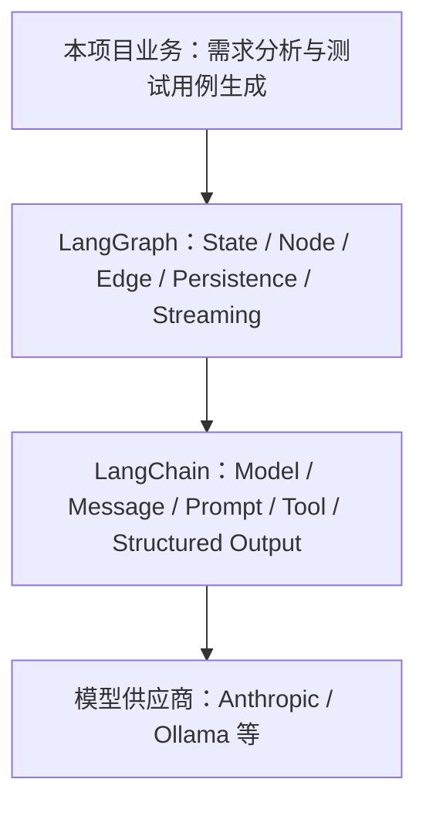
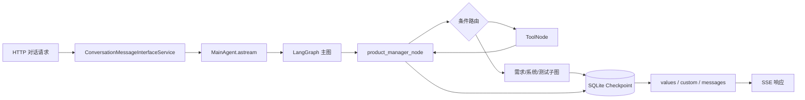

# LangChain 与 LangGraph 团队分享稿 Implementation Plan

> **For agentic workers:** REQUIRED SUB-SKILL: Use superpowers:subagent-driven-development (recommended) or superpowers:executing-plans to implement this plan task-by-task. Steps use checkbox (`- [ ]`) syntax for tracking.

**Goal:** 在 `doc/langchain_and_langgraph_intro.md` 创建一份可用于 45–60 分钟团队分享的中文介绍稿，讲清 LangChain/LangGraph 的关系、开发模式、核心概念、本项目用法、Dify 对比及 LangSmith/Langfuse 可观测性。

**Architecture:** 使用“概念主线 + 项目映射”的单文档结构：先建立 LangChain 与 LangGraph 的分层心智模型，再讲核心概念和标准开发流程，最后沿一次真实请求走读本项目。正文通过两个 Mermaid 图、精简代码片段、对比表和实践清单兼顾口头分享与会后查阅。

**Tech Stack:** Markdown、Mermaid、Python 3.12+ 代码片段、LangChain `>=1.2.15`、LangGraph `>=1.1.6`

## Global Constraints

- 最终文件固定为 `doc/langchain_and_langgraph_intro.md`。
- 内容面向刚接触框架的 Python 开发者和本项目维护者，使用中文讲解，英文术语首次出现时给出中文含义。
- 分享时长按 45–60 分钟设计：基础概念约 15 分钟，LangGraph 开发模式约 15 分钟，本项目代码走读约 20 分钟，其余用于对比、监控和总结。
- 每个重要概念采用“是什么 → 解决什么问题 → 最小示例 → 本项目位置 → 实践注意事项”的顺序。
- 代码片段仅保留理解概念所需内容，必须标注当前仓库中的真实文件路径。
- 至少包含“LangChain/LangGraph 分层关系图”和“本项目请求生命周期图”两张 Mermaid 图。
- Dify 对比保持中立，聚焦开发方式和适用边界，不给出脱离场景的绝对排名。
- LangSmith/Langfuse 只介绍基础概念、能力差异、选型原则和本项目接入位置，不修改依赖或实施监控集成。
- 当前 API 和产品能力仅依据 LangChain、LangGraph、Dify、LangSmith、Langfuse 官方资料表述。
- 不修改任何 `src/` 文件、依赖文件或运行配置。

## File Structure

- Create: `doc/langchain_and_langgraph_intro.md` — 唯一交付物，承载分享目标、框架关系、核心概念、开发流程、项目走读、平台对比、可观测性和实践总结。
- Reference only: `requirements.txt` — 核对 LangChain/LangGraph 版本下限。
- Reference only: `src/graphs/`、`src/agents/main_agent.py`、`src/services/interface/conversation_message_interface_service.py` — 核对项目代码路径、符号名和执行链路。
- Reference only: `docs/superpowers/specs/2026-07-23-langchain-langgraph-introduction-design.md` — 验收范围与表达约束。

---

### Task 1: 建立分享稿骨架与框架关系

**Files:**
- Create: `doc/langchain_and_langgraph_intro.md`
- Reference: `requirements.txt:4-11`
- Reference: `README.md:1`

**Interfaces:**
- Consumes: 已确认的设计规格和仓库依赖版本。
- Produces: 完整标题体系、分享目标、阅读地图、LangChain/LangGraph 定位说明及分层关系图，供后续章节沿同一术语体系扩展。

- [ ] **Step 1: 写入标题、分享目标和阅读地图**

创建 `doc/langchain_and_langgraph_intro.md`，开头必须包含以下信息：

```markdown
# LangChain 与 LangGraph：从核心概念到项目实践

> 面向团队内部的 45–60 分钟知识分享稿

## 1. 分享目标与阅读地图

完成本次分享后，读者应能够：

- 区分 LangChain 与 LangGraph 的职责；
- 按状态、节点、工具、路由、持久化和流式输出的顺序搭建工作流；
- 沿本项目代码定位一次 Agent 请求的完整执行过程；
- 根据项目约束初步选择 LangGraph、Dify 及可观测性工具。
```

紧随其后增加“时间分配”和“先记住的三个结论”：LangChain 提供 AI 应用组件，LangGraph 提供有状态编排运行时，本项目在 LangGraph 节点中组合 LangChain 组件。

- [ ] **Step 2: 编写 LangChain 与 LangGraph 定位章节**

新增：

```markdown
## 2. LangChain 是什么
## 3. LangGraph 是什么，以及它与 LangChain 的关系
```

准确表达以下边界：

- LangChain 是面向模型、消息、Prompt、Tool 和常见 Agent 循环的高层框架与集成层；
- LangGraph 是面向长时运行、有状态、可循环、可分支工作流的低层编排框架和运行时；
- LangGraph 可以独立使用，但通常会配合 LangChain 的模型与工具抽象；
- LangChain 的高层 Agent 能力建立在 LangGraph 之上，而手写 `StateGraph` 提供更细粒度控制。

引用官方入口：

- `https://docs.langchain.com/oss/python/concepts/products`
- `https://docs.langchain.com/oss/python/langgraph/overview`

- [ ] **Step 3: 增加分层关系 Mermaid 图**

图中至少包含以下层次和关系：



图后增加一句限制说明：该图表示本项目的主要依赖方向，不表示 LangGraph 必须依赖 LangChain。

- [ ] **Step 4: 验证基础章节**

Run:

```bash
test -f doc/langchain_and_langgraph_intro.md
rg -n '^## [123]\.' doc/langchain_and_langgraph_intro.md
rg -n '^```mermaid$|LangChain|LangGraph|45–60' doc/langchain_and_langgraph_intro.md
git diff --check
```

Expected: 文件存在；输出包含第 1、2、3 节、Mermaid 起始标记以及两个框架名；`git diff --check` 无输出。

- [ ] **Step 5: 提交基础章节**

```bash
git add doc/langchain_and_langgraph_intro.md
git commit -m "docs: 介绍 LangChain 与 LangGraph 关系"
```

---

### Task 2: 编写核心概念与标准开发流程

**Files:**
- Modify: `doc/langchain_and_langgraph_intro.md`
- Reference: `src/graphs/common/llms.py:1-24`
- Reference: `src/graphs/state.py:1-80`
- Reference: `src/graphs/tools.py:30-110`
- Reference: `src/graphs/common/reduce.py:11-80`

**Interfaces:**
- Consumes: Task 1 建立的 LangChain/LangGraph 分层术语。
- Produces: 第 4–6 节核心概念、可运行思路明确的最小示例及七步开发流程，供项目走读逐项映射。

- [ ] **Step 1: 编写 LangChain 核心概念章节**

新增 `## 4. LangChain 核心概念`，使用一张“概念 / 职责 / 本项目位置”表覆盖：

- Chat Model：统一模型调用接口，对应 `src/graphs/common/llms.py` 的 `init_chat_model`；
- Message：`SystemMessage`、`HumanMessage`、`AIMessage`、`ToolMessage` 的角色语义；
- Prompt：将业务规则、上下文和输入组织为模型指令；
- Tool 与 Tool Calling：函数 schema 提供给模型，模型产生调用意图，执行器真正调用函数；
- Structured Output：用 Pydantic/schema 约束机器可消费输出；
- Runnable 与 `RunnableConfig`：统一调用配置、callbacks、tags 和 metadata 的传递入口。

最小示例必须展示当前项目使用的导入风格：

```python
from langchain.chat_models import init_chat_model
from langchain.messages import HumanMessage
from langchain.tools import tool

model = init_chat_model(model="your-model", model_provider="your-provider")

@tool
def get_project_progress(project_id: str) -> str:
    """查询项目当前阶段。"""
    return "requirement_outline_design"

response = model.bind_tools([get_project_progress]).invoke(
    [HumanMessage(content="项目下一步做什么？")]
)
```

示例后明确：模型返回 tool call 不等于工具已经执行，项目使用 `ToolNode` 完成执行闭环。

- [ ] **Step 2: 编写 LangGraph 核心概念章节**

新增 `## 5. LangGraph 核心概念`，分别解释并给出本项目映射：

- State：图内共享数据契约；
- Node：读取状态并返回局部更新的执行单元；
- Edge：固定流转；
- Conditional Edge：根据状态选择下一节点；
- Reducer：同一字段收到更新时的合并规则；
- `ToolNode`：执行模型产生的工具调用；
- `Command`：工具或节点返回状态更新，也可表达控制指令；
- `Send`：为并行任务动态创建分支；
- Subgraph：把可复用流程作为节点嵌入父图；
- Checkpoint：按 thread 保存每一步状态快照；
- Streaming：输出状态、消息 token 和自定义进度事件。

加入以下最小图示例，并说明 reducer 对并发写入尤其重要：

```python
from typing import Annotated, TypedDict
from operator import add
from langgraph.graph import StateGraph, START, END

class DemoState(TypedDict):
    topic: str
    notes: Annotated[list[str], add]

def collect_note(state: DemoState) -> dict:
    return {"notes": [f"分析：{state['topic']}"]}

builder = StateGraph(DemoState)
builder.add_node("collect_note", collect_note)
builder.add_edge(START, "collect_note")
builder.add_edge("collect_note", END)
graph = builder.compile()
```

- [ ] **Step 3: 编写标准开发流程章节**

新增 `## 6. LangChain/LangGraph 标准开发流程`，使用七步清单：

1. 定义输入、输出和状态字段；
2. 确定 reducer，尤其是列表和并发字段；
3. 初始化模型并设计 Prompt；
4. 编写单一职责节点与 schema 明确的 Tool；
5. 添加固定边、条件路由、循环和子图；
6. 选择 Checkpointer，并约定稳定的 `thread_id`；
7. 编译、调用、消费 Streaming，并分层测试。

每一步写明“产物”和“检查问题”。例如状态建模的检查问题是：“两个并发节点同时更新此字段时，应覆盖、追加、去重还是拒绝？”

- [ ] **Step 4: 验证概念覆盖**

Run:

```bash
rg -n '^## [456]\.|Chat Model|RunnableConfig|State|Reducer|ToolNode|Command|Send|Checkpoint|Streaming' doc/langchain_and_langgraph_intro.md
test "$(rg -c '^```' doc/langchain_and_langgraph_intro.md)" -ge 6
git diff --check
```

Expected: 第 4、5、6 节及所有列出的核心术语均有匹配；代码围栏不少于 6 行起止标记；`git diff --check` 无输出。

- [ ] **Step 5: 提交核心概念章节**

```bash
git add doc/langchain_and_langgraph_intro.md
git commit -m "docs: 补充 LangChain LangGraph 核心概念"
```

---

### Task 3: 沿真实请求走读本项目

**Files:**
- Modify: `doc/langchain_and_langgraph_intro.md`
- Reference: `src/services/interface/conversation_message_interface_service.py:74-171`
- Reference: `src/agents/main_agent.py:9-72`
- Reference: `src/graphs/graph.py:24-108`
- Reference: `src/graphs/state.py:21-100`
- Reference: `src/graphs/routes.py:55-100`
- Reference: `src/graphs/nodes.py:103-211`
- Reference: `src/graphs/common/base/graph.py:16-113`
- Reference: `src/graphs/common/base/routes.py:100-125`
- Reference: `src/graphs/common/reduce.py:11-80`
- Reference: `src/graphs/common/utils/structured_output_utils.py:78-115`

**Interfaces:**
- Consumes: Task 2 定义的 State、Node、Route、Tool、Reducer、Subgraph、Checkpoint、Streaming 术语。
- Produces: 第 7–8 节请求生命周期图和代码模式映射，让读者可以从 HTTP 请求定位到 SSE 响应。

- [ ] **Step 1: 编写请求生命周期章节**

新增 `## 7. 本项目：一次请求如何穿过整个 Agent`，按以下顺序讲解：

1. `ConversationMessageInterfaceService._start_agent()` 接收请求并遍历流事件；
2. `MainAgent.astream()` 将用户输入转换为 `HumanMessage`；
3. `project_id` 同时作为业务标识和 LangGraph `thread_id`；
4. `create_agent()` 构建并编译主图；
5. 产品经理节点通过模型输出或工具调用决定下一步；
6. 条件路由进入 `ToolNode`、业务子图或结束节点；
7. reducer 合并状态，SQLite checkpointer 保存快照；
8. `values`、`custom`、`messages` 流事件被转换成 SSE。

- [ ] **Step 2: 增加请求生命周期 Mermaid 图**

使用以下节点，不隐藏 Tool 与子图分支：



图后说明这是教学视图：Checkpoint 由编译后的图在执行步骤中维护，并非业务节点手动调用。

- [ ] **Step 3: 编写典型代码模式章节**

新增 `## 8. 本项目中的典型开发模式`，每个小节都按“代码位置 / 做法 / 原因 / 注意事项”编写：

- 模型统一初始化：`src/graphs/common/llms.py`；
- 大状态模型：`src/graphs/state.py`；
- 主图与八个业务子图：`src/graphs/graph.py`；
- 节点执行与路由分离：`src/graphs/nodes.py`、`src/graphs/routes.py`；
- Tool Calling 与结构化输出：`src/graphs/tools.py`、`src/graphs/common/utils/structured_output_utils.py`；
- 通用优化循环与嵌套子图：`src/graphs/common/base/graph.py`；
- `Send` 并发评审与 reducer 汇总：`src/graphs/common/base/routes.py`、`src/graphs/common/reduce.py`；
- SQLite Checkpoint 和 `thread_id`：`src/graphs/graph.py`、`src/agents/main_agent.py`；
- 三种 Streaming 模式到 SSE：`src/agents/main_agent.py`、`src/services/interface/conversation_message_interface_service.py`。
- 异常边界：节点和 Tool 记录上下文并向图调用层传播异常，`ConversationMessageInterfaceService._start_agent()` 在服务边界捕获异常、持久化失败消息并发送前端可消费的 SSE 错误事件；说明生产实现还应区分可重试模型错误、业务校验错误和系统错误。

至少引用以下三个短代码片段并解释，不整段复制函数：

```python
agent_builder = StateGraph(State)
agent_builder.add_conditional_edges("product_manager_node", routes.product_manager_tool_router, [...])
agent = agent_builder.compile(checkpointer=sqlite_saver)
```

```python
config={"configurable": {"thread_id": project_id}}
stream_mode=["values", "custom", "messages"]
```

```python
Send("group_member_review_optimization_doc_node", {"role": role, **state})
```

- [ ] **Step 4: 校验所有项目引用路径**

Run:

```bash
for path in \
  src/graphs/common/llms.py \
  src/graphs/state.py \
  src/graphs/graph.py \
  src/graphs/nodes.py \
  src/graphs/routes.py \
  src/graphs/tools.py \
  src/graphs/common/base/graph.py \
  src/graphs/common/base/routes.py \
  src/graphs/common/reduce.py \
  src/graphs/common/utils/structured_output_utils.py \
  src/agents/main_agent.py \
  src/services/interface/conversation_message_interface_service.py; do
  test -f "$path" || exit 1
done
rg -n '^## [78]\.|thread_id|values.*custom.*messages|Send|SSE' doc/langchain_and_langgraph_intro.md
git diff --check
```

Expected: 路径循环退出码为 0；第 7、8 节和请求链路关键字均有匹配；`git diff --check` 无输出。

- [ ] **Step 5: 提交项目走读章节**

```bash
git add doc/langchain_and_langgraph_intro.md
git commit -m "docs: 增加 LangGraph 项目代码走读"
```

---

### Task 4: 补充 Dify 对比与 LLM 可观测性

**Files:**
- Modify: `doc/langchain_and_langgraph_intro.md`
- Reference: `src/context.py`
- Reference: `src/agents/main_agent.py:43-72`
- Reference: `src/services/interface/conversation_message_interface_service.py:74-171`

**Interfaces:**
- Consumes: Task 3 的项目请求链路、`thread_id` 和流式事件说明。
- Produces: 第 9–10 节选型对比、Trace 数据模型、LangSmith/Langfuse 简介和本项目接入建议。

- [ ] **Step 1: 编写 LangChain/LangGraph 与 Dify 对比**

新增 `## 9. LangChain/LangGraph 与 Dify：开发模式对比`。对比表使用以下维度：

- 定位；
- 主要开发界面；
- 状态与流程控制粒度；
- 自定义业务代码集成；
- 测试与版本管理；
- 部署和平台能力；
- 适合团队与场景。

结论分三类：

- 标准化流程、快速验证、产品和开发共同编排：优先评估 Dify；
- 复杂状态、动态路由、并发归并、深度业务集成：优先评估 LangGraph；
- 组织已有 Dify 平台但局部流程复杂：采用 Dify 调用独立 LangGraph 服务的组合方式。

以 Dify 官方资料为依据：

- `https://docs.dify.ai/en/guides/application-orchestrate/creating-an-application`
- `https://docs.dify.ai/api-reference/workflows/list-workflow-logs`

- [ ] **Step 2: 建立 LLM 可观测性心智模型**

新增 `## 10. LLM 应用可观测性：LangSmith 与 Langfuse`，先解释：

- 一个 Trace 表示一次完整请求或 Agent run；
- 一个 Run/Span/Observation 表示模型、工具、检索或业务节点等单步操作；
- 多轮对话使用 Thread/Session 关联多个 Trace；
- 可观测性应同时回答执行路径、输入输出、耗时、Token、成本、错误与质量评分。

强调可观测性数据可能包含 Prompt、模型输出和业务信息，接入时必须考虑脱敏、权限、采样和保留周期。

- [ ] **Step 3: 编写 LangSmith 与 Langfuse 对比及最小配置**

使用一张表对比生态集成、自动追踪、开源/自托管选项、Prompt 管理、数据集与评测、成本与指标分析。具体套餐或价格不写入正文，避免内容快速过期。

LangSmith 最小示例只作为说明，不要求项目实际配置：

```bash
export LANGSMITH_TRACING=true
export LANGSMITH_PROJECT="ai-case-generator-demo"
# LANGSMITH_API_KEY 由部署环境的密钥管理服务注入，不写入仓库。
```

Langfuse 说明 Python/LangChain 集成通常通过 SDK、Callback 或 OpenTelemetry 传递追踪数据，具体代码以当前官方集成页为准，不把未安装依赖写成项目现状。

官方资料：

- `https://docs.langchain.com/langsmith/observability-concepts`
- `https://docs.langchain.com/langsmith/evaluation-concepts`
- `https://langfuse.com/docs/observability/overview`
- `https://langfuse.com/docs/evaluation/core-concepts`

- [ ] **Step 4: 映射本项目可观测性接入点**

增加“当前日志基础 / 推荐 Trace 层级 / 关联字段”表：

- 根 Trace：一次 `_start_agent()` 或 `MainAgent.astream()` 调用；
- 子 Span：主图、业务子图、模型调用、Tool 调用、SSE 输出；
- 会话关联：`thread_id = project_id`；
- 业务关联：项目 ID、事务 ID、环境、模型名、业务阶段；
- 指标：端到端耗时、节点耗时、模型 Token/成本、工具错误率、路由次数、循环次数、首 token 延迟；
- 安全：Prompt/响应脱敏，避免记录密钥、上传文件原文和敏感业务字段。

明确本稿不修改 `src/` 和依赖，仅给出接入设计思路。

- [ ] **Step 5: 验证对比与监控章节**

Run:

```bash
rg -n '^## (9|10)\.|Dify|LangSmith|Langfuse|Trace|Span|Token|脱敏|thread_id' doc/langchain_and_langgraph_intro.md
rg -n 'docs\.dify\.ai|docs\.langchain\.com/langsmith|langfuse\.com/docs' doc/langchain_and_langgraph_intro.md
git diff --check
```

Expected: 两个章节、三项产品名、可观测性术语、安全提醒及三个官方域名均有匹配；`git diff --check` 无输出。

- [ ] **Step 6: 提交对比与监控章节**

```bash
git add doc/langchain_and_langgraph_intro.md
git commit -m "docs: 补充 Dify 与 LLM 可观测性介绍"
```

---

### Task 5: 完成实践建议、参考资料与全文验收

**Files:**
- Modify: `doc/langchain_and_langgraph_intro.md`
- Reference: `doc/optimize_list.md:35`
- Reference: `docs/superpowers/specs/2026-07-23-langchain-langgraph-introduction-design.md`

**Interfaces:**
- Consumes: Task 1–4 的全部正文。
- Produces: 可直接分享、可会后查阅且通过静态检查的最终文档。

- [ ] **Step 1: 编写常见误区与实践建议**

新增 `## 11. 常见误区与工程实践`，至少覆盖：

- LangChain 与 LangGraph 不是简单替代关系；
- Tool call 是调用意图，不是工具执行结果；
- 节点返回局部状态更新，不应随意原地修改共享状态；
- 并发字段必须明确 reducer；
- `Command.goto` 的作用范围不能被当作任意父图回滚机制；
- Checkpoint 依赖稳定且隔离良好的 `thread_id`；
- 节点执行与路由决策分离；
- Structured Output 仍需 schema 验证和错误处理；
- Streaming 需要区分状态更新、消息 token 和自定义事件。

测试建议分为节点单测、路由参数化测试、图级集成测试、结构化输出契约测试和离线评测五层。

- [ ] **Step 2: 编写总结和延伸阅读**

新增：

```markdown
## 12. 总结：团队开发时先做哪几件事
## 13. 官方延伸阅读
```

总结提供一份不超过 10 项的启动清单。延伸阅读按 LangChain、LangGraph、Dify、LangSmith、Langfuse 分组，至少包含：

- `https://docs.langchain.com/oss/python/concepts/products`
- `https://docs.langchain.com/oss/python/langchain/tools`
- `https://docs.langchain.com/oss/python/langgraph/overview`
- `https://docs.langchain.com/oss/python/langgraph/persistence`
- `https://docs.langchain.com/oss/python/langgraph/streaming`
- `https://docs.dify.ai/en/guides/application-orchestrate/creating-an-application`
- `https://docs.langchain.com/langsmith/observability-concepts`
- `https://docs.langchain.com/langsmith/evaluation-concepts`
- `https://langfuse.com/docs/observability/overview`
- `https://langfuse.com/docs/evaluation/core-concepts`

- [ ] **Step 3: 执行结构与占位内容检查**

Run:

```bash
test "$(rg -c '^## [0-9]+\.' doc/langchain_and_langgraph_intro.md)" -eq 13
test "$(rg -c '^```mermaid$' doc/langchain_and_langgraph_intro.md)" -ge 2
fence_count=$(rg -c '^```' doc/langchain_and_langgraph_intro.md)
test $((fence_count % 2)) -eq 0
! rg -n 'T[B]D|T[O]DO|待补充|稍后补充|占位文本' doc/langchain_and_langgraph_intro.md
git diff --check
```

Expected: 恰好 13 个编号二级章节；至少 2 个 Mermaid 图；全部代码围栏成对；占位内容检查无匹配；`git diff --check` 无输出。

- [ ] **Step 4: 执行项目引用与篇幅检查**

Run:

```bash
rg -n 'src/graphs/common/llms.py|src/graphs/state.py|src/graphs/graph.py|src/graphs/nodes.py|src/graphs/routes.py|src/graphs/tools.py|src/graphs/common/base/graph.py|src/graphs/common/reduce.py|src/agents/main_agent.py|src/services/interface/conversation_message_interface_service.py' doc/langchain_and_langgraph_intro.md
test "$(wc -m < doc/langchain_and_langgraph_intro.md | tr -d ' ')" -ge 8000
git status --short
```

Expected: 所有主要项目路径均出现在正文中；正文不少于 8000 个字符，足以支撑目标分享时长；Git 状态只包含预期文档变更。

- [ ] **Step 5: 人工通读分享体验**

按以下顺序逐项确认并直接修正文档：

1. 新人不读源码也能解释 LangChain 与 LangGraph 的关系；
2. 每个核心概念都有项目落点或明确说明为何本项目未使用；
3. 两张 Mermaid 图与正文的执行顺序一致；
4. Dify、LangSmith、Langfuse 的表述没有绝对化优劣或易过期价格；
5. 项目代码引用与当前符号名一致；
6. 介绍稿能自然口述，不是只有表格和代码的参考手册；
7. 文末启动清单能指导团队创建新的 LangGraph 项目。

- [ ] **Step 6: 提交最终验收修改**

```bash
git add doc/langchain_and_langgraph_intro.md
git commit -m "docs: 完成 LangChain 团队分享稿"
```
