# AI 软件交付平台 V2 Implementation Roadmap

> **For agentic workers:** REQUIRED SUB-SKILL: Use superpowers:subagent-driven-development (recommended) or superpowers:executing-plans to implement each approved phase plan task-by-task. This roadmap is the dependency map; each phase receives its own execution-self-contained plan before code changes.

**Goal:** Replace the V1 demo with a production-grade V2 platform that reliably delivers approved requirement, PRD, architecture, system module, API, database, and test-design baselines.

**Architecture:** Build a modular monolith shared by separate FastAPI, Worker, and Scheduler processes, with a React SPA. PostgreSQL owns business truth and LangGraph checkpoints, Redis owns expiring coordination state, GitLab owns approved history, and MinIO/S3 owns attachments and export packages.

**Tech Stack:** Python, FastAPI, Pydantic, LangGraph, PostgreSQL, Redis, internal GitLab, MinIO/S3, React, TypeScript, generated OpenAPI client.

## Global Constraints

- V2 directly replaces V1; no compatibility layer, feature flag, data import, or parallel V1 runtime.
- The first release stops after the TEST design baseline; automatic coding and test execution are excluded.
- Do not add Manifest, Outbox, Run History, Artifact History, Gate, Command, Event History, Session, Password Reset, Profile Revision, or migration-run tables.
- Structured YAML is authoritative; Markdown is deterministic rendered output.
- Only the platform service account writes GitLab; project users read, compare, and download through the platform.
- Every behavior change follows red-green-refactor and is committed only after its focused checks pass.
- Existing V1 code remains untouched until the corresponding V2 slice is verified; final cutover removes V1 entrypoints in one explicit task.
- Any production dependency not already present must be reviewed before the phase that introduces it is executed.

---

## 1. Why This Is Split Into Phase Plans

The approved specification covers multiple independently reviewable systems. A single implementation plan would couple infrastructure, identity, conversation concurrency, Graph orchestration, artifact publication, Profile migration, React, and production hardening into one unsafe change. Each phase below produces working, testable software and has a separate detailed plan with exact files, tests, commands, and commits.

## 2. Target File Structure

```text
web/
  src/
    app/
    api/
    features/
      auth/
      projects/
      conversation/
      stages/
      artifacts/
      administration/
    shared/

src/
  bootstrap/
    api.py
    worker.py
    scheduler.py
  modules/
    access/
    projects/
    conversation/
    delivery/
    artifacts/
    profiles/
    changes/
    files/
    stages/
      requirements/
      architecture/
      system_design/
      api_design/
      database_design/
      test_design/
  integrations/
    models/
    gitlab/
    object_store/
    redis/
  transport/
    http/
    sse/
  persistence/
    postgres/
  shared/
    ids/
    errors/
    time/

tests/
  unit/
  contract/
  integration/
  graph/
  e2e/
```

The phase plans may refine leaf filenames, but must preserve these module boundaries and dependency direction.

## 3. Phase Dependency Map

```mermaid
flowchart TD
    P1[1. Runtime and Persistence Foundation]
    P2[2. Identity and Project Access]
    P3[3. Conversation and Delivery Control]
    P4[4. Profile, Artifact, Git and Files]
    P5[5. PM Graph and Stage Modules]
    P6[6. HTTP API, SSE and OpenAPI]
    P7[7. React Workspace and Administration]
    P8[8. Resilience, Security and Cutover]

    P1 --> P2
    P1 --> P3
    P2 --> P3
    P1 --> P4
    P2 --> P4
    P3 --> P5
    P4 --> P5
    P2 --> P6
    P3 --> P6
    P4 --> P6
    P5 --> P6
    P6 --> P7
    P5 --> P8
    P6 --> P8
    P7 --> P8
```



## 4. Phase Plans

### Phase 1: Runtime and Persistence Foundation

**Deliverable:** API, Worker, and Scheduler boot against PostgreSQL and Redis; all approved business tables and LangGraph checkpoint schema are migratable; shared error, ID, time, configuration, transaction, and health seams are tested.

**Owns:** application entrypoints, configuration, PostgreSQL DDL/migrations, Redis connection, transaction boundary, test containers/fixtures, process health.

**Does not own:** authentication behavior, conversation state machine, Graph business behavior, React.

**Exit evidence:** fresh database migration succeeds; downgrade/upgrade policy is documented; schema constraints have integration tests; each process starts and reports dependency health.

### Phase 2: Identity and Project Access

**Deliverable:** local users, independent salts, multi-device Redis Sessions, CSRF, login logs, user administration, projects, members, project creation idempotency, and role authorization work through domain interfaces and focused HTTP endpoints.

**Consumes:** Phase 1 transaction, Redis, error and process seams.

**Produces:** authenticated Actor, project authorization decisions, project/member current projections, Session/CSRF middleware.

**Exit evidence:** TC-AUTH-001—012 and TC-PROJ-001—010 pass for the implemented slice.

### Phase 3: Conversation and Delivery Control

**Deliverable:** shared project messages, scoped idempotency, five-minute conversation occupancy, DIRECT/STEER/QUEUE, one current Run, Worker lease, Scheduler recovery, Human Gate projection, cancel/retry/abandon, and safe interrupt state machines.

**Consumes:** authenticated Actor and project authorization.

**Produces:** `submit_message`, `request_interrupt`, `resolve_human_gate`, Worker claim, Checkpoint lifecycle, process timeline events.

**Exit evidence:** TC-MSG, TC-GRAPH-005—009, TC-REC, TC-SSE core persistence tests pass without model or Git implementations.

### Phase 4: Profile, Artifact, Git and Files

**Deliverable:** Profile draft/version/migration registry, automatic project migration, artifact drafts/current projections, continuous project-local numbering, deterministic YAML/Markdown rendering, GitLab publication/recovery, attachments, historical read, diff, and approved downloads.

**Consumes:** Access, Project, Delivery and transaction seams.

**Produces:** runtime Profile, candidate lifecycle, `seal_stage`, Git baseline reads, object storage evidence and export ports.

**Exit evidence:** TC-ART, TC-PROF and TC-FILE pass, including Git-success/PG-failure recovery without Outbox.

### Phase 5: PM Graph and Stage Modules

**Deliverable:** PM control Graph, structured intent routing, three mandatory gates, requirement module approvals, PRD/architecture/system-module stages, API/DB fork-join convergence, layered test design, change impact/rebaselining, deterministic validators, semantic reviewers, and model gateway diagnostics.

**Consumes:** Conversation, Delivery, Profile, Artifact, File and Model Gateway ports.

**Produces:** the complete first-release delivery pipeline and one final TEST baseline.

**Exit evidence:** TC-GRAPH, TC-DESIGN and deterministic model-driven E2E scenarios pass.

### Phase 6: HTTP API, SSE and OpenAPI

**Deliverable:** all 63 approved public endpoints, `application/problem+json`, SSE reconnect/resync, cursor pagination, multipart uploads, binary downloads, ADMIN diagnostic filtering, and stable OpenAPI operation IDs.

**Consumes:** all domain module interfaces; contains no business state machine.

**Produces:** generated OpenAPI document and TypeScript client package.

**Exit evidence:** every documented endpoint has contract tests for success, applicable authorization, validation and conflict paths; OpenAPI snapshot is reviewed.

### Phase 7: React Workspace and Administration

**Deliverable:** login, project list/create, shared conversation, process timeline, occupancy, DIRECT/STEER/QUEUE controls, Gate UI, stage workspace, candidate/approved artifact views, Git history/diff/download, member management, and ADMIN user/Profile/model screens.

**Consumes:** generated OpenAPI client and SSE contract only; does not duplicate domain types or Graph state.

**Produces:** production React build and browser-level workflows.

**Exit evidence:** component tests and Playwright flows cover OWNER/MEMBER/VIEWER/ADMIN roles, reconnect, conflict refresh and actionable errors.

### Phase 8: Resilience, Security and V1 Cutover

**Deliverable:** full failure injection, observability, backup/restore rehearsal, resource limits, security scans, production Compose/deployment changes, internal acceptance project, and explicit V1 runtime removal.

**Consumes:** all completed phases.

**Produces:** release candidate and rollback/runbook package.

**Exit evidence:** all 132 approved tests pass as applicable; P0 is 100%; V1 data is archived but not read; React/API/Worker/Scheduler are the only production entrypoints.

## 5. Required Plan Files

Before executing each phase, create and approve these files in order:

```text
docs/superpowers/plans/2026-08-06-platform-v2-phase-1-foundation.md
docs/superpowers/plans/2026-08-06-platform-v2-phase-2-access-projects.md
docs/superpowers/plans/2026-08-06-platform-v2-phase-3-conversation-delivery.md
docs/superpowers/plans/2026-08-06-platform-v2-phase-4-profile-artifact-integrations.md
docs/superpowers/plans/2026-08-06-platform-v2-phase-5-graph-stages.md
docs/superpowers/plans/2026-08-06-platform-v2-phase-6-http-sse.md
docs/superpowers/plans/2026-08-06-platform-v2-phase-7-react.md
docs/superpowers/plans/2026-08-06-platform-v2-phase-8-hardening-cutover.md
```

Each phase plan must contain exact file paths, interface signatures, failing tests, verification commands, expected failures/passes, and small verified commit boundaries. No phase may start before its prerequisite exit evidence exists.

## 6. Cross-Phase Rules

1. A module exposes transaction-level commands and queries, not repositories or ORM models.
2. API, Worker, Scheduler and React never write another module's tables directly.
3. External adapters have deterministic fakes before production adapters are used in tests.
4. Long-running work is never executed inside an HTTP request.
5. Redis and SSE loss can reduce freshness but cannot alter approved truth.
6. Git publication is idempotent by publish key and deterministic Tag; partial success is recovered from current Stage state.
7. Every new error code is added to the approved API error catalog and contract tests.
8. Every changed requirement updates traceability and the TEST baseline design before implementation is accepted.

## 7. Implementation Routing Policy

Superpowers remains the workflow owner. Each detailed phase-plan Task contains exactly one executor contract and defaults to `claude-code` with `sonnet`. Tasks involving architecture ambiguity, cross-module consistency, concurrency, security, database constraints, migration, external side-effect recovery, or difficult debugging route to `claude-code` with `opus`. Codex owns requirements, plans, task-state coordination, Spec Review, Code Quality Review, whole-branch Final Review, and branch completion; Codex is an implementer only when a Task genuinely depends on a Codex-only authorization or the user explicitly overrides routing.

Claude self-checks never replace native Superpowers reviews. Task source, tests, documentation, and configuration remain with the Task's selected implementer, and concurrently available Tasks must not claim overlapping files or mutable state.

## 8. Immediate Next Plan

Phase 1 is the only executable next phase. Its detailed plan must first lock:

- the approved business ORM/migration approach for PostgreSQL;
- the exact LangGraph PostgreSQL checkpointer package/version;
- local/CI dependency topology;
- the safe V2 package namespace that allows construction before final V1 cutover.

The React package manager and browser toolchain are intentionally deferred to the Phase 7 plan. Phase 1 choices may introduce production dependencies and therefore require explicit review before execution.
